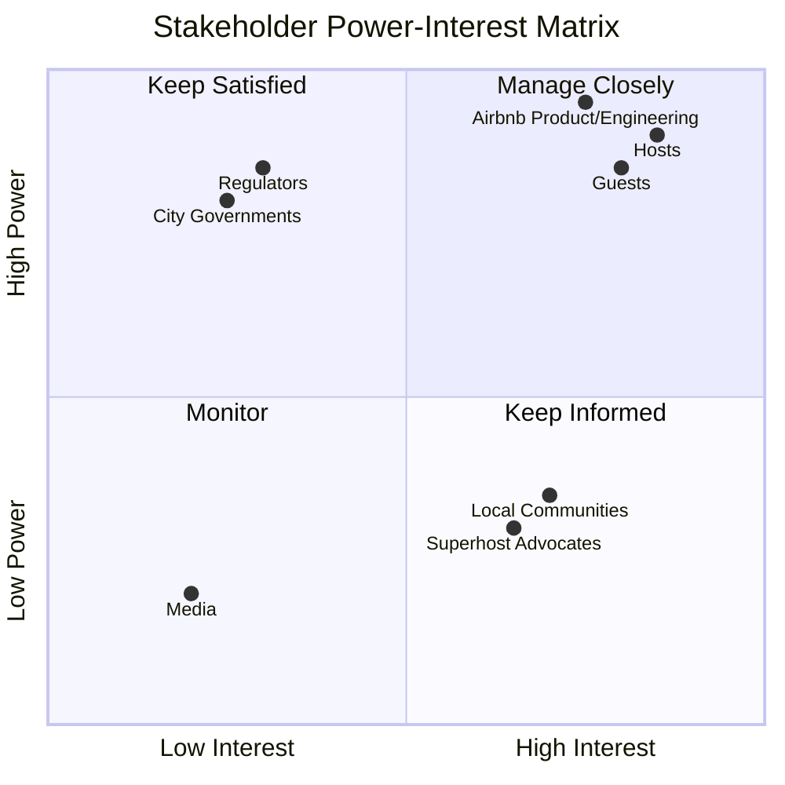
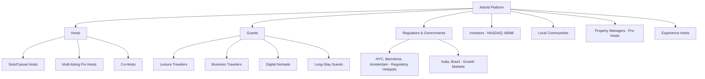
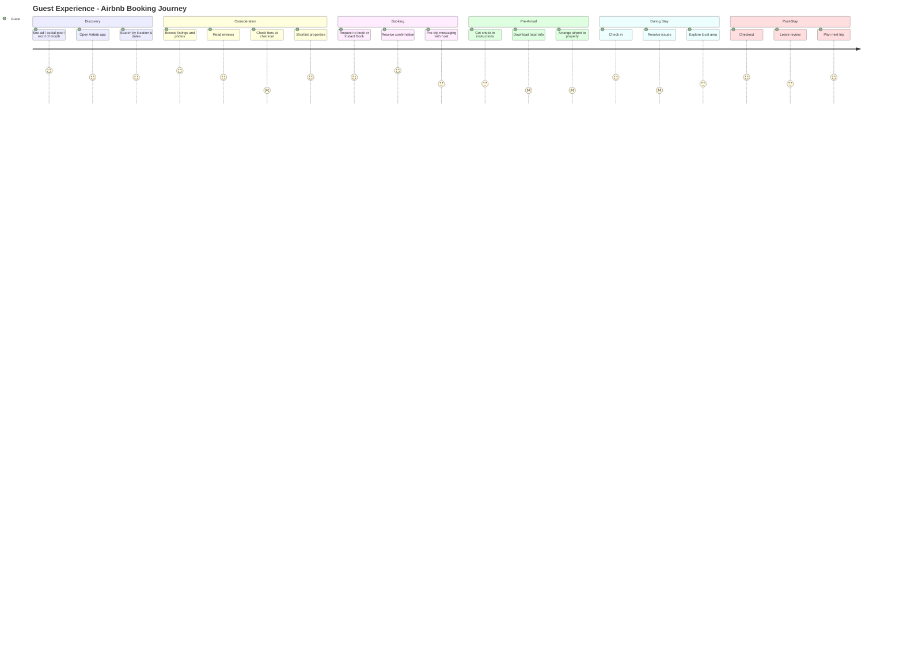
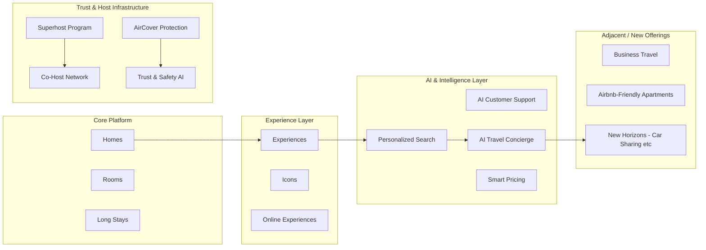
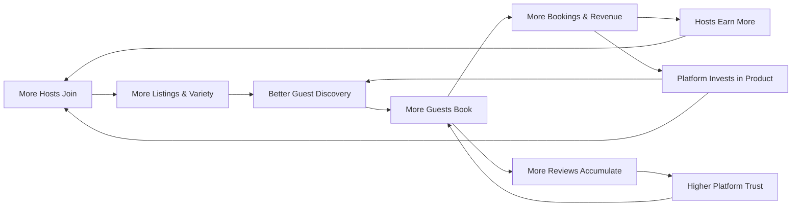
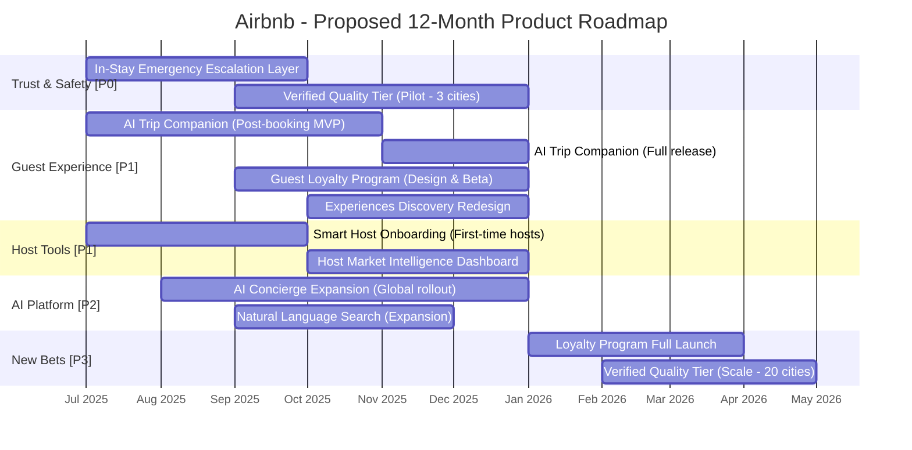

# 🏠 Airbnb Product Management Case Study

---

> **A note on integrity:** Figures in this document (revenue, GBV, nights booked, host and listing counts) are sourced from Airbnb's public SEC filings and shareholder letters, cited in the References section. No primary user research (interviews, surveys) was conducted for this case study. The five personas in Section 12, along with any attributed quotes, are **illustrative composites** built from publicly reported user-sentiment patterns and general travel-industry research, not real individuals. They should be validated with real user interviews before being used to justify a production roadmap decision. Where a specific figure (pricing, adoption rate, conversion uplift) could not be traced to a public source, it is labeled `ASSUMPTION` rather than presented as fact.

---

## 📋 Table of Contents

1. [Why This Product](#1-why-this-product)
2. [Executive Summary](#2-executive-summary)
3. [Company Overview](#3-company-overview)
4. [Product Evolution](#4-product-evolution)
5. [Industry Analysis](#5-industry-analysis)
6. [Problem Statement](#6-problem-statement)
7. [Product Vision](#7-product-vision)
8. [Product Strategy](#8-product-strategy)
9. [Market Analysis](#9-market-analysis)
10. [Stakeholder Analysis](#10-stakeholder-analysis)
11. [User Segmentation](#11-user-segmentation)
12. [Five Detailed User Personas](#12-five-detailed-user-personas)
13. [Jobs To Be Done (JTBD)](#13-jobs-to-be-done-jtbd)
14. [Customer Journey Map](#14-customer-journey-map)
15. [Empathy Map](#15-empathy-map)
16. [Product Ecosystem](#16-product-ecosystem)
17. [Information Architecture](#17-information-architecture)
18. [Core Features](#18-core-features)
19. [Business Model](#19-business-model)
20. [Revenue Streams](#20-revenue-streams)
21. [Business Model Canvas](#21-business-model-canvas)
22. [Product Flywheel](#22-product-flywheel)
23. [Network Effects](#23-network-effects)
24. [Product Metrics](#24-product-metrics)
25. [North Star Metric](#25-north-star-metric)
26. [AARRR Metrics Framework](#26-aarrr-metrics-framework)
27. [SWOT Analysis](#27-swot-analysis)
28. [Porter's Five Forces](#28-porters-five-forces)
29. [Competitor Analysis](#29-competitor-analysis)
30. [UX Audit](#30-ux-audit)
31. [Product Opportunities](#31-product-opportunities)
32. [Feature Prioritization (RICE)](#32-feature-prioritization-rice)
33. [12-Month Product Roadmap](#33-12-month-product-roadmap)
34. [Risks & Mitigation](#34-risks-mitigation)
35. [Product Recommendations](#35-product-recommendations)
36. [Product Management Lessons](#36-product-management-lessons)
37. [Reflection](#37-reflection)
38. [Conclusion](#38-conclusion)
39. [References](#39-references)

---

## 1. Why This Product

Airbnb is a compelling subject for a product teardown for three reasons.

First, **it is one of the most complex two-sided marketplace products ever built**. Managing supply (hosts) and demand (guests) simultaneously, across 220+ countries, with no owned inventory, is a fundamentally hard product and business problem.

Second, **the trust and safety challenge is genuinely distinctive**. Airbnb asks two strangers to share a living space based entirely on a digital interface. How a product builds, maintains, and scales trust at a global level is a problem with few close analogues elsewhere in consumer tech.

Third, **Airbnb's 2024-2025 pivot toward AI and experiential travel** signals a significant strategic shift. The company is no longer just a booking platform; it is positioning itself as a lifestyle companion. This shift is a useful case study in how incumbents reinvent themselves without losing their core value proposition.

This case study is not an endorsement of Airbnb. It is a structured attempt to understand how the company thinks, where it has succeeded, and where real product gaps remain.

---

## 2. Executive Summary

Airbnb, founded in 2008 in San Francisco, is the world's largest short-term rental marketplace. It operates on an asset-light, two-sided platform model - connecting people who want to rent out their spaces (hosts) with people who need a place to stay (guests).

**Key Metrics (FY 2024 - Publicly Reported):**

| Metric | Value |
|--------|-------|
| Annual Revenue | $11.1 billion |
| Full-Year Net Income | ~$2.6 billion (FY 2024) |
| Free Cash Flow (FY 2024) | $4.5 billion |
| Gross Booking Value (GBV) | $81.8 billion |
| Nights & Experiences Booked | ~491.5 million |
| Active Listings | 8 million+ |
| Hosts | 5 million+ |
| Countries & Regions | 220+ |
| All-Time Guest Arrivals | 2 billion+ |
| Employees (Dec 2024) | ~7,300 |

**The Core Thesis:** Airbnb's product power comes from a classic network effect - more hosts bring more guests, and more guests attract more hosts. The challenge in 2024–2026 is moving beyond the commoditized "book a room" transaction and becoming a trusted companion across the entire travel journey, including discovery, experiences, and long stays.

**My Core Finding:** Airbnb has an exceptional supply-demand engine, but a fragmented post-booking experience, inconsistent trust standards, and an underdeveloped loyalty mechanism represent the most significant product gaps. These are addressable through structured product investment.

---

## 3. Company Overview

| Attribute | Detail |
|-----------|--------|
| **Founded** | August 2008 |
| **Founders** | Brian Chesky, Joe Gebbia, Nathan Blecharczyk |
| **Headquarters** | San Francisco, California, USA |
| **IPO** | December 2020 (NASDAQ: ABNB) |
| **CEO** | Brian Chesky |
| **Business Model** | Two-sided marketplace (commission-based) |
| **Category** | Travel Technology / Short-Term Rental Marketplace |
| **Mission** | "To create a world where anyone can belong anywhere" |

**Origin Story:** In October 2007, Brian Chesky and Joe Gebbia were struggling to pay rent in San Francisco. A design conference was coming to the city, and hotels were sold out. They placed three air mattresses in their living room, charged $80/night each, and hosted three strangers. This experiment became the idea behind "Air Bed and Breakfast," which they launched with Nathan Blecharczyk as CTO in 2008.

The founding story is not just trivia - it defines Airbnb's product DNA. The platform was born from a problem of affordability, belonging, and human connection. Those values have shaped every major product decision since.

---

## 4. Product Evolution

```
2007  ──  Air mattresses in a San Francisco apartment
2008  ──  AirBedandBreakfast.com launches | First 3 guests
2009  ──  Renamed Airbnb | $600K seed funding (Y Combinator)
2011  ──  International expansion | 1M+ bookings milestone
2012  ──  Raised $150M | Expanded to Europe, Asia, Latin America
2014  ──  Launched "Experiences" concept internally
2016  ──  Launched Trips (Experiences, Places, Homes)
2017  ──  Revenue reaches $1B+ | Launched Business Travel
2018  ──  Acquired HotelTonight | Launched Airbnb Plus (curated listings)
2019  ──  Launched Airbnb Luxe | 2M+ listings globally
2020  ──  COVID-19 crisis (-70% bookings) | IPO filing | Launched Online Experiences
          IPO: December 2020 at $68/share | Raised $3.5B
2021  ──  Return to growth | Launched AirCover (host & guest protection)
2022  ──  Biggest product update in 10 years (Summer Release) | GAAP profitable for the first time
          Launched "I'm Flexible" search feature | Revenue: $8.4B
2023  ──  Launched "Rooms" category (private rooms revival) | Revenue: $9.9B
          Winter Release: Checkout Instructions, Co-Host Network beta
2024  ──  Launched "Icons" (extraordinary experiential stays)
          Banned indoor security cameras | Re-opened Experiences for new hosts
          AI-powered customer support launched (reduced human contact by ~15%)
          Transparent pricing initiative | Reserve Now, Pay Later (US)
          Revenue: $11.1B | GBV: $81.8B | FCF: $4.5B
2025  ──  Summer Release (May 13, 2025): Rebuilt app, AI personalization,
          smarter search with natural language, social features for Experiences
          Accelerated global expansion: India (+50% nights booked in 2025)
          AI Travel Concierge launched (LLM-powered conversational search)
          Experiences social features: direct messaging between guests
```

**Key Observation:** Airbnb's evolution shows a deliberate pattern - consolidate the core, then expand. The 2020 IPO forced financial discipline, which ironically made the product stronger. The post-2022 era is defined by profitable growth and platform depth over breadth.

---

## 5. Industry Analysis

### Global Short-Term Rental Market

| Metric | Value |
|--------|-------|
| Global STR Market Revenue (2024) | ~$183 billion (Skift Research) |
| Market Leader | Airbnb (44% share) |
| Growth Driver | Post-pandemic revenge travel, digital nomadism, long stays |

### Market Share: Short-Term Rental OTAs (2024)

```
Platform          | 2019 Share | 2024 Share | Trend
──────────────────|────────────|────────────|──────────
Airbnb            |    28%     |    44%     |   ↑
Booking.com       |    14%     |    18%     |   ↑
Vrbo (Expedia)    |    11%     |     9%     |   ↓
Other/Long-tail   |    47%     |    29%     |   ↓
```
Source: Skift Research, 2025

**Structural Tailwinds:**
- Rise of digital nomadism and remote work
- Growing preference for "local" and "authentic" travel experiences
- Long-stay demand (28+ days = 17% of gross nights booked in 2024)
- Emerging markets: India nights booked grew 50%+ in 2025

**Structural Headwinds:**
- Short-term rental regulations in major cities (NYC, Barcelona, Amsterdam, Paris)
- Hotel chains investing in alternative accommodation inventory
- Rising Average Daily Rate (ADR) squeezing price-sensitive travelers
- Cleaning fees and service fees eroding price competitiveness

---

## 6. Problem Statement

### The Host Problem
> **Hosts are entrepreneurs, not just landlords - but Airbnb's tooling treats them as the latter and the platform dynamics reinforce it.**

Independent hosts operating 1–3 listings face a growing asymmetry. As professional property managers with 10+ listings scale up and offer more competitive pricing, solo hosts struggle with pricing strategy, guest communication load, occupancy optimization, and the emotional labor of hosting. The Superhost program rewards outcomes but does not adequately equip average hosts to achieve them.

### The Guest Problem
> **Guests land on Airbnb to find a place to stay, but the product leaves them alone the moment they check in.**

The booking flow is polished, but the post-booking experience is fragmented. Once a guest confirms a reservation, the product's job feels complete - yet the guest's journey has barely begun. Check-in anxiety, local discovery, mid-stay issues, and post-stay closure are handled poorly or not at all.

### The Platform Problem
> **Trust is Airbnb's entire product, but it remains unverified at the listing level.**

Unlike hotels, Airbnb does not physically inspect listings. Safety standards, accuracy of photos, cleanliness, and quality consistency are self-regulated by hosts and evaluated retroactively through reviews. This creates a structurally low floor for quality that damages both guest trust and the brand, particularly in markets where Airbnb is still building credibility.

### Problem Summary

| Stakeholder | Core Pain | Impact |
|-------------|-----------|--------|
| **Guests** | Inconsistent quality, high fees, post-booking abandonment | Churn, negative NPS, hotel switching |
| **Hosts** | Complex pricing, high communication burden, low Superhost attainment support | Host burnout, listing exits |
| **Platform** | Unverified listing standards, reactive trust & safety | Regulatory risk, brand damage |

---

## 7. Product Vision

> **"To make any corner of the world feel like home - before, during, and after every stay."**

Airbnb's stated mission is "to create a world where anyone can belong anywhere." The product vision I would articulate as a PM builds on this: Airbnb should be the only product a traveler needs from inspiration to memory - not just the booking layer.

This means the product's ambition must extend from:
- **Discovery** (what to do, where to go)
- **Booking** (accommodations + experiences)
- **During Stay** (local guidance, issue resolution, in-stay upgrades)
- **After Stay** (memory, community, next trip inspiration)

This is the platform evolution from marketplace to **travel companion**.

---

## 8. Product Strategy

Airbnb publicly articulates a three-pillar strategy (FY 2024–2025):

### Pillar 1: Perfect the Core Service
Make the booking and hosting experience consistently excellent. This means better search, transparent pricing, improved host tools, stronger quality signals for guests.

### Pillar 2: Accelerate Global Markets
Prioritize underpenetrated, high-growth markets. India, Brazil, Southeast Asia, and parts of Africa represent the next frontier. India alone saw 50%+ growth in nights booked in 2025.

### Pillar 3: Expand Beyond Core
Launch and scale new offerings: Experiences 2.0, AI Concierge, long stays, co-hosting marketplace, and potential adjacent categories (car sharing, services).

### Strategic Positioning

```
        HIGH TRUST
             │
Boutique Hotels │  Airbnb
(consistent) │  (aspirational)
             │
─────────────┼─────────────────────
             │
Booking.com  │      Vrbo
(transactional)│   (family-focused)
             │
        LOW TRUST
             │
        STANDARDIZED ──── UNIQUE
```

Airbnb occupies the **High Trust + Unique Experience** quadrant - this is its moat. The risk is that inconsistent quality erodes the trust axis.

### My Strategic Assessment

The three-pillar strategy is sound but sequenced ambiguously. "Perfecting the core" and "expanding beyond core" are somewhat in tension - they compete for the same engineering and design resources. The product organization needs to make a clearer bet: **fix trust and quality first, then expand**. Expansion onto a cracked foundation compounds trust problems globally.

---

## 9. Market Analysis

### Total Addressable Market (TAM)

| Segment | Est. Market Size |
|---------|-----------------|
| Global Short-Term Rental Market (2024) | ~$183B |
| Global Travel & Tourism (2024) | ~$1.5T+ |
| Global Experiences/Activities Market | ~$254B |
| Long-Stay / Remote Work Housing | Growing segment, estimated $50B+ |

Airbnb's 2024 GBV was $81.8B - indicating significant room for continued capture in a fragmented global market.

### Geographic Revenue Breakdown (FY 2024, approximate)

| Region | Notes |
|--------|-------|
| North America | Largest revenue region (~$5B+) |
| EMEA | Largest by nights booked (201M in 2024) |
| APAC & Latin America | Fastest-growing regions |
| India | 50%+ growth in nights booked in 2025 |

### User Demographics (Available Public Data)

- Users aged 25–34 are the largest segment of airbnb.com visitors (28.18%)
- 55.59% of website visitors are women
- 58% of guest bookings were made via app in 2024 (up from 53% in 2023)
- 75%+ of Gen Z users book via app
- Families account for approximately 20% of nights booked
- Solo travelers account for approximately 26% of nights booked

---

## 10. Stakeholder Analysis

### Stakeholder Power-Interest Matrix



**Reading the matrix:** Hosts, Guests, and Airbnb's own Product/Engineering org sit in "Manage Closely," they have both the power to affect outcomes and a direct stake in every product decision, which is why the personas and pain-point analysis in this document center on exactly these three groups. Regulators and City Governments sit in "Keep Satisfied," lower day-to-day interest in product specifics, but the power to reshape the entire business model overnight (see the Regulatory Risk Scenario in Risks & Mitigation). Local Communities and Superhost Advocates sit in "Keep Informed," high interest but limited direct power, meaning their influence works indirectly, through regulators and public sentiment, not through the product roadmap directly.

### Stakeholder Taxonomy



### Stakeholder Needs & Tensions

| Stakeholder | Primary Need | Tension with Platform |
|-------------|-------------|----------------------|
| **Hosts** | Consistent bookings, fair dispute resolution, low platform friction | Platform favors guests in disputes; rising competition from pro hosts |
| **Guests** | Quality assurance, price transparency, responsive support | Inconsistent listing quality; high cleaning fees |
| **Regulators** | Housing availability, tax compliance, safety standards | Airbnb listings reduce housing supply in tight markets |
| **Investors** | Revenue growth, margin expansion, FCF | Growth requires investment that compresses margins short-term |
| **Local Communities** | Neighborhood character, housing affordability | STR supply reduces long-term rental availability |

---

## 11. User Segmentation

Airbnb's user base can be segmented across two dimensions: **Hosts** and **Guests**.

### Guest Segmentation

| Segment | Description | Size | Key Need |
|---------|-------------|------|----------|
| **Leisure Travelers** | Vacation/holiday stays | Largest | Unique, quality stays at good value |
| **Business Travelers** | Work trips, team offsites | Mid-tier | Reliability, Wi-Fi, receipts |
| **Digital Nomads** | Remote workers, monthly stays | Growing | Long-stay pricing, kitchen, fast internet |
| **Experience Seekers** | Primarily booking Experiences | Niche | Activity booking, local connection |
| **Family Travelers** | Multi-room, kid-friendly | ~20% of nights | Space, safety, amenities |

### Host Segmentation

| Segment | Description | Behavior |
|---------|-------------|----------|
| **Casual/Supplemental Host** | Rents primary home occasionally | Infrequent, low optimization |
| **Dedicated Host** | 1–3 listings, side income | Active, Superhost aspirant |
| **Professional Operator** | 10+ listings, full-time | Revenue-focused, uses PMS tools |
| **Co-Host** | Manages listings for others | Service-oriented, fee-based |
| **Experience Host** | Offers activities, not properties | Community-oriented |

---

## 12. Five Detailed User Personas

> **ASSUMPTION - Reasonable Product Assumption:** The following personas are illustrative composites built from publicly reported Airbnb user-demographic data (Section 9) and general travel-industry research, not from primary interviews with actual Airbnb users. Names, quotes, and specific circumstances are constructed to make the analysis concrete, not drawn from real individuals. They should be validated with real user interviews before being used to justify a production roadmap decision.

### Persona 1: The Weekend Wanderer (Guest)

| Attribute | Detail |
|-----------|--------|
| **Name** | Priya, 28 |
| **Location** | Mumbai, India |
| **Occupation** | UX Designer at a tech startup |
| **Travel Frequency** | 4–6 trips/year, domestic and Southeast Asia |
| **Device** | iPhone, always books via app |
| **Budget** | Mid-range (₹3,000–₹8,000/night) |

**Goals:**
- Find a unique, aesthetically pleasing space that feels "Instagram-worthy"
- Have a smooth, contactless check-in experience
- Discover local food and activities without over-planning

**Frustrations:**
- Cleaning fees feel deceptive when shown only at checkout
- Reviews sometimes contradict each other with no way to resolve discrepancy
- Post-booking: no curated local guide from Airbnb, relies on Google

**JTBD:** _When I'm planning a long weekend escape, I want to find a space that feels personal and local so that I feel like I'm genuinely experiencing the city rather than just sleeping in it._

---

### Persona 2: The Seasoned Superhost (Host)

| Attribute | Detail |
|-----------|--------|
| **Name** | Rajesh, 52 |
| **Location** | Goa, India |
| **Occupation** | Former hotel manager, now full-time host |
| **Listings** | 3 (two beach villas, one studio) |
| **Annual Revenue** | ~₹28L/year via Airbnb |
| **Superhost Status** | Maintained for 4+ years |

**Goals:**
- Maximize occupancy during peak season while protecting the off-season with competitive long-stay pricing
- Maintain his 4.9 rating with minimal review risk
- Reduce time spent on repetitive guest messages (check-in, Wi-Fi, checkout)

**Frustrations:**
- Pricing algorithm doesn't always match local market dynamics
- Dispute resolution heavily favors guests even when evidence is clear
- Superhost status can be lost due to a single cancellation outside his control

**JTBD:** _When I'm managing my three properties during peak season, I want to automate repetitive communications and trust that the platform will back me up in disputes so that I can focus on delivering a great guest experience._

---

### Persona 3: The Remote Work Nomad (Guest)

| Attribute | Detail |
|-----------|--------|
| **Name** | Marco, 34 |
| **Location** | Lisbon, Portugal (base) |
| **Occupation** | Senior Software Engineer, fully remote |
| **Travel Pattern** | 1–4 month stays in different cities per year |
| **Budget** | €1,500–€3,500/month |
| **Must-Haves** | Gigabit Wi-Fi, dedicated workspace, good kitchen |

**Goals:**
- Find monthly rental deals that don't penalize him for not booking hotels
- Understand the actual internet speed before committing (not just "Wi-Fi available")
- Build a routine in a new city with local community

**Frustrations:**
- Long-stay discounts are inconsistent and often hidden
- No standardized speed test or workspace quality verification
- Monthly pricing often requires direct negotiation outside the app

**JTBD:** _When I'm relocating for a month of remote work, I want a verified workspace setup so that I can maintain my productivity without the anxiety of discovering weak Wi-Fi after I've checked in._

---

### Persona 4: The First-Time Host (Host)

| Attribute | Detail |
|-----------|--------|
| **Name** | Ananya, 38 |
| **Location** | Bengaluru, India |
| **Occupation** | Marketing Manager |
| **Situation** | Recently bought a second apartment, wants to offset EMI |
| **Hosting Experience** | Zero - just listed for the first time |

**Goals:**
- Set up a listing that attracts guests without making costly pricing mistakes
- Understand how to handle the first guest review situation
- Protect her property from damage without deterring bookings with a high security deposit

**Frustrations:**
- The onboarding flow provides general tips but no local market benchmarks
- She has no way to know if her pricing is competitive vs. similar listings in her area
- Scared of a negative first review before she has had a chance to establish her reputation

**JTBD:** _When I'm setting up my first Airbnb listing, I want clear local pricing guidance and a low-risk first guest experience so that I can build confidence as a host without making expensive early mistakes._

---

### Persona 5: The Family Vacation Planner (Guest)

| Attribute | Detail |
|-----------|--------|
| **Name** | Sunita & Vikram, 41 & 44 |
| **Location** | Delhi, India |
| **Family** | Two kids (8 and 14) |
| **Travel Frequency** | 2 major trips/year during school holidays |
| **Budget** | ₹10,000–₹18,000/night for a whole unit |

**Goals:**
- Book a safe, family-friendly property with bunk beds or separate rooms for kids
- Confirm that the listing has safety basics (no sharp corners, secure balcony)
- Have a kitchen to prepare some meals and manage a child's dietary restrictions

**Frustrations:**
- "Family-friendly" filter is not granular enough (doesn't distinguish between baby-safe and teen-appropriate)
- Difficult to assess actual safety standards from photos alone
- Cancellation policy anxiety: What happens if a child falls sick before the trip?

**JTBD:** _When I'm planning a family vacation, I want to book a verified, child-safe space with confirmed amenities so that I can focus on the trip itself rather than worrying about safety unknowns after arrival._

---

## 13. Jobs To Be Done (JTBD)

The JTBD framework asks: _What progress is the user trying to make when they "hire" Airbnb?_

| Job | Functional Dimension | Emotional Dimension | Social Dimension |
|-----|---------------------|---------------------|------------------|
| **Find a unique place to stay** | Secure accommodation in a specific location | Feel the excitement of discovering something special | Signal to others: "I travel differently" |
| **Host to earn income** | Generate supplemental/primary revenue from spare space | Feel like an entrepreneur with control | Be recognized as a good host by guests |
| **Experience local culture** | Book an Experience activity | Feel authentically connected to a place | Share an experience with companions |
| **Escape from routine** | Leave familiar surroundings | Feel a sense of freedom and adventure | Show family or friends a memorable trip |
| **Work remotely from somewhere new** | Secure a reliable, comfortable workspace | Feel productive and liberated at the same time | Be the kind of person who "works from anywhere" |
| **Manage my property efficiently** | Maximize bookings and minimize vacancies | Feel in control of my financial future | Be respected as a professional host |

---

## 14. Customer Journey Map



### Key Emotional Inflection Points

| Moment | Emotion | Product Gap |
|--------|---------|-------------|
| Seeing full price at checkout (with fees) | Frustration, betrayal | Price transparency should start at search |
| Waiting for host approval on non-Instant Book | Anxiety | No real-time status update reduces confidence |
| Check-in instructions arrive 24h before | Relief mixed with last-minute stress | Should be delivered 72h prior with a trip brief |
| Something goes wrong mid-stay | Fear, helplessness | No in-app emergency escalation path |
| Leaving review | Obligation, anxiety about retaliation | Review system lacks perceived psychological safety |

---

## 15. Empathy Map

### Guest Empathy Map (Primary: Leisure Traveler)

```
┌─────────────────────────────────────────────────────────────┐
│                     THINKS & FEELS                          │
│  "I hope it looks like the photos."                         │
│  "The fees seem too high for what this is."                 │
│  "What if the host doesn't respond in time?"                │
│  "Will I feel safe traveling alone?"                        │
├──────────────────────┬──────────────────────────────────────┤
│        HEARS         │             SEES                     │
│ Friends recommending │ Glossy photos on listings            │
│ specific listings    │ "Superhost" badge                    │
│ Complaints about     │ "5 stars - 247 reviews"             │
│ cleaning fees online │ Competing hotel prices in other tabs │
│ Influencers sharing  │ Map view with pins clustered in      │
│ "Airbnb finds"       │ desirable areas                     │
├──────────────────────┴──────────────────────────────────────┤
│                        SAYS & DOES                          │
│  Searches by flexible dates, uses filters extensively       │
│  Opens 15–20 listings before shortlisting 3                 │
│  Reads ALL reviews, especially recent 1-star reviews        │
│  Messages host with questions before booking                │
│  Screenshots listing in case something changes              │
├─────────────────────────────────────────────────────────────┤
│                    PAINS              │     GAINS            │
│  Unexpected cleaning fees            │ Unique, local feel   │
│  Inconsistent quality                │ More space than hotel │
│  Fear of last-minute cancellation    │ Kitchen access        │
│  Poor customer support if issues     │ Better value/space    │
│  No in-stay support                  │ Authentic community  │
└─────────────────────────────────────────────────────────────┘
```

---

## 16. Product Ecosystem



---

## 17. Information Architecture

```mermaid
graph TD
    APP[Airbnb App / Web]
    
    APP --> EXPLORE[Explore]
    APP --> WISHLISTS[Wishlists]
    APP --> TRIPS[Trips]
    APP --> INBOX[Inbox]
    APP --> PROFILE[Profile]

    EXPLORE --> SEARCH[Search by Location / Dates]
    EXPLORE --> CATEGORIES[Browse by Category - Beachfront, Cabins, Icons...]
    EXPLORE --> MAP[Map View]
    EXPLORE --> FILTERS[Filters - Price, Amenities, Bedrooms]
    EXPLORE --> EXP[Experiences Tab]

    TRIPS --> UPCOMING[Upcoming Trips]
    TRIPS --> PAST[Past Trips]
    TRIPS --> CHECKIN[Check-in Details]
    TRIPS --> RECEIPT[Receipts & Invoices]

    INBOX --> HOST_MSG[Host Messages]
    INBOX --> SUPPORT[Airbnb Support]
    INBOX --> NOTIFS[Notifications]

    PROFILE --> REVIEWS[Reviews Given & Received]
    PROFILE --> PAYMENTS[Payment Methods]
    PROFILE --> IDENTITY[Identity Verification]
    PROFILE --> SETTINGS[Account Settings]
    PROFILE --> HOSTING[Switch to Hosting Mode]

    HOST_MODE[Hosting Mode]
    HOST_MODE --> LISTINGS[Manage Listings]
    HOST_MODE --> CALENDAR[Calendar & Availability]
    HOST_MODE --> INSIGHTS[Host Insights & Earnings]
    HOST_MODE --> PRICING[Smart Pricing]
    HOST_MODE --> COHOST[Co-Host Management]
```



---

## 18. Core Features

### For Guests

| Feature | Purpose | Maturity |
|---------|---------|---------|
| **Search & Filters** | Find stays by location, dates, guests, amenities | Mature |
| **Category Browse** | Discovery via Beachfront, Cabins, Icons, etc. | Evolving |
| **Instant Book** | Frictionless booking without host approval | Mature |
| **Flexible Dates ("I'm Flexible")** | Discover stays by duration rather than fixed dates | Growth |
| **Guest Favorites** | Trust signal - highly-rated, frequently-booked listings | Active |
| **AirCover for Guests** | Rebooking assistance, refund protection | Active |
| **Reserve Now, Pay Later** | Flexible payment (US, expanding) | New (2024) |
| **AI Customer Support** | Reduced response time, action-capable chatbot | New (2024–2025) |
| **Experiences Booking** | Activities led by local hosts | Revamped (2024) |
| **Icons** | Extraordinary experiential listings (Pixar's Up house, etc.) | New (2024) |

### For Hosts

| Feature | Purpose | Maturity |
|---------|---------|---------|
| **Smart Pricing** | Algorithm-driven pricing suggestions | Mature |
| **Calendar Management** | Availability and multi-listing sync | Mature |
| **Superhost Program** | Recognition and visibility boost for top hosts | Mature |
| **Co-Host Network** | Hosts can hire co-hosts through the platform | New (2024) |
| **AirCover for Hosts** | $3M property damage protection | Active |
| **Host Insights Dashboard** | Earnings, occupancy, reviews analytics | Active |
| **Checkout Instructions** | Automated guest checkout messaging | Active |
| **AI Support for Hosts** | Smart responses to common guest questions | New (2025) |

---

## 19. Business Model

Airbnb operates a **two-sided marketplace** with an **asset-light** model. It owns no properties - instead it takes a commission from transactions between hosts and guests.

**Why this model is powerful:**
- No CAPEX on property inventory
- Network effects accelerate supply and demand simultaneously
- Revenue scales with GBV (Gross Booking Value) without proportional cost growth
- FCF margin of ~40% TTM as of 2024 demonstrates capital efficiency

**Why this model has structural tension:**
- Platform must satisfy two economically opposed parties (host wants max revenue, guest wants min cost)
- Trust and safety costs are high and largely opaque to users
- Regulatory risk is real - regulations can restrict supply overnight (e.g., New York City's Local Law 18 in 2023)

---

## 20. Revenue Streams

| Revenue Stream | Description | Estimated Contribution |
|----------------|-------------|----------------------|
| **Guest Service Fee** | 14.2% average of booking subtotal charged to guests | Primary (~60–70%) |
| **Host Service Fee** | ~3% of booking subtotal charged to hosts | Secondary (~25–30%) |
| **Cross-Currency Fee** | Fee for bookings in a different currency (launched Q2 2024) | Growing |
| **Experiences Booking Fee** | Commission on Experience bookings | Niche but growing |
| **Business Travel** | Corporate accounts with enhanced invoicing | Niche |

**Take Rate:** Airbnb's implied take rate (Revenue ÷ GBV) was approximately 14.1% in Q4 2024.

> _Note: Airbnb does not publicly break down revenue by stream. The above represents my analysis based on publicly available information and their stated pricing policies._

---

## 21. Business Model Canvas

```
┌─────────────────┬─────────────────┬─────────────┬─────────────────┬─────────────────┐
│  KEY PARTNERS   │ KEY ACTIVITIES  │    VALUE    │  CUSTOMER       │ CUSTOMER        │
│                 │                 │PROPOSITIONS │  RELATIONS      │ SEGMENTS        │
│ Payment         │ Platform        │             │                 │                 │
│ providers       │ development     │ GUESTS:     │ Trust via       │ GUESTS:         │
│ (Stripe etc.)   │                 │ Unique,     │ reviews,        │ Leisure,        │
│                 │ Trust & safety  │ affordable, │ AirCover,       │ Business,       │
│ Regulators &    │ systems         │ local stays │ AI Support      │ Nomads,         │
│ governments     │                 │             │                 │ Families        │
│                 │ Host acquisition│ HOSTS:      │ Community       │                 │
│ Property        │ & support       │ Income from │ (Superhost      │ HOSTS:          │
│ managers        │                 │ spare space │ program,        │ Casual,         │
│ & co-hosts      │ Product design  │             │ forums)         │ Dedicated,      │
│                 │ & AI/ML         │             │                 │ Professional    │
│ Insurance       │                 │             │                 │                 │
│ partners        │ Marketing &     │             │                 │                 │
│                 │ brand building  │             │                 │                 │
├─────────────────┴────────┬────────┴─────────────┴─────────────────┴─────────────────┤
│      KEY RESOURCES       │                   CHANNELS                               │
│                          │                                                           │
│ Platform / Tech          │ Mobile App (iOS, Android) - 58% of bookings 2024          │
│ Brand & Trust            │ Website                                                   │
│ Network of 5M+ hosts     │ Paid Marketing (Google, Meta)                             │
│ 8M+ listings             │ Word of mouth / Referrals                                 │
│ Data & AI/ML             │ Email / Push notifications                                │
│ 7,300+ employees         │ Airbnb Newsroom / PR                                      │
├──────────────────────────┼───────────────────────────────────────────────────────────┤
│      COST STRUCTURE      │                REVENUE STREAMS                            │
│                          │                                                           │
│ Product & Engineering    │ Guest Service Fee (~14% of booking subtotal)              │
│ Operations & Support     │ Host Service Fee (~3% of booking subtotal)               │
│ Sales & Marketing        │ Cross-currency Booking Fee (launched 2024)               │
│ G&A                      │ Experience Booking Fee                                    │
│ Trust & Safety           │ Business Travel Accounts                                  │
└──────────────────────────┴───────────────────────────────────────────────────────────┘
```

---

## 22. Product Flywheel



**How the flywheel works:**
1. Every new host listing expands the breadth and geographic coverage of the supply
2. Expanded supply increases the probability that any given guest finds a match
3. More successful bookings generate more reviews
4. More reviews increase trust, which reduces booking friction for future guests
5. Increased guest activity generates platform revenue, which funds product improvements that attract more hosts and guests

**Flywheel Accelerators:** AI personalization, Instant Book, Guest Favorites, Superhost program, AirCover trust signal.

**Flywheel Friction Points:** High service fees, inconsistent quality, regulatory restrictions on supply, host burnout.

---

## 23. Network Effects

Airbnb exhibits **cross-side network effects** - the core dynamic of a two-sided marketplace.

| Type | Mechanism | Strength |
|------|-----------|----------|
| **Cross-side: Guests → Hosts** | More guests means higher host earnings potential, attracting more hosts | High |
| **Cross-side: Hosts → Guests** | More host listings mean better location/price fit for guests | High |
| **Same-side: Review accumulation** | More reviews on a listing reduce uncertainty for future guests | Medium |
| **Geographic clustering** | Dense supply in a city makes Airbnb the default option for that market | High |
| **Brand network effect** | Airbnb is increasingly a verb ("I'm Airbnb-ing it") - brand recognition lowers CAC | Growing |

**Where network effects are weakest:**
- Experiences: thin supply in most cities makes this feel like a separate, underdeveloped product
- Rural/emerging markets: sparse host density means the marketplace is thin in both directions
- Long stays: pro-host operators are better at this, but the product UX still feels designed for short stays

---

## 24. Product Metrics

### Level 1: Business Health Metrics

| Metric | FY 2024 Value | Trend |
|--------|--------------|-------|
| Revenue | $11.1B | ↑ 12% YoY |
| Gross Booking Value (GBV) | $81.8B | ↑ 12% YoY |
| Free Cash Flow | $4.5B | Strong |
| Net Income | ~$2.6B | Profitable (GAAP) |
| Adjusted EBITDA Margin | ~35% (FY avg) | Stable |
| Implied Take Rate | ~14.1% (Q4) | Stable |

### Level 2: Product Performance Metrics

| Metric | FY 2024 Value |
|--------|--------------|
| Nights & Experiences Booked | 491.5 million |
| Active Listings | 8 million+ |
| Hosts | 5 million+ |
| Countries/Regions | 220+ |
| All-Time Guest Arrivals | 2 billion+ |
| App Booking Share | 58% (up from 53% in 2023) |
| Average Daily Rate (ADR) | ~$158 (global avg) |
| Average Stay Length | 3.7 nights |
| Long Stays (28+ days) | ~17% of gross nights |

### Level 3: User Quality Metrics (Inferred)

| Metric | Insight |
|--------|---------|
| Reviews per minute | 100+ five-star reviews/minute (Airbnb claim) |
| Total reviews | 460M+ since inception |
| AI Support efficiency | Reduced human agent contact by ~15% in US |
| Bookings per user (2024) | ~1.78 (up from 0.93 in 2018) |

---

## 25. North Star Metric

> **North Star Metric: Nights and Experiences Booked (NEB)**

**Why NEB is the right North Star:**

Airbnb uses Nights and Experiences Booked as its primary volume metric, and I agree this is the right choice. Here is why:

1. **It captures both supply and demand health** - a booking requires both a host to list and a guest to book. If NEB grows, both sides of the marketplace are working.
2. **It correlates directly with host earnings** - which is the primary value proposition for supply.
3. **It reflects true product-market fit** - search clicks and app opens don't indicate if the product is working. A booking does.
4. **It drives revenue** - GBV and revenue are direct functions of NEB multiplied by ADR.

**What NEB alone misses:**
- Quality of experience (a guest can book and have a terrible stay)
- Return guest rate (are first-time guests becoming loyal repeaters?)
- Host satisfaction (are hosts choosing to stay active?)

**Complementary Metrics I would add:**
- **Repeat Booking Rate (RBR):** Percentage of guests who book again within 12 months
- **Host Retention Rate:** Percentage of hosts who remain active quarter-over-quarter
- **Guest NPS by stay type:** Differentiates quality across Homes, Rooms, Experiences

---

## 26. AARRR Metrics Framework

```
┌─────────────────────────────────────────────────────────────────┐
│  ACQUISITION                                                    │
│  How do users find Airbnb?                                      │
│  • Organic search (SEO) - dominant channel                      │
│  • Paid social (Meta, Google) - $2.1B sales & marketing (2024) │
│  • Referral (host/guest word of mouth)                          │
│  • App store discovery                                          │
│  • PR / media ("Icons" launch generated massive earned media)   │
│  Metric: New user registrations, app installs, CAC             │
├─────────────────────────────────────────────────────────────────┤
│  ACTIVATION                                                     │
│  Did users have a "first value moment"?                         │
│  • Guest: First successful booking completed                    │
│  • Host: First listing published + first guest confirmed        │
│  Metric: Booking completion rate for new users, host            │
│          onboarding to first booking conversion                 │
├─────────────────────────────────────────────────────────────────┤
│  RETENTION                                                      │
│  Do users come back?                                            │
│  • Guest: Bookings per user increasing (1.78 in 2024 vs 0.93   │
│    in 2018 - strong signal of retention improvement)           │
│  • Host: Host retention rate by cohort                          │
│  Metric: Repeat booking rate (12M), host quarterly churn        │
├─────────────────────────────────────────────────────────────────┤
│  REVENUE                                                        │
│  Are users generating revenue?                                  │
│  • Take rate: ~14.1% of GBV                                     │
│  • GBV: $81.8B (2024)                                          │
│  • Revenue: $11.1B (2024)                                      │
│  • FCF: $4.5B (2024)                                           │
│  Metric: GBV per booking, ADR trend, take rate stability        │
├─────────────────────────────────────────────────────────────────┤
│  REFERRAL                                                       │
│  Do users refer others?                                         │
│  • Hosts refer other potential hosts (Co-Host Network)          │
│  • Guests share listings on social media (especially unique     │
│    stays - treehouses, castles, domes)                         │
│  • "Icons" category generates massive earned media referral     │
│  Metric: Referral-driven new user rate, viral coefficient       │
└─────────────────────────────────────────────────────────────────┘
```

---

## 27. SWOT Analysis

### Strengths

| Strength | Evidence |
|----------|----------|
| **Brand recognition & trust** | One of the most recognized travel brands globally |
| **Supply depth** | 8M+ listings across 220+ countries |
| **Network effects** | Self-reinforcing host-guest flywheel |
| **Financial strength** | $4.5B FCF (2024), $11.4B cash reserves (mid-2025) |
| **Asset-light model** | No owned inventory, high FCF margins |
| **Review moat** | 460M+ reviews - irreplaceable competitive data |
| **AI investment** | AI customer support reduced human contact by ~15% |

### Weaknesses

| Weakness | Evidence |
|----------|----------|
| **Inconsistent quality** | No physical listing inspection; quality is self-regulated |
| **Opaque fee structure** | Cleaning fees and service fees erode price trust |
| **Post-booking product gap** | No strong in-stay engagement or local discovery layer |
| **Host dispute resolution bias** | Hosts report systemic bias toward guests in disputes |
| **Experiences underutilization** | Despite years of investment, Experiences remains thin in most cities |
| **Customer support quality** | Bureaucratic resolution process for complex cases |

### Opportunities

| Opportunity | Potential |
|-------------|-----------|
| **AI personalization** | LLM-powered concierge can become the default travel planning interface |
| **Emerging markets (India, Brazil)** | India grew 50%+ in nights booked (2025) - massive runway |
| **Long stays / digital nomad segment** | 17% of nights are already 28+ days; product investment is underrepresented |
| **Experiences 2.0** | Revamped social features signal a content/community layer |
| **Co-Host Network** | Unlock casual hosts who need operational support to become active |
| **Loyalty program** | Airbnb has no formal loyalty program; significant guest retention opportunity |

### Threats

| Threat | Evidence | Severity |
|--------|----------|----------|
| **Regulatory restrictions** | NYC Local Law 18 reduced STR supply significantly; Barcelona, Amsterdam follow suit | High |
| **Rising ADR** | Higher nightly rates risk driving price-sensitive guests to hotels or competitors | Medium |
| **Booking.com expansion** | Booking.com grew from 14% to 18% market share (2019–2024) | Medium |
| **Hotel chain response** | Major chains investing in boutique and alternative accommodation | Medium |
| **Trust incidents** | A single high-profile safety incident can cause outsized brand damage | High |
| **Macroeconomic downturn** | Travel is discretionary; recession could reduce bookings significantly | Medium |

---

## 28. Porter's Five Forces

```
                    THREAT OF NEW ENTRANTS
                         [Medium]
                    ─────────────────────
                    • High brand moat (network effects)
                    • Significant capital required for supply
                    • But: regional players can emerge in
                      specific underpenetrated markets

        ┌─────────┐         ┌─────────┐
        │         │         │         │
SUPPLIER│ [Low]   │ AIRBNB  │ [High]  │BUYER
POWER  │         │  Core   │         │POWER
        │Hosts are│ Platform│ Guests  │
        │numerous │         │ have many│
        │and      │         │ OTA      │
        │fragmented│        │ choices  │
        └─────────┘         └─────────┘

              THREAT OF SUBSTITUTES
                    [High]
            ─────────────────────
            • Hotels - still dominant globally
            • Vrbo, Booking.com
            • Direct booking / local platforms
            • Long-stay: serviced apartments

              COMPETITIVE RIVALRY
                    [High]
            ─────────────────────
            • Booking.com gaining share fast
            • Vrbo retaining family segment
            • Hotel chains adding inventory
```

### Force-by-Force Analysis

| Force | Rating | Rationale |
|-------|--------|-----------|
| **Threat of New Entrants** | Medium | High brand moat, but regional specialization is possible |
| **Supplier Power (Hosts)** | Low–Medium | Individual hosts have low power; professional operators have more leverage as supply concentrates |
| **Buyer Power (Guests)** | Medium–High | Easy switching between OTAs; price comparison is trivial |
| **Threat of Substitutes** | High | Hotels, serviced apartments, Vrbo, Booking.com, direct bookings |
| **Competitive Rivalry** | High | Booking.com is the most credible long-term threat, growing faster in key markets |

---

## 29. Competitor Analysis

### Head-to-Head Comparison

| Dimension | Airbnb | Booking.com | Vrbo (Expedia) |
|-----------|--------|-------------|----------------|
| **Global STR Market Share (2024)** | 44% | 18% | 9% |
| **Inventory Focus** | Unique stays, urban | Urban + hotel mix | Family beach/lake |
| **Revenue Model** | Guest + host commission | Guest + host commission | Host subscription + commission |
| **Experiences** | Yes (revamped 2024) | No | No |
| **Long Stay Focus** | Growing (17% of bookings) | Limited | Limited |
| **AI Integration** | Significant (2024–2025) | Moderate | Limited |
| **Trust Mechanism** | Reviews + AirCover | Reviews | Reviews |
| **Brand Perception** | Unique, community | Transactional, efficient | Family-friendly |
| **Key Strength** | Brand + unique inventory + network | Scale in Europe + hotel hybrid | Family market + Expedia bundle |
| **Key Weakness** | Quality consistency | Less brand personality | Platform migration issues (2024) |

### Competitive Positioning

Airbnb's strongest moat is **brand identity and unique inventory**. When a traveler wants to feel like they're living in a neighborhood rather than visiting it, Airbnb is the default choice. This is genuinely hard to replicate.

Booking.com's strongest advantage is its **European market depth and hotel-hybrid model**. In Europe, Booking.com is often the default for any accommodation search. Airbnb's EMEA growth is strong, but Booking.com owns the baseline traveler in this region.

Vrbo's niche - **family beach and lake properties** - is defensible because it's a category Airbnb doesn't serve particularly well. Airbnb's urban-skewed supply and room-sharing model (Rooms) doesn't appeal to families looking for a week at a lake house.

**My Assessment:** Booking.com poses the highest long-term competitive risk to Airbnb. It is growing faster in key geographies, has a hotel+STR hybrid model that captures a wider audience, and is investing in improving its alternative accommodation experience. If Airbnb does not build stronger loyalty mechanics and deepen its experience layer, it risks commoditization in price-driven markets.

---

## 30. UX Audit

### Audit Methodology
I evaluated the Airbnb app across the guest journey using publicly available app stores, user reviews, community forums, and product releases.

### What Works Well

| Feature | Strength |
|---------|----------|
| **Search & Category Browse** | Visual, intuitive, "I'm Flexible" is genuinely innovative |
| **Listing page design** | Photo galleries, review summaries, host info are well-organized |
| **Instant Book** | Reduces booking friction significantly; smart default for casual hosts |
| **AirCover communication** | Well-positioned trust signal with clear, specific coverage terms |
| **Checkout price breakdown (post-2023)** | Transparent pricing initiative shows total price upfront - a genuine improvement |

### What Needs Work

| Issue | Impact | Severity |
|-------|--------|----------|
| **Price shock at checkout (legacy)** | Despite improvements, cleaning fee visibility varies by market | High |
| **Post-booking product desert** | After confirmation, the app offers little: no trip timeline, no local guides, no packing suggestions | High |
| **Review system asymmetry** | Guests fear retaliation for negative reviews; hosts fear unfair 1-stars | High |
| **Check-in instruction timing** | Instructions often arrive 24–48h before, creating last-minute anxiety | Medium |
| **In-stay support** | No clear, in-app emergency escalation path for mid-stay issues | High |
| **Experiences discoverability** | Experiences are buried behind a secondary tab and rarely surface in main search | High |
| **Host dashboard complexity** | New hosts find pricing, calendar sync, and listing optimization overwhelming | Medium |
| **Filtering granularity for families** | "Family-friendly" is a binary tag, not a detailed attribute | Medium |

### UX Opportunity Summary

The pre-booking experience is polished. The post-booking experience is where Airbnb's UX falls behind its potential. A guest who books a 5-night stay interacts with the app heavily for search, then goes largely dark until check-in. This is a massive missed opportunity - both for engagement and for upselling Experiences, local guides, or extensions.

---

## 31. Product Opportunities

Based on my analysis, I identified six product opportunities ranked by potential impact:

| # | Opportunity | Problem Solved | Beneficiary |
|---|-------------|---------------|-------------|
| 1 | **AI Trip Companion (post-booking)** | Product desert after booking confirmation | Guests |
| 2 | **Verified Quality Tier** | Inconsistent listing quality eroding trust | Guests + Brand |
| 3 | **Loyalty & Repeat Guest Program** | No formal retention mechanism for guests | Guests + Revenue |
| 4 | **Smart Host Onboarding** | First-time hosts have no local pricing/market guidance | Hosts |
| 5 | **Experiences Discovery Redesign** | Experiences are hidden behind search; conversion is low | Guests + Experience Hosts |
| 6 | **In-Stay Emergency Layer** | No clear escalation path for mid-stay issues | Guests + Trust |

---

## 32. Feature Prioritization (RICE)

**RICE Formula:** Score = (Reach × Impact × Confidence) ÷ Effort

| Feature | Reach (1–10) | Impact (1–3) | Confidence (%) | Effort (months) | RICE Score | Priority |
|---------|-------------|-------------|----------------|-----------------|------------|----------|
| **AI Trip Companion** | 9 | 3 | 80% | 6 | 360 | P1 |
| **Verified Quality Tier** | 8 | 3 | 70% | 9 | 187 | P2 |
| **Guest Loyalty Program** | 9 | 2 | 75% | 6 | 225 | P2 |
| **Smart Host Onboarding** | 6 | 2 | 85% | 3 | 340 | P1 |
| **Experiences Discovery Redesign** | 7 | 2 | 80% | 4 | 280 | P2 |
| **In-Stay Emergency Layer** | 8 | 3 | 90% | 3 | 720 | P0 |

> **Explanation of Scoring:**
> - **Reach:** Percentage of total users who experience this problem weekly (scaled 1–10)
> - **Impact:** How much does this move the North Star metric? 1=low, 2=medium, 3=high
> - **Confidence:** How confident are we in our estimates, based on available evidence?
> - **Effort:** Estimated engineering months to ship MVP

**Why In-Stay Emergency Layer is P0:**
- Highest confidence (known, documented problem)
- Moderate effort but high safety impact
- Trust damage from mid-stay incidents is disproportionately brand-damaging
- Directly supports regulatory conversations (safety compliance)

**Reconciling this table with the three recommendations in Section 35:** In-Stay Emergency Layer (720) and Smart Host Onboarding (340) both outscore all three features developed into full recommendations. That is deliberate, not an oversight, and the two priority lists are answering different questions.

- **In-Stay Emergency Layer** is correctly P0 on a near-term execution roadmap: it is cheap, well-understood, and directly reduces safety and trust risk (see Risks & Mitigation, Section 34, where it already appears as the named mitigation for the highest-impact risk in this document). It does not need a separate "recommendation" write-up because it is not a strategic bet requiring justification, it is an operational fix any competent safety-conscious team would prioritize immediately, RICE score or not.
- **Smart Host Onboarding** scores well because it is low-effort and high-confidence, but it optimizes the supply side of a marketplace that is already Airbnb's stronger side (Section 27's SWOT). Its RICE score reflects ease of execution, not strategic leverage.
- **The three developed recommendations were selected for structural leverage, not RICE ranking.** AI Trip Companion, Verified Quality Tier, and Guest Loyalty Program each address a **structural gap** identified earlier in this document (the post-booking product desert, Section 6; the unverified quality floor, Section 27; the absent retention mechanism, Section 29's competitor comparison), not just a near-term optimization. RICE rewards well-understood, low-effort wins; it systematically undervalues bets whose payoff compounds over multiple years and is harder to estimate with confidence today, which is exactly why their Confidence scores in the table above are the three lowest (70-80%) despite addressing the case study's biggest strategic findings. A complete roadmap runs both lists in parallel: ship the high-RICE operational fixes on a near-term track (see Section 33), while resourcing the lower-RICE, higher-leverage strategic bets on a separate track, rather than letting the RICE table alone decide the roadmap.

---

## 33. 12-Month Product Roadmap



### Roadmap Rationale

**Q3 2025 - Foundation:** Fix the trust floor first. In-Stay Emergency Layer and Smart Host Onboarding address known friction with high confidence. AI Trip Companion MVP gives the team a proof-of-concept before full investment.

**Q4 2025 - Growth:** Scale what works. Full AI Trip Companion, Experiences Discovery redesign, and Loyalty Beta deepen engagement and retention.

**Q1 2026 - Expansion:** Loyalty full launch and Verified Quality Tier scaling compound the retention and trust improvements from the previous two quarters.

---

## 34. Risks & Mitigation

| Risk | Probability | Impact | Mitigation Strategy |
|------|------------|--------|---------------------|
| **Regulatory supply reduction** | High | High | Diversify supply geographically; invest in Airbnb-Friendly Apartments model to build compliant supply |
| **Safety incident (high-profile)** | Medium | Very High | Invest in In-Stay Emergency Layer (P0); improve listing inspection pilot; faster AirCover resolution |
| **Booking.com closes UX gap** | Medium | Medium | Accelerate AI personalization advantage; build loyalty lock-in before competitors do |
| **AI features don't meet user quality bar** | Medium | Medium | Ship AI features iteratively; human escalation always available; A/B test adoption metrics |
| **Host burnout / supply decline** | Medium | High | Host Onboarding investment; improve dispute resolution fairness; reduce hosting friction |
| **Macroeconomic recession** | Low–Medium | High | Lean into long stays and value-tier inventory; expand "Rooms" positioning as affordable alternative |
| **Loyalty program drives unprofitable behavior** | Low | Medium | Cap points redemption, focus on non-monetary rewards (Superhost perks, priority support) |

### Regulatory Risk Scenario: What If the NYC Pattern Spreads?

The "Regulatory supply reduction" row above is the single highest-rated risk on this table (High/High), but the mitigation as written is generic. Worth gaming out the scenario explicitly, since it is not hypothetical, it has already happened once.

**Precedent:** NYC's Local Law 18 (2023) is not a theoretical risk, it materially reduced short-term rental supply in one of Airbnb's largest US markets (Section 6's industry analysis; Section 20's competitor comparison). Barcelona and Amsterdam are named regulatory hotspots moving in a similar direction (Section 6).

**Downside scenario (illustrative, ASSUMPTION):** If 3-5 additional major-market cities (candidates already flagged in this document: Barcelona, Amsterdam, Paris) adopt NYC-comparable restrictions over the next 12-24 months, and these cities collectively represent a meaningfully above-average share of EMEA bookings given their tourism density, a plausible illustrative range is a **mid-single-digit percentage reduction in global GBV**, concentrated disproportionately in EMEA rather than spread evenly across the platform. This is a scale estimate to reason about the problem, not a disclosed or predicted figure.

**Why this is a product risk, not just a legal one:** a wave of city-level restrictions doesn't just remove supply, it removes it unevenly, concentrated in exactly the dense urban markets where Airbnb's brand and search-ranking algorithms are most optimized. Rebuilding comparable supply density in newly compliant formats (see Airbnb-Friendly Apartments, below) takes years, not quarters, meaning the revenue impact likely front-loads faster than the mitigation can offset it.

**Plausible response, beyond "diversify geographically":** the Airbnb-Friendly Apartments model (partnering directly with landlords who pre-clear units for compliant short-term rental, similar to approaches already used in regulated European markets) is the most concrete lever named in this document, because it changes the supply's legal status rather than just its geographic distribution. A useful leading indicator to track: the ratio of "Friendly Apartments" supply growth to regulatory-restricted supply loss, city by city, rather than a single global GBV number that would mask exactly where the risk is concentrated.

---

## 35. Product Recommendations

These are my three highest-conviction recommendations as a product thinker. Each is grounded in the analysis above, not general best practice.

---

### Recommendation 1: Build the "AI Trip Companion": Own the Post-Booking Experience

**The Problem:** Airbnb's product effectively ends at booking confirmation. The 3.7 nights a guest spends at a property generate zero product engagement. This is an enormous retention, upsell, and loyalty opportunity being left on the table.

**The Recommendation:** Build an AI-powered Trip Companion that activates upon booking confirmation and guides the guest through every subsequent stage:
- **T-7 days:** "Your trip to Goa is coming up - here's what past guests loved nearby"
- **T-48 hours:** Automated check-in brief from host + AI-curated local guide (restaurants, activities, transport)
- **Day 1 of stay:** In-app "How's your check-in going?" with one-tap issue escalation
- **Mid-stay:** "Two days left - would you like to extend?" or "Explore [Experiences nearby]"
- **Post-stay:** Personalized thank-you + "Start planning your next trip" seeded with behavioral data

**Why now:** The AI infrastructure is already being built (Airbnb rebuilt its tech stack in 2024–2025 for AI). The marginal cost of extending this intelligence to the post-booking layer is relatively low compared to the retention value.

**Why this is defensible, not just a feature Booking.com or Expedia could copy:** a generic post-booking assistant is not defensible on its own, both competitors already ship comparable trip-management notifications. The defensibility comes from what only Airbnb can ground the recommendations in: **host-supplied local knowledge at the specific listing** (a host's own neighborhood tips, not a generic city guide) and **behavioral data from the two-sided marketplace itself** (what past guests at this exact property, or similar properties in this micro-neighborhood, actually did nearby). A hotel-chain competitor has neither of these signals, and a pure OTA like Booking.com has the booking data but not the host relationship that makes hyper-local, listing-specific recommendations credible. The differentiation is the data source, not the AI layer, which is a commodity any competitor can build.

**Trade-off:** There is a risk of over-notification fatigue. This must be designed with strict permission controls and opt-in mechanics.

---

### Recommendation 2: Introduce a "Verified Stay" Quality Tier

**The Problem:** Airbnb's quality floor is self-regulated. The most common guest complaint is that listing photos and descriptions don't accurately represent reality. This is a structural trust problem that reviews alone cannot fix - because reviews are retrospective.

**The Recommendation:** Introduce a "Verified Stay" badge for listings that have passed a third-party in-person inspection against a defined quality and safety checklist. Initially pilot in the top 5 cities by booking volume. Charge hosts an annual fee ($150–$250) for verification.

**What verification covers:**
- Photo accuracy (third-party photographer)
- Safety basics: smoke detector, fire extinguisher, first aid kit, secure locks
- Amenity accuracy: listed Wi-Fi speed tested, kitchen appliances functional
- Cleanliness standard confirmed on inspection date

**Why this works:** It creates a premium supply tier with higher booking probability, incentivizing hosts to opt in. Guests can filter by "Verified" and book with significantly higher confidence. This is the kind of trust investment that makes regulatory conversations easier too.

**Pilot viability math (illustrative, ASSUMPTION):** Airbnb does not disclose per-city host counts, so the figures below are constructed to size the pilot, not asserted as fact.

| Adoption scenario | Hosts opting in (5-city pilot, illustrative base of ~200K hosts) | Annual verification revenue (at $200 avg fee) | Read |
|---|---|---|---|
| Low (5%) | ~10,000 | ~$2M | Covers inspector cost in only the highest-density neighborhoods; pilot likely subsidized |
| Moderate (15%) | ~30,000 | ~$6M | Roughly self-funding once local inspection-vendor contracts are at scale |
| High (30%) | ~60,000 | ~$12M | Only plausible if "Verified" measurably lifts booking probability enough that hosts see the fee as a growth investment, not a cost |

**The pilot's real test is not revenue, it's the conversion-uplift number.** The fee only justifies itself to hosts if Verified listings convert meaningfully better than unverified ones in the same search results. If that lift is under roughly 5-10%, most hosts will not renew the fee in year two regardless of how the pilot is marketed, and the tier degrades into a badge only the highest-end hosts bother with. The 3-5 city pilot (Trade-off, below) exists specifically to measure this number before any wider commitment.

**Trade-off:** Physical inspection at scale is expensive and logistically complex. Starting with 3–5 cities as a paid pilot, then expanding based on conversion uplift, is the right sequencing.

---

### Recommendation 3: Launch Airbnb's First Guest Loyalty Program

**The Problem:** Airbnb has no formal loyalty program. A guest who has made 20 bookings over five years receives no differentiated benefit over a first-time user. This is a significant retention gap that Booking.com (Genius program) and hotel chains (Marriott Bonvoy, Hilton Honors) exploit directly.

**The Recommendation:** Introduce an "Airbnb Passport" loyalty program with three tiers based on nights booked:

| Tier | Requirement | Benefits |
|------|-------------|---------|
| **Explorer** | 0–10 nights | Flexible cancellation access, early access to Icons |
| **Adventurer** | 11–30 nights | Priority customer support, host profile visibility boost |
| **Voyager** | 31+ nights | 5% GBV credit, dedicated support agent, surprise upgrades |

**Design principles:**
- Do not use discounts as the primary mechanic (protects margins)
- Emphasize status, access, and recognition over monetary rewards
- Integrate with the AI Trip Companion to make loyalty feel personalized

**Why this matters now:** Airbnb's repeat booking rate is already improving (1.78 bookings/user in 2024 vs 0.93 in 2018). A structured loyalty program would accelerate this trend and make switching more costly for frequent travelers.

**Trade-off:** Loyalty programs can condition users to wait for benefits, or drive low-quality volume. Careful tier design and benefit calibration are essential.

---

## 36. Product Management Lessons

Working through this case study surfaces several product thinking principles worth carrying into other work:

### 1. Trust is a product feature, not a values statement
Airbnb's most fundamental product challenge is trust. Trust at scale is not maintained by writing better community guidelines, it's maintained through verifiable, product-embedded signals: reviews, AirCover, Superhost, identity verification, Instant Book. For any product where users share sensitive personal data, this suggests trust architecture must be designed from day zero, not retrofitted.

### 2. Two-sided marketplaces require two product teams, not one
The host experience and the guest experience share an infrastructure but have fundamentally different needs. Airbnb has historically under-invested in host tools relative to guest UX. The Co-Host Network and improved host dashboard in 2024 signal a course correction. A PM must resist the temptation to optimize only for the more visible side of the market.

### 3. Network effects are a moat only if you maintain them
Airbnb has powerful network effects, but they are not self-sustaining. Every time a guest has a bad experience - inconsistent quality, surprise fees, poor support - the network effect weakens. The product investment in "perfecting the core" is not defensive; it is necessary maintenance of the flywheel.

### 4. The post-booking gap is where retention is lost
The most valuable moment in the user journey is often the one nobody designs for. Every PM should map the full journey, including the phases that happen off-platform, and ask: "What is the user doing right now, and how could we be adding value here?"

### 5. Prioritization requires honest trade-offs, not wish lists
The RICE scoring exercise is a useful discipline precisely because it resists the temptation to score every feature high on Impact and Confidence. Honest prioritization requires choosing what NOT to build, which is just as important as choosing what to build.

---

## 37. Reflection

The most instructive parts of this case study turned out to be the user personas, the customer journey, and the UX audit, more so than the business model and competitive analysis.

The reason is that all three force a shift from thinking like an analyst to thinking like a user.

The persona for "Ananya, the first-time host in Bengaluru" surfaces what it feels like to publish a first listing with no certainty anyone will ever book it, the anxiety of being a supply-side participant in a marketplace you don't control. That framing is a useful lens for any two-sided marketplace, not just Airbnb.

The UX audit reinforces a broader point: elegant product design doesn't mean beautiful UI. It means eliminating sources of user anxiety at every step of the journey. Airbnb's pre-booking experience is genuinely good. Its post-booking experience is a product gap that no amount of good marketing can compensate for.

The Verified Stay recommendation is the clearest illustration of a more general principle worth carrying into other trust-dependent products: trust should not be retrospective and review-based alone. Embedded, verifiable quality signals, whether that's credentials, sourced claims, or transparent data-usage policies, do more structural work than after-the-fact ratings.

---

## 38. Conclusion

Airbnb is one of the most sophisticated two-sided marketplace products ever built. From an air mattress in a San Francisco apartment in 2007, it has grown into an $11B+ revenue platform with 8 million listings, 5 million hosts, and 491 million annual bookings across 220 countries.

Its core strengths - brand identity, network effects, unique inventory, and a profitable asset-light model - are durable. The FCF machine it has built since its 2020 IPO gives it the capital to invest in the next chapter of the platform.

But the next chapter is not guaranteed. Trust inconsistency at the listing level, an underdeveloped post-booking experience, the absence of a formal loyalty program, and growing competition from Booking.com in key European markets are real product gaps that require deliberate investment.

My three recommendations, AI Trip Companion, Verified Stay quality tier, and Guest Loyalty Program, are not moonshots. They are logical, evidence-based extensions of what Airbnb already does well, applied to the areas where the product falls short.

Airbnb's next product era will be defined by whether it can evolve from a **booking platform** to a **travel companion**. The AI infrastructure investment in 2024-2025 suggests the foundation is being built. The question is whether the product team will use it to fix the fundamentals or chase new categories prematurely.

The right sequence is to fix the fundamentals first, then expand.

---

## 39. References

All data and claims in this case study are sourced from publicly available information. No proprietary or confidential data was used.

| Source | Type | Key Data Used |
|--------|------|--------------|
| [Airbnb Form 10-K FY 2024 (SEC)](https://www.sec.gov/cgi-bin/browse-edgar?action=getcompany&CIK=0001559720) | Official SEC Filing | Revenue, net income, employees, GBV, nights booked |
| [Airbnb Q4 2024 Shareholder Letter](https://www.sec.gov/Archives/edgar/data/0001559720/000119312525026054/d915198dex991.htm) | Official SEC Filing | Q4 revenue, FCF, strategic priorities |
| [Airbnb Q3 2025 Shareholder Letter](https://www.sec.gov/Archives/edgar/data/0001559720/000119312525269432/d40503dex991.htm) | Official SEC Filing | Revenue, AI features, new offerings |
| [Airbnb Q1 2025 Shareholder Letter](https://www.sec.gov/Archives/edgar/data/0001559720/000119312525109934/d40594dex991.htm) | Official SEC Filing | Q1 GBV, nights booked, market commentary |
| [Airbnb Newsroom - About Us](https://news.airbnb.com/about-us/) | Official | Hosts, listings, countries, all-time arrivals |
| [Skift Research - STR Market Share 2024](https://skift.com/2025/03/14/short-term-rentals-airbnbs-dominance-and-bookings-gains-in-1-chart/) | Industry Report | Global STR market share by platform |
| [PhocusWire - Airbnb Q4 2024 Earnings](https://www.phocuswire.com/airbnb-earnings-q4-2024) | Industry News | GBV, nights booked, sales & marketing spend |
| [RentalScaleUp - Airbnb 2025 Strategy](https://www.rentalscaleup.com/airbnb-2025-strategy-lifestyle-platform/) | Industry Analysis | Strategic pillars, Airbnb-Friendly Apartments |
| [Marketing Dive - Airbnb Experiences Social Features](https://www.marketingdive.com/news/airbnb-continues-focus-on-travel-experiences-with-new-social-features/803513/) | Industry News | Experiences social features, AI support |
| [iPropertyManagement - Airbnb Statistics](https://ipropertymanagement.com/research/airbnb-statistics) | Research Aggregator | User demographics, booking behavior |
| [Radical Storage - Airbnb Statistics](https://radicalstorage.com/travel/airbnb-statistics/) | Research Aggregator | User count, bookings per user trend |
| [Awning - Airbnb Statistics](https://awning.com/post/airbnb-statistics) | Research Aggregator | Long stay share, Icons launch context |
| [Frommer's - Why People Are Done with Airbnb](https://www.frommers.com/tips/hotel-news/heres-why-more-and-more-people-are-done-with-airbnb-its-quite-a-list/) | Editorial | UX issues, safety gaps, quality concerns |
| [Airbnb Design Blog](https://airbnb.design) | Official | Design philosophy and product values |

---

> **Document Version:** 1.1
> **Last Updated:** June 2026

---

*This case study was created for portfolio and learning purposes. All financial and statistical data is sourced from publicly available information. This document reflects no access to Airbnb's internal data. Recommendations are based on publicly available product research and independent analysis.*