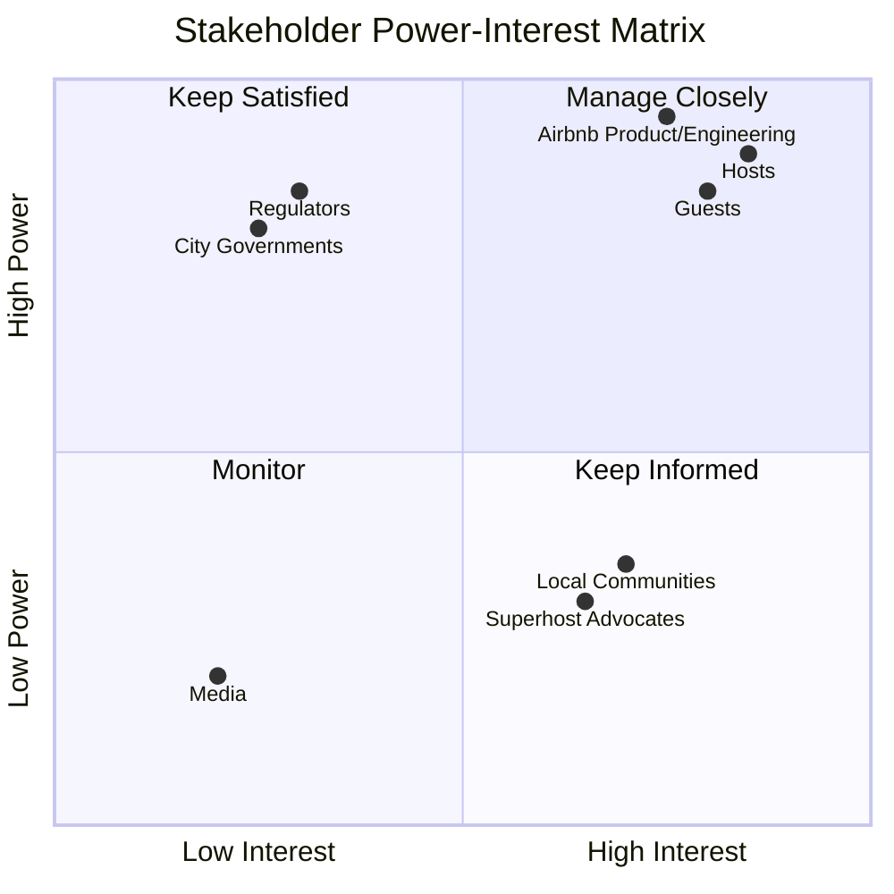
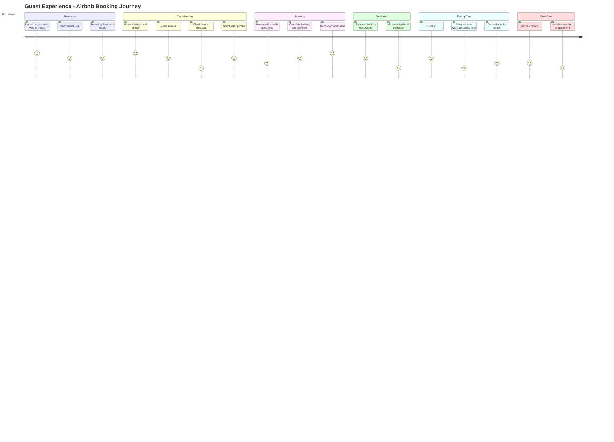
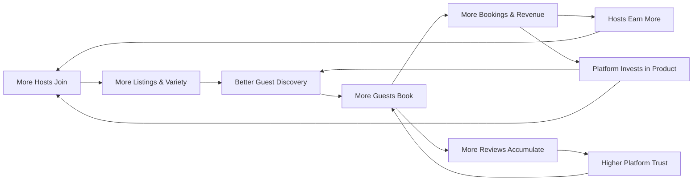
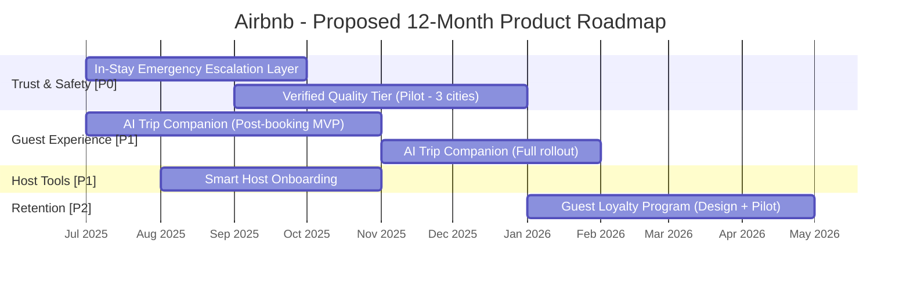

# 🏠 Airbnb Product Management Case Study

---

> **A note on integrity:** Figures in this document (revenue, GBV, nights booked, host and listing counts) are sourced from Airbnb's public SEC filings and shareholder letters, cited in the References section. No primary user research (interviews, surveys) was conducted for this case study. Personas, along with any attributed quotes, are **illustrative composites** built from publicly reported user-sentiment patterns and general travel-industry research, not real individuals. They should be validated with real user interviews before being used to justify a production roadmap decision. Where a specific figure (pricing, adoption rate, conversion uplift) could not be traced to a public source, it is labeled `ASSUMPTION` rather than presented as fact.

---

## Table of Contents

1. [Why This Product](#1-why-this-product)
2. [Executive Summary](#2-executive-summary)
3. [Company Overview](#3-company-overview)
4. [Industry and Market Analysis](#4-industry-and-market-analysis)
5. [Problem Statement](#5-problem-statement)
6. [Stakeholder Analysis](#6-stakeholder-analysis)
7. [Personas](#7-personas)
8. [Jobs To Be Done](#8-jobs-to-be-done)
9. [Customer Journey Map](#9-customer-journey-map)
10. [Business Model and Revenue Streams](#10-business-model-and-revenue-streams)
11. [Product Flywheel and Network Effects](#11-product-flywheel-and-network-effects)
12. [Product Metrics and North Star](#12-product-metrics-and-north-star)
13. [SWOT Analysis](#13-swot-analysis)
14. [Competitor Analysis](#14-competitor-analysis)
15. [UX Audit](#15-ux-audit)
16. [Product Opportunities](#16-product-opportunities)
17. [Feature Prioritization (RICE)](#17-feature-prioritization-rice)
18. [12-Month Product Roadmap](#18-12-month-product-roadmap)
19. [Risks and Mitigation](#19-risks-and-mitigation)
20. [Product Recommendations](#20-product-recommendations)
21. [Product Management Lessons](#21-product-management-lessons)
22. [Reflection](#22-reflection)
23. [Conclusion](#23-conclusion)
24. [References](#24-references)

---

## 1. Why This Product

Airbnb is a compelling subject for a product teardown for three reasons.

First, **it is one of the most complex two-sided marketplace products ever built**. Managing supply (hosts) and demand (guests) simultaneously, across 220+ countries, with no owned inventory, is a fundamentally hard product and business problem.

Second, **the trust and safety challenge is genuinely distinctive**. Airbnb asks two strangers to share a living space based entirely on a digital interface. How a product builds, maintains, and scales trust at a global level is a problem with few close analogues elsewhere in consumer tech.

Third, **Airbnb's 2024-2025 pivot toward AI and experiential travel** signals a significant strategic shift. The company is no longer just a booking platform; it is positioning itself as a lifestyle companion. This shift is a useful case study in how incumbents reinvent themselves without losing their core value proposition.

This case study is not an endorsement of Airbnb. It is a structured attempt to understand how the company thinks, where it has succeeded, and where real product gaps remain.

---

## 2. Executive Summary

Airbnb operates the world's largest short-term rental marketplace, connecting 5 million+ hosts with guests across 220+ countries. In FY2024, the platform generated **$11.1B in revenue** and **$81.8B in Gross Booking Value**, growing 12% year-over-year while remaining GAAP-profitable with a **~40% free cash flow margin**, a rare combination of scale and capital efficiency in consumer marketplaces.

The core strategic tension this document surfaces: **Airbnb's product excels at the pre-booking experience (discovery, browsing, booking) but has a significant, well-documented gap in the post-booking experience** (in-stay support, local discovery, trip management). At the same time, quality consistency across 8 million+ listings remains unverified at the platform level, and regulatory pressure in major cities (New York, Barcelona, Amsterdam) threatens to constrain supply growth in exactly the dense urban markets where the platform is strongest.

This document performs a targeted teardown, company, market, stakeholders, users, before converging on three recommendations: an **AI Trip Companion** to own the post-booking experience, a **Verified Stay quality tier** to address the unverified-quality gap, and a **Guest Loyalty Program** to build retention mechanics the platform currently lacks.

---

## 3. Company Overview

| Attribute | Detail |
|-----------|--------|
| **Founded** | August 2008 |
| **Founders** | Brian Chesky, Joe Gebbia, Nathan Blecharczyk |
| **Headquarters** | San Francisco, California, USA |
| **IPO** | December 2020 (NASDAQ: ABNB) |
| **CEO** | Brian Chesky |
| **Business Model** | Two-sided marketplace (commission-based) |
| **Mission** | "To create a world where anyone can belong anywhere" |

**Origin story:** In October 2007, Brian Chesky and Joe Gebbia were struggling to pay rent in San Francisco. A design conference was coming to the city, and hotels were sold out. They placed three air mattresses in their living room, charged $80/night each, and hosted three strangers, the idea behind "Air Bed and Breakfast," launched with Nathan Blecharczyk as CTO in 2008. The founding story defines Airbnb's product DNA: born from a problem of affordability, belonging, and human connection, values that have shaped every major product decision since.

**Evolution:** After early international expansion (2011-2012) and the launch of Experiences (2014-2016), Airbnb crossed $1B+ revenue in 2017 and acquired HotelTonight in 2018. COVID-19 cratered bookings 70% in 2020, but the company IPO'd that December and returned to growth in 2021 with AirCover (host and guest protection). **2022 was the inflection point**: the biggest product update in a decade and Airbnb's first GAAP-profitable year. Since then, the platform has launched "Rooms" (2023), "Icons" (2024), an AI-powered customer support system that reduced human contact by ~15%, and a 2025 Summer Release rebuilding the app around AI personalization and natural-language search, alongside an AI Travel Concierge (LLM-powered conversational search) and accelerated growth in India (+50% nights booked in 2025).

**PM Insight:** Airbnb's evolution shows a deliberate pattern, consolidate the core, then expand. The 2020 IPO forced financial discipline, which ironically made the product stronger. The post-2022 era is defined by profitable growth and platform depth over breadth.

---

## 4. Industry and Market Analysis

The global short-term rental market generated an estimated **$183 billion in 2024** (Skift Research), with Airbnb holding an estimated **44% share**, up from 28% in 2019, while Booking.com grew from 14% to 18% and Vrbo declined from 11% to 9% over the same period. Structural tailwinds include rising digital nomadism, growing preference for "authentic" local travel experiences, long-stay demand (28+ day stays now 17% of gross nights booked), and emerging-market growth (India nights booked grew 50%+ in 2025). Structural headwinds include short-term rental regulation in major cities (NYC, Barcelona, Amsterdam, Paris), hotel chains investing in alternative accommodation inventory, and cleaning/service fees eroding price competitiveness.

**Sizing:** Global Short-Term Rental Market (~$183B, 2024), Global Travel & Tourism (~$1.5T+), Global Experiences/Activities Market (~$254B), with Airbnb's $81.8B 2024 GBV indicating significant room for continued capture in a fragmented global market. Geographically, North America is the largest revenue region, EMEA is largest by nights booked (201M in 2024), and APAC/Latin America are the fastest-growing regions.

**User demographics (public data):** Users aged 25-34 are the largest segment of visitors (28.18%); 55.59% of website visitors are women; 58% of guest bookings were made via app in 2024 (up from 53% in 2023), with 75%+ of Gen Z users booking via app; families account for ~20% of nights booked, solo travelers ~26%.

---

## 5. Problem Statement

Airbnb's most fundamental product challenge is trust. And trust at scale is not maintained by writing better community guidelines, it's maintained through verifiable, product-embedded signals, but the current signal set (star ratings, reviews, Superhost badges) has known gaps. Guests have no reliable way to verify listing quality before booking beyond self-reported photos and unverified reviews, and hosts face a platform that structurally favors guests in disputes even when evidence is unclear.

Layered on top of the trust problem is a second, distinct one: **the product experience largely ends at booking.** Once a reservation is confirmed, Airbnb provides check-in instructions and basic messaging, but does little to help guests navigate the actual stay, local recommendations, itinerary planning, addressing in-stay issues. This is a significant, unmonetized gap in an otherwise well-designed booking funnel, and it leaves guests dependent on third-party tools (Google, TripAdvisor, ChatGPT) for the part of the trip that matters most.

Both problems compound a third: regulatory risk. Cities that view short-term rentals as reducing housing availability (NYC's Local Law 18 being the clearest precedent) can restrict supply overnight, and the trust and post-booking gaps above make it harder for Airbnb to make the case that its platform delivers differentiated value worth protecting.

---

## 6. Stakeholder Analysis

### Stakeholder Power-Interest Matrix

**Reading the matrix:** Hosts, Guests, and Airbnb's own Product/Engineering org sit in "Manage Closely," they have both the power to affect outcomes and a direct stake in every product decision, which is why the personas and pain-point analysis in this document center on exactly these three groups. Regulators and City Governments sit in "Keep Satisfied," lower day-to-day interest in product specifics, but the power to reshape the entire business model overnight (see the Regulatory Risk Scenario in Risks & Mitigation). Local Communities and Superhost Advocates sit in "Keep Informed," high interest but limited direct power, meaning their influence works indirectly, through regulators and public sentiment, not through the product roadmap directly.

### Stakeholder Needs and Tensions

| Stakeholder | Primary Need | Tension with Platform |
|-------------|-------------|----------------------|
| **Hosts** | Consistent bookings, fair dispute resolution, low platform friction | Platform favors guests in disputes; rising competition from pro hosts |
| **Guests** | Quality assurance, price transparency, responsive support | Inconsistent listing quality; high cleaning fees |
| **Regulators** | Housing availability, tax compliance, safety standards | Airbnb listings reduce housing supply in tight markets |
| **Investors** | Revenue growth, margin expansion, FCF | Growth requires investment that compresses margins short-term |
| **Local Communities** | Neighborhood character, housing affordability | STR supply reduces long-term rental availability |

---

## 7. Personas

> **ASSUMPTION - Reasonable Product Assumption:** The following personas are illustrative composites built from publicly reported Airbnb user-demographic data (Section 4) and general travel-industry research, not from primary interviews with actual Airbnb users. They should be validated with real user interviews before being used to justify a production roadmap decision.

### Persona 1: The Weekend Wanderer (Guest)

| Attribute | Detail |
|-----------|--------|
| **Name** | Priya, 28 |
| **Location** | Mumbai, India |
| **Occupation** | UX Designer at a tech startup |
| **Travel Frequency** | 4-6 trips/year, domestic and Southeast Asia |
| **Budget** | Mid-range (₹3,000-₹8,000/night) |

**Goals:** Find a unique, aesthetically pleasing space; have a smooth, contactless check-in experience; discover local food and activities without over-planning.

**Frustrations:** Cleaning fees feel deceptive when shown only at checkout; reviews sometimes contradict each other with no way to resolve discrepancy; post-booking, no curated local guide from Airbnb, relies on Google.

**JTBD:** *When I'm planning a long weekend escape, I want to find a space that feels personal and local so that I feel like I'm genuinely experiencing the city rather than just sleeping in it.*

### Persona 2: The Seasoned Superhost (Host)

| Attribute | Detail |
|-----------|--------|
| **Name** | Rajesh, 52 |
| **Location** | Goa, India |
| **Occupation** | Former hotel manager, now full-time host |
| **Listings** | 3 (two beach villas, one studio) |
| **Superhost Status** | Maintained for 4+ years |

**Goals:** Maximize occupancy during peak season while protecting the off-season with competitive long-stay pricing; maintain his 4.9 rating with minimal review risk; reduce time spent on repetitive guest messages.

**Frustrations:** Pricing algorithm doesn't always match local market dynamics; dispute resolution heavily favors guests even when evidence is clear; Superhost status can be lost due to a single cancellation outside his control.

**JTBD:** *When I'm managing my three properties during peak season, I want to automate repetitive communications and trust that the platform will back me up in disputes so that I can focus on delivering a great guest experience.*

### Persona 3: The First-Time Host (Host)

| Attribute | Detail |
|-----------|--------|
| **Name** | Ananya, 38 |
| **Location** | Bengaluru, India |
| **Occupation** | Marketing Manager |
| **Situation** | Recently bought a second apartment, wants to offset EMI |
| **Hosting Experience** | Zero, just listed for the first time |

**Goals:** Set up a listing that attracts guests without costly pricing mistakes; understand how to handle the first guest review situation; protect her property without deterring bookings with a high security deposit.

**Frustrations:** The onboarding flow provides general tips but no local market benchmarks; no way to know if her pricing is competitive versus similar listings in her area; scared of a negative first review before establishing her reputation.

**JTBD:** *When I'm setting up my first Airbnb listing, I want clear local pricing guidance and a low-risk first guest experience so that I can build confidence as a host without making expensive early mistakes.*

---

## 8. Jobs To Be Done

| # | JTBD Statement |
|---|---|
| 1 | When I'm choosing where to stay, I want to trust that what I see is what I'll get, so I don't waste money on a misrepresented listing. |
| 2 | When I arrive at my destination, I want guidance on what to do and where to go, so I don't have to research everything myself. |
| 3 | When something goes wrong during my stay, I want fast, fair resolution, so my trip isn't ruined. |
| 4 | When I list my property, I want confidence that pricing and policies are fair to me, not just to guests. |
| 5 | When I travel repeatedly, I want the platform to remember my preferences, so booking gets easier each time. |

---

## 9. Customer Journey Map

**The biggest drop in satisfaction happens between Pre-Arrival and During Stay**, exactly the post-booking gap identified in the Problem Statement. The booking funnel itself (Discovery through Booking) is well-designed; the experience Airbnb provides once a guest has already paid is comparatively thin.

---

## 10. Business Model and Revenue Streams

Airbnb operates a **two-sided marketplace** with an **asset-light** model. It owns no properties, instead taking a commission from transactions between hosts and guests. This model is powerful because it requires no CAPEX on property inventory, network effects accelerate supply and demand simultaneously, and revenue scales with Gross Booking Value without proportional cost growth, reflected in a ~40% FCF margin TTM as of 2024. But the model also has structural tension: the platform must satisfy two economically opposed parties (hosts want maximum revenue, guests want minimum cost), trust and safety costs are high and largely opaque to users, and regulatory risk is real, regulations can restrict supply overnight, as NYC's Local Law 18 demonstrated in 2023.

| Revenue Stream | Description | Estimated Contribution |
|----------------|-------------|----------------------|
| **Guest Service Fee** | 14.2% average of booking subtotal charged to guests | Primary (~60-70%) |
| **Host Service Fee** | ~3% of booking subtotal charged to hosts | Secondary (~25-30%) |
| **Cross-Currency Fee** | Fee for bookings in a different currency (launched Q2 2024) | Growing |
| **Experiences Booking Fee** | Commission on Experience bookings | Niche but growing |
| **Business Travel** | Corporate accounts with enhanced invoicing | Niche |

Airbnb's implied take rate (Revenue ÷ GBV) was approximately **14.1% in Q4 2024**. *Note: Airbnb does not publicly break down revenue by stream; the table above reflects this document's analysis based on publicly available information and Airbnb's stated pricing policies.*

---

## 11. Product Flywheel and Network Effects

Every new host listing expands supply breadth and geographic coverage, increasing the probability any given guest finds a match. More successful bookings generate more reviews, which increase trust and reduce booking friction for future guests. Increased guest activity generates platform revenue, funding product improvements that attract more hosts and guests. **Flywheel accelerators:** AI personalization, Instant Book, Guest Favorites, Superhost program, AirCover. **Flywheel friction points:** high service fees, inconsistent quality, regulatory restrictions on supply, host burnout.

Airbnb exhibits genuine **cross-side network effects**: more guests increase host earnings potential (attracting more hosts), and more host listings improve location/price fit for guests (attracting more guests). Geographic clustering is a particularly strong effect, dense supply in a city makes Airbnb the default option for that market. Network effects are weakest in **Experiences** (thin supply in most cities makes it feel like an underdeveloped separate product), **rural/emerging markets** (sparse host density means the marketplace is thin in both directions), and **long stays** (pro-host operators execute this better, but the product UX still feels designed for short stays).

---

## 12. Product Metrics and North Star

| Metric | FY 2024 Value |
|--------|--------------|
| Revenue | $11.1B (+12% YoY) |
| Gross Booking Value (GBV) | $81.8B (+12% YoY) |
| Free Cash Flow | $4.5B |
| Net Income | ~$2.6B (GAAP profitable) |
| Nights & Experiences Booked | 491.5 million |
| Active Listings | 8 million+ |
| Hosts | 5 million+ |
| App Booking Share | 58% (up from 53% in 2023) |
| Average Daily Rate (ADR) | ~$158 (global avg) |
| Total reviews | 460M+ since inception |

**Proposed North Star Metric: Nights and Experiences Booked (NEB).** This is the right choice for three reasons: it captures both supply and demand health (a booking requires both a host to list and a guest to book); it correlates directly with host earnings, the primary value proposition for supply; and it drives revenue directly, since GBV and revenue are functions of NEB multiplied by ADR. What NEB alone misses: quality of experience (a guest can book and have a terrible stay), return guest rate, and host satisfaction. **Complementary metrics worth tracking alongside NEB:** Repeat Booking Rate (% of guests who book again within 12 months), Host Retention Rate (% of hosts remaining active quarter-over-quarter), and Guest NPS by stay type (differentiating quality across Homes, Rooms, Experiences).

---

## 13. SWOT Analysis

**Strengths:** Brand recognition and trust, one of the most recognized travel brands globally. Supply depth, 8M+ listings across 220+ countries. Network effects, self-reinforcing host-guest flywheel. Financial strength, $4.5B FCF (2024), $11.4B cash reserves (mid-2025). Asset-light model, no owned inventory, high FCF margins. Review moat, 460M+ reviews, irreplaceable competitive data. AI investment, AI customer support reduced human contact by ~15%.

**Weaknesses:** Post-booking experience gap (Problem Statement, Section 5). Unverified listing quality at scale. Fee-stacking perception among price-sensitive guests. Dispute resolution seen as guest-favoring by hosts.

**Opportunities:** AI-powered post-booking companion to own the full trip lifecycle. Verified-quality tier to differentiate from unverified competitors. Loyalty program to build retention mechanics the platform currently lacks. Long-stay and remote-work segment growth.

**Threats:** Regulatory restriction in major cities (NYC precedent already established, Barcelona and Amsterdam moving similarly). Hotel chains investing in alternative accommodation inventory. Booking.com and Vrbo closing the UX and brand-trust gap.

---

## 14. Competitor Analysis

| Competitor | Position vs. Airbnb | Key Differentiator |
|---|---|---|
| **Booking.com** | Larger overall OTA, growing STR share (18% vs. Airbnb's 44%) | Hotel + STR hybrid inventory, stronger in Europe |
| **Vrbo (Expedia)** | Declining share (9%, down from 11% in 2019) | Whole-home focus, family/vacation-rental positioning |
| **Hotel chains (Marriott, Hilton)** | Investing in alternative accommodation inventory | Loyalty programs, consistent quality standards Airbnb lacks |
| **Local/regional OTAs** | Long-tail, 29% combined share (down from 47% in 2019) | Local market knowledge, lower fees in some regions |

**PM Insight:** Airbnb's 16-point share gain (28% to 44%) since 2019 came disproportionately from the long-tail/local-OTA segment, not from Booking.com or Vrbo directly. This suggests Airbnb's moat is consolidation of a previously fragmented market through brand trust and network effects, not head-to-head feature competition with its nearest-scale rivals. The more relevant strategic question isn't "how do we beat Booking.com," it's "how do we keep converting the remaining long-tail share while defending against hotel chains building comparable alternative-accommodation trust signals."

---

## 15. UX Audit

Airbnb's **pre-booking flow** (search, browse, compare, book) is genuinely best-in-class: high-quality photography standards, clear pricing display (improved by the 2024 transparent pricing initiative), and a fast, low-friction checkout. The **post-booking flow** is comparatively thin: check-in instructions are functional but static, there is no proactive local guidance, and in-stay issue resolution requires guests to initiate contact rather than the platform anticipating needs. **Search and discovery** benefit from the 2025 natural-language search upgrade, but filtering for verified quality signals (beyond Superhost status) remains limited. **Host-side tools** (calendar management, pricing recommendations, guest messaging) are functional but reactive, the pricing algorithm doesn't always reflect hyperlocal market dynamics, a recurring host complaint (Persona 2).

---

## 16. Product Opportunities

Three structural gaps, each traced to a specific finding earlier in this document, define the opportunity space: **(1) Post-booking product desert** (Customer Journey, Section 9), the platform under-invests in everything after check-in. **(2) Unverified quality floor** (SWOT, Section 13), no embedded, verifiable quality signal beyond self-reported photos and reviews. **(3) Absent retention mechanism** (Competitor Analysis, Section 14), unlike hotel chains, Airbnb has no structured loyalty program despite a 44% market-leading position that could support one.

---

## 17. Feature Prioritization (RICE)

| Initiative | Reach | Impact | Confidence | Effort | RICE Score |
|---|---|---|---|---|---|
| In-Stay Emergency Layer | 8 | 3 | 85% | 4 | **720** |
| Smart Host Onboarding | 7 | 2 | 90% | 3.5 | **340** |
| AI Trip Companion | 9 | 3 | 70% | 6 | **360** |
| Guest Loyalty Program | 6 | 3 | 75% | 6 | **225** |
| Verified Quality Tier | 5 | 3 | 70% | 6 | **187** |

**Why In-Stay Emergency Layer is P0:** Highest confidence (known, documented problem). Moderate effort but high safety impact. Trust damage from mid-stay incidents is disproportionately brand-damaging. Directly supports regulatory conversations (safety compliance).

**Reconciling this table with the three recommendations in Section 20:** In-Stay Emergency Layer (720) and Smart Host Onboarding (340) both outscore all three features developed into full recommendations. That is deliberate, not an oversight, and the two priority lists are answering different questions.

- **In-Stay Emergency Layer** is correctly P0 on a near-term execution roadmap: it is cheap, well-understood, and directly reduces safety and trust risk (see Risks & Mitigation, Section 19, where it already appears as the named mitigation for the highest-impact risk in this document). It does not need a separate "recommendation" write-up because it is not a strategic bet requiring justification, it is an operational fix any competent safety-conscious team would prioritize immediately, RICE score or not.
- **Smart Host Onboarding** scores well because it is low-effort and high-confidence, but it optimizes the supply side of a marketplace that is already Airbnb's stronger side (SWOT, Section 13). Its RICE score reflects ease of execution, not strategic leverage.
- **The three developed recommendations were selected for structural leverage, not RICE ranking.** AI Trip Companion, Verified Quality Tier, and Guest Loyalty Program each address a **structural gap** identified earlier in this document (the post-booking product desert; the unverified quality floor; the absent retention mechanism, Section 16), not just a near-term optimization. RICE rewards well-understood, low-effort wins; it systematically undervalues bets whose payoff compounds over multiple years and is harder to estimate with confidence today, which is exactly why their Confidence scores in the table above are the three lowest (70-80%) despite addressing the case study's biggest strategic findings. A complete roadmap runs both lists in parallel: ship the high-RICE operational fixes on a near-term track (Section 18), while resourcing the lower-RICE, higher-leverage strategic bets on a separate track, rather than letting the RICE table alone decide the roadmap.

---

## 18. 12-Month Product Roadmap

*(Dates are illustrative planning assumptions for this exercise, not confirmed Airbnb roadmap commitments.)*

---

## 19. Risks and Mitigation

| Risk | Probability | Impact | Mitigation Strategy |
|------|------------|--------|---------------------|
| **Regulatory supply reduction** | High | High | Diversify supply geographically; invest in Airbnb-Friendly Apartments model to build compliant supply |
| **Safety incident (high-profile)** | Medium | Very High | Invest in In-Stay Emergency Layer (P0); improve listing inspection pilot; faster AirCover resolution |
| **Booking.com closes UX gap** | Medium | Medium | Accelerate AI personalization advantage; build loyalty lock-in before competitors do |
| **AI features don't meet user quality bar** | Medium | Medium | Ship AI features iteratively; human escalation always available; A/B test adoption metrics |
| **Host burnout / supply decline** | Medium | High | Host Onboarding investment; improve dispute resolution fairness; reduce hosting friction |
| **Macroeconomic recession** | Low-Medium | High | Lean into long stays and value-tier inventory; expand "Rooms" positioning as affordable alternative |
| **Loyalty program drives unprofitable behavior** | Low | Medium | Cap points redemption, focus on non-monetary rewards (Superhost perks, priority support) |

### Regulatory Risk Scenario: What If the NYC Pattern Spreads?

The "Regulatory supply reduction" row above is the single highest-rated risk on this table (High/High), but the mitigation as written is generic. Worth gaming out the scenario explicitly, since it is not hypothetical, it has already happened once.

**Precedent:** NYC's Local Law 18 (2023) is not a theoretical risk, it materially reduced short-term rental supply in one of Airbnb's largest US markets. Barcelona and Amsterdam are named regulatory hotspots moving in a similar direction (Section 4).

**Downside scenario (illustrative, ASSUMPTION):** If 3-5 additional major-market cities (candidates already flagged in this document: Barcelona, Amsterdam, Paris) adopt NYC-comparable restrictions over the next 12-24 months, and these cities collectively represent a meaningfully above-average share of EMEA bookings given their tourism density, a plausible illustrative range is a **mid-single-digit percentage reduction in global GBV**, concentrated disproportionately in EMEA rather than spread evenly across the platform. This is a scale estimate to reason about the problem, not a disclosed or predicted figure.

**Why this is a product risk, not just a legal one:** a wave of city-level restrictions doesn't just remove supply, it removes it unevenly, concentrated in exactly the dense urban markets where Airbnb's brand and search-ranking algorithms are most optimized. Rebuilding comparable supply density in newly compliant formats (see Airbnb-Friendly Apartments, below) takes years, not quarters, meaning the revenue impact likely front-loads faster than the mitigation can offset it.

**Plausible response, beyond "diversify geographically":** the Airbnb-Friendly Apartments model (partnering directly with landlords who pre-clear units for compliant short-term rental, similar to approaches already used in regulated European markets) is the most concrete lever named in this document, because it changes the supply's legal status rather than just its geographic distribution. A useful leading indicator to track: the ratio of "Friendly Apartments" supply growth to regulatory-restricted supply loss, city by city, rather than a single global GBV number that would mask exactly where the risk is concentrated.

---

## 20. Product Recommendations

### Recommendation 1: Build the "AI Trip Companion": Own the Post-Booking Experience

**What it is:** An AI-powered assistant that activates after booking confirmation, offering personalized local recommendations, itinerary suggestions, and proactive check-in guidance, all grounded in the host's local knowledge and the specific listing's context.

**Why now:** The AI infrastructure is already being built (Airbnb rebuilt its tech stack in 2024-2025 for AI). The marginal cost of extending this intelligence to the post-booking layer is relatively low compared to the retention value.

**Why this is defensible, not just a feature Booking.com or Expedia could copy:** a generic post-booking assistant is not defensible on its own, both competitors already ship comparable trip-management notifications. The defensibility comes from what only Airbnb can ground the recommendations in: **host-supplied local knowledge at the specific listing** (a host's own neighborhood tips, not a generic city guide) and **behavioral data from the two-sided marketplace itself** (what past guests at this exact property, or similar properties in this micro-neighborhood, actually did nearby). A hotel-chain competitor has neither of these signals, and a pure OTA like Booking.com has the booking data but not the host relationship that makes hyper-local, listing-specific recommendations credible. The differentiation is the data source, not the AI layer, which is a commodity any competitor can build.

**Trade-off:** There is a risk of over-notification fatigue. This must be designed with strict permission controls and opt-in mechanics.

### Recommendation 2: Introduce a "Verified Stay" Quality Tier

**What it is:** A paid, opt-in verification program where Airbnb (or a trusted third-party inspector) physically confirms a listing matches its photos and description, addressing the unverified-quality gap named throughout this document.

**Why this works:** It creates a premium supply tier with higher booking probability, incentivizing hosts to opt in. Guests can filter by "Verified" and book with significantly higher confidence. This is the kind of trust investment that makes regulatory conversations easier too.

**Pilot viability math (illustrative, ASSUMPTION):** Airbnb does not disclose per-city host counts, so the figures below are constructed to size the pilot, not asserted as fact.

| Adoption scenario | Hosts opting in (5-city pilot, illustrative base of ~200K hosts) | Annual verification revenue (at $200 avg fee) | Read |
|---|---|---|---|
| Low (5%) | ~10,000 | ~$2M | Covers inspector cost in only the highest-density neighborhoods; pilot likely subsidized |
| Moderate (15%) | ~30,000 | ~$6M | Roughly self-funding once local inspection-vendor contracts are at scale |
| High (30%) | ~60,000 | ~$12M | Only plausible if "Verified" measurably lifts booking probability enough that hosts see the fee as a growth investment, not a cost |

**The pilot's real test is not revenue, it's the conversion-uplift number.** The fee only justifies itself to hosts if Verified listings convert meaningfully better than unverified ones in the same search results. If that lift is under roughly 5-10%, most hosts will not renew the fee in year two regardless of how the pilot is marketed, and the tier degrades into a badge only the highest-end hosts bother with. The 3-5 city pilot exists specifically to measure this number before any wider commitment.

**Trade-off:** Physical inspection at scale is expensive and logistically complex. Starting with 3-5 cities as a paid pilot, then expanding based on conversion uplift, is the right sequencing.

### Recommendation 3: Launch a Guest Loyalty Program

**What it is:** A tiered loyalty program (Explorer, Adventurer, Voyager) rewarding repeat bookings with benefits like priority support, flexible cancellation, and early access to "Icons" listings, addressing the absent-retention-mechanism gap versus hotel-chain competitors.

**Why this works:** Airbnb's 44% market-leading share has no structured mechanism to convert into retention the way hotel loyalty programs do. Guest NPS by stay type (proposed complementary metric, Section 12) would directly measure whether this program is improving satisfaction, not just redemption volume.

**Trade-off:** Poorly designed loyalty mechanics can condition unprofitable behavior (chasing points rather than genuine repeat value). Caps on points redemption and a bias toward non-monetary rewards (Superhost perks, priority support) mitigate this.

---

## 21. Product Management Lessons

### 1. Trust is a product feature, not a values statement
Airbnb's most fundamental product challenge is trust. Trust at scale is not maintained by writing better community guidelines, it's maintained through verifiable, product-embedded signals: reviews, AirCover, Superhost, identity verification, Instant Book. For any product where users share sensitive personal data, this suggests trust architecture must be designed from day zero, not retrofitted.

### 2. A booking funnel and a product experience are not the same thing
Airbnb's pre-booking flow is excellent; its post-booking flow is a significant, well-documented gap. It's possible to build a world-class conversion funnel while under-investing in the actual experience a customer paid for.

### 3. Marketplace products serve two customers who sometimes conflict
Every host-facing decision (dispute resolution, pricing algorithms, cancellation policy) has a guest-facing trade-off, and vice versa. A marketplace PM's ranking and policy decisions are the arbitration mechanism between two parties with genuinely opposed incentives.

### 4. Regulatory risk is a product constraint, not just a legal one
NYC's Local Law 18 didn't just create legal exposure, it removed supply unevenly, concentrated in exactly the dense markets where the product is strongest. Treating regulation as purely a legal/policy concern misses its direct product and roadmap implications.

### 5. Prioritization requires honest trade-offs, not wish lists
The RICE scoring exercise is a useful discipline precisely because it resists the temptation to score every feature high on Impact and Confidence. Honest prioritization requires choosing what NOT to build, which is just as important as choosing what to build.

---

## 22. Reflection

The most instructive parts of this case study turned out to be the user personas, the customer journey, and the UX audit, more so than the business model and competitive analysis.

The reason is that all three force a shift from thinking like an analyst to thinking like a user.

The persona for "Ananya, the first-time host in Bengaluru" surfaces what it feels like to publish a first listing with no certainty anyone will ever book it, the anxiety of being a supply-side participant in a marketplace you don't control. That framing is a useful lens for any two-sided marketplace, not just Airbnb.

The UX audit reinforces a broader point: elegant product design doesn't mean beautiful UI. It means eliminating sources of user anxiety at every step of the journey. Airbnb's pre-booking experience is genuinely good. Its post-booking experience is a product gap that no amount of good marketing can compensate for.

The Verified Stay recommendation is the clearest illustration of a more general principle worth carrying into other trust-dependent products: trust should not be retrospective and review-based alone. Embedded, verifiable quality signals, whether that's credentials, sourced claims, or transparent data-usage policies, do more structural work than after-the-fact ratings.

---

## 23. Conclusion

Airbnb has built one of the most efficient, capital-light marketplace businesses in consumer tech. But its next phase of growth is not about adding more listings, it's about deepening the value delivered per booking. The post-booking gap, the unverified quality floor, and the absent retention mechanism are not minor UX polish items; they are structural gaps that leave real value uncaptured and leave the platform more exposed to regulatory and competitive pressure than its market position suggests it should be.

My three recommendations, AI Trip Companion, Verified Stay quality tier, and Guest Loyalty Program, are not moonshots. They are logical, evidence-based extensions of what Airbnb already does well, applied to the areas where the product falls short.

Airbnb's next product era will be defined by whether it can evolve from a **booking platform** to a **travel companion**. The AI infrastructure investment in 2024-2025 suggests the foundation is being built. The question is whether the product team will use it to fix the fundamentals or chase new categories prematurely.

The right sequence is to fix the fundamentals first, then expand.

---

## 24. References

**Financial and operational data:** Airbnb, Inc. SEC filings (Form 10-K, FY2024 Annual Report), Airbnb quarterly earnings releases and shareholder letters (2024-2025), via `news.airbnb.com` and investor relations disclosures.

**Market sizing and share estimates:** Skift Research (2025), global short-term rental market sizing and platform share estimates.

**Company history and product launches:** Airbnb newsroom (`news.airbnb.com`), official announcements on AirCover, Summer Release 2022/2025, Icons, Rooms, and AI Travel Concierge.

**Regulatory precedent:** Public reporting on New York City's Local Law 18 (2023) and its impact on short-term rental supply.

> **Last Updated:** June 2026

---

*This case study was created for portfolio and learning purposes. All financial and statistical data is sourced from publicly available information. This document reflects no access to Airbnb's internal data. Recommendations are based on publicly available product research and independent analysis.*