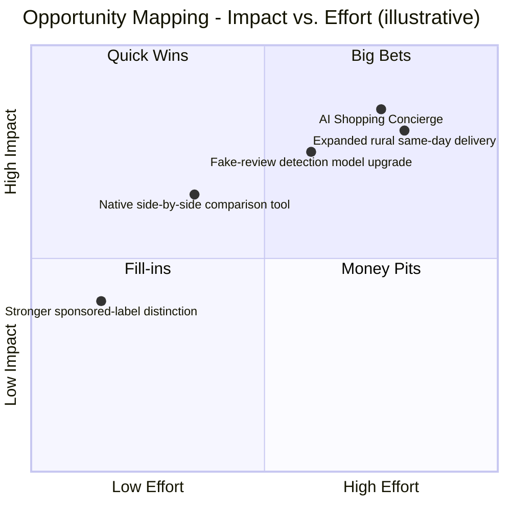
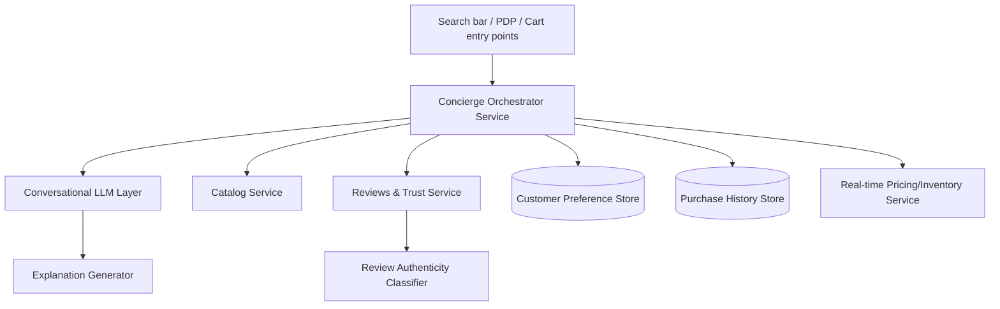
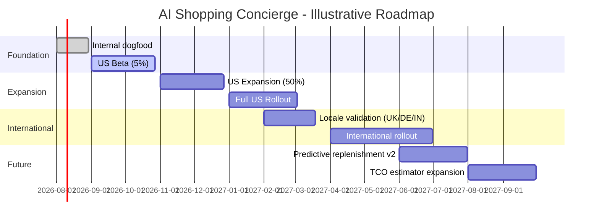

# 🛒 Amazon: Product Management Case Study

> A deep, evidence-based teardown of Amazon's consumer marketplace: strategy, metrics, AI systems, and a full PRD for a proposed **AI Shopping Concierge** feature.

---

## Repository Metadata

| Field | Value |
|---|---|
| Product analyzed | Amazon Shopping (consumer marketplace), with ecosystem context from Prime, Advertising, Alexa, Logistics, Payments |
| Company | Amazon.com, Inc. (NASDAQ: AMZN) |
| Domain | Global E-commerce Marketplace |
| Category | Marketplace, E-commerce, AI, Logistics, Cloud Ecosystem, Retail Media |
| Primary competitors covered | Walmart, Flipkart, eBay, Temu, Alibaba, Meesho, Target, Best Buy |
| Last updated | July 2026 |
| Data cutoff | Public information available through mid-2026 (see References) |

**Methodology note:** Every figure in this document is either (a) sourced from Amazon's official SEC filings, investor relations releases, or aboutamazon.com/Amazon Science publications, (b) explicitly labeled as a **third-party industry estimate**, or (c) explicitly labeled as an **assumption made for educational purposes**. Where Amazon has not publicly disclosed a number (e.g., exact Prime membership count since 2021, or internal AI model architectures), this document says so directly rather than inventing a figure.

---

## Table of Contents

1. [Executive Summary](#1-executive-summary)
2. [Company Overview](#2-company-overview)
3. [Problem Statement](#3-problem-statement)
4. [Market and Industry Overview](#4-market-and-industry-overview)
5. [Competitor Analysis](#5-competitor-analysis)
6. [SWOT Analysis](#6-swot-analysis)
7. [Revenue Model](#7-revenue-model)
8. [Personas](#8-personas)
9. [Jobs To Be Done](#9-jobs-to-be-done)
10. [AI Capabilities and Trust and Safety](#10-ai-capabilities-and-trust-and-safety)
11. [Product Metrics and North Star](#11-product-metrics-and-north-star)
12. [Growth Strategy](#12-growth-strategy)
13. [Pain Points](#13-pain-points)
14. [Opportunity Mapping](#14-opportunity-mapping)
15. [RICE Prioritization](#15-rice-prioritization)
16. [Feature Proposal: AI Shopping Concierge](#16-feature-proposal-ai-shopping-concierge)
17. [PRD: AI Shopping Concierge](#17-prd-ai-shopping-concierge)
18. [Rollout and A/B Testing Plan](#18-rollout-and-ab-testing-plan)
19. [KPI Dashboard](#19-kpi-dashboard)
20. [Product Roadmap](#20-product-roadmap)
21. [Risks and Mitigation](#21-risks-and-mitigation)
22. [Future Vision](#22-future-vision)
23. [PM Lessons](#23-pm-lessons)
24. [References](#24-references)
25. [Closing Note](#25-closing-note)

---

## 1. Executive Summary

Amazon Shopping is the world's largest consumer marketplace product, generating **$716.9B in FY2025 net sales** across a first-party retail business and a third-party marketplace that now accounts for **61-62% of paid units sold**. The product sits at the center of an ecosystem, Prime, Advertising, Alexa for Shopping, Logistics, Payments, that together make Amazon less a retailer and more a full-stack commerce operating system.

The core strategic tension this document surfaces: **Amazon's greatest structural advantage, near-infinite selection, is also its biggest UX liability.** More sellers and more listings without proportional investment in ranking, trust, and discovery makes shopping *harder*, not easier, and this decision-fatigue problem is well-documented in independent consumer research. At the same time, Amazon's US e-commerce market share has plateaued around 36-38% (down from a 2021 peak near 42%), and a new class of general-purpose AI shopping agents (ChatGPT, Gemini, Claude) threatens to intercept the "first moment of research," the point at which a customer decides what to buy, before that customer ever opens Amazon.

This document performs a targeted teardown, company, market, users, pain points, before converging on one recommendation: an **AI Shopping Concierge** that extends Amazon's existing Alexa for Shopping investment to directly address decision fatigue and trust erosion at the moment of highest-consideration purchases, while defending the "first moment of research" against disintermediation.

---

## 2. Company Overview

**Amazon Shopping** is the consumer-facing storefront (web at amazon.com and 20+ country domains, plus native iOS/Android apps) through which customers search, discover, compare, purchase, and manage returns for products sold both directly by Amazon (first-party/1P retail) and by independent third-party sellers (3P marketplace). This third-party share, 61-62% of paid units, makes Amazon Shopping fundamentally a *marketplace* product, not merely a retail storefront, a distinction that shapes almost every product decision discussed in this document, from search ranking (which must fairly rank 1P and 3P listings) to trust and safety (which must police hundreds of millions of third-party listings).

The product sits inside a wider ecosystem: **Prime** (subscription membership bundling fast/free shipping, streaming, and increasingly AI features), **Advertising** (sponsored placements, one of Amazon's highest-margin businesses), **Alexa for Shopping** (formerly "Rufus," rebranded May 2026, the generative-AI conversational layer embedded in search and product pages), the **Logistics network** (owned/leased fulfillment centers and last-mile fleet), **Payments** (Amazon Pay, stored credentials reducing checkout friction), and **Kindle** (increasingly integrated into cross-sell). This case study focuses on the consumer marketplace and does not attempt a deep teardown of AWS, which, while central to Amazon's profitability, is a distinct B2B cloud-infrastructure product with its own customer base.

**History:** Amazon.com, Inc. was founded by **Jeff Bezos** in 1994, launching in July 1995 as an online bookstore, a category chosen because its near-infinite catalog variety was something no physical store could stock. The company went public in 1997, introducing the "Day 1" philosophy: operate with startup urgency, because "Day 2" complacency leads to "stasis, followed by irrelevance, followed by excruciating, painful decline, followed by death." Amazon expanded into a general marketplace via **Amazon Marketplace** (2000), opening the platform to third-party sellers, arguably the single decision most responsible for Amazon's current scale. **AWS** launched in 2006; **Amazon Prime** launched in 2005 as a $79/year shipping subscription and has since become the retention backbone of the entire business. Andy Jassy, previously founder and CEO of AWS, became CEO in 2021, a signal of how central cloud/AI infrastructure thinking has become to Amazon's overall strategy. In FY2025, Amazon's three reported segments generated: North America **$426.3B**, International **$161.9B**, AWS **$128.7B** in net sales.

**Mission:** "To be Earth's most customer-centric company," built on four pillars: customer obsession, passion for invention, operational excellence, and long-term thinking. Layered onto that mission are the operating principles that most directly shape the shopping product: **Selection**, **Price**, **Convenience**, **Speed**, **Trust**, and **Personalization & AI**.

**PM Insight:** Most companies pick 2-3 of {selection, price, convenience, speed}. Amazon's specific bet, enabled by scale economics and the 3P marketplace, is that it doesn't have to choose, and that combination is what's hardest for any single competitor to replicate. Walmart can match price and (in the US) speed via physical stores; Temu can match price but not speed or trust; Flipkart can match selection and price in India but not Amazon's logistics precision at Amazon's global scale.

---

## 3. Problem Statement

Amazon's core product tension is that its greatest strength (near-infinite selection, enabled by the 3P marketplace) directly creates its most persistent weakness (decision fatigue and search/comparison difficulty). A customer searching for a common product category, say, phone cases, often faces dozens of near-duplicate listings with minimal differentiating information, unreliable review signals, and no easy way to understand genuine trade-offs between options.

This is compounded by two trust problems that are well-documented in independent consumer and seller-community reporting, but not comprehensively disclosed by Amazon itself: **fake or incentivized reviews**, and **counterfeit goods**, particularly in categories like electronics accessories and apparel. Amazon has invested visibly in countermeasures (ML-based fraud detection, "Project Zero," brand registry tools, legal action against review-manipulation brokers), but this remains a genuine, unresolved tension rather than a solved problem.

Layered on top of both is a strategic-level threat: general-purpose AI shopping agents are emerging as an alternate entry point to shopping, ahead of typing into a retailer's own search bar. If customers increasingly do their product research inside ChatGPT, Gemini, or Claude rather than on Amazon, Amazon risks losing the "first moment of research," and with it, the entire downstream purchase decision, even if the transaction eventually still happens on Amazon's platform.

---

## 4. Market and Industry Overview

Global e-commerce continues to grow faster than total retail. Industry estimates put **US e-commerce sales at roughly $1.25 trillion in 2025**, rising toward **$1.38 trillion in 2026**, with online penetration around **21-22% of total US retail**, meaning the large majority of retail spend is still offline, which is why Amazon continues to invest in categories (grocery, pharmacy, same-day) where online penetration is still low.

Within this market, **Amazon holds an estimated 35.7%-37.6% share of US retail e-commerce** (estimates vary by methodology/source; Statista, Marketplace Pulse, and eMarketer converge in this range), down from a peak of roughly **41.8% in 2021**. This is a market-share plateau, not a decline in absolute dollars, but it does mean competitors are capturing a growing share of *incremental* market growth: Walmart (~6.4% share, growing faster than Amazon off a smaller base), Shopify-powered independent merchants (~14% in aggregate), Temu, and TikTok Shop.

The industry in 2026 is shaped by four forces: **(1) AI-mediated discovery**, generative AI assistants becoming an alternate entry point to shopping; **(2) retail media**, sponsored placements becoming structurally higher-margin than product sales themselves; **(3) cross-border, factory-direct competition**, Temu and Shein removing traditional markup layers (though 2025 changes to US "de minimis" customs exemptions raised costs for this model); and **(4) logistics as a shared utility**, same-day/same-hour delivery increasingly requiring micro-fulfillment centers close to demand, narrowing Amazon's historical speed advantage in dense urban markets.

**PM Insight:** Amazon's moat is shifting from "we have the biggest catalog" (largely commoditized now) toward "we have the most trustworthy, fastest, most personalized AI-assisted decision layer on top of that catalog." That reframing is the strategic logic behind both Alexa for Shopping and the AI Shopping Concierge proposal later in this document.

**Sizing (TAM/SAM/SOM):** TAM (global e-commerce retail spend) is roughly **$7.4 trillion** (2026 projection). SAM (e-commerce spend in the ~19 countries/regions where Amazon operates a retail marketplace) is several trillion USD, though an exact figure isn't independently verifiable from public data, so this document presents it as a directional midpoint rather than false precision. SOM (Amazon's actual captured net sales) is the official **$716.9 billion** FY2025 figure.

---

## 5. Competitor Analysis

| Competitor | Primary battleground vs. Amazon | Est. scale | Key differentiator |
|---|---|---|---|
| **Walmart** | US general merchandise + grocery, omnichannel | ~$713B revenue (FY2026, near-parity with Amazon); ~6.4% US e-commerce share, growing ~3x faster off a smaller base | 4,600+ US physical stores doubling as fulfillment/pickup points; grocery strength |
| **Flipkart** (Walmart-owned) | India marketplace | ~47% India e-commerce share vs. Amazon India's ~30-35%; ~$9.8B FY2025 revenue (est.) | Deep tier-2/tier-3 India penetration; Myntra (fashion) |
| **eBay** | C2C, used/collectible goods, auctions | ~3% US e-commerce share | Auction model, no owned-inventory competition with sellers |
| **Temu** (PDD Holdings) | Ultra-low-price, factory-direct goods | ~$70B+ annual revenue (est.); 290M+ MAU (est.) | Direct-from-manufacturer pricing; prompted Amazon's "Haul" storefront response |
| **Alibaba** | Global (esp. China) marketplace + cloud | Comparable diversified model to Amazon (retail + cloud) | Dominant in China; Amazon has limited direct China consumer presence |
| **Meesho** | India social/reseller commerce | Fast-growing India platform, no membership fee model | Zero-commission-era growth strategy, social selling |
| **Target** | US general merchandise, style-forward retail | ~1.9% US e-commerce share | Curated assortment, store experience, private label strength |
| **Best Buy** | Consumer electronics category specialist | Category-specific competitor | In-store expert service (Geek Squad), electronics specialization |

**PM Insight:** Amazon's competitive set isn't one company, it's a different challenger per axis: Walmart on omnichannel/grocery, Temu on price, Flipkart/Meesho on India-specific reach, Best Buy/Target on curated category experience. No single competitor threatens Amazon's *combination* of selection + speed + trust, which is precisely why Amazon's product strategy optimizes for defending that combination rather than winning any single axis outright.

---

## 6. SWOT Analysis

**Strengths:** Largest 3P marketplace selection combined with owned logistics at global scale. Prime as a high-retention subscription bundling shipping + entertainment + (now) AI. Highest-margin, fastest-growing ad business among retailers. Deep first-party purchase-history data, an advantage no external AI agent can replicate.

**Weaknesses:** Search/recommendation quality strained by sheer catalog size, "decision fatigue" is a named, recurring customer complaint. Counterfeit and fake-review problems persist despite continuous investment. Seller experience complexity creates friction and diversification pressure toward Walmart/Shopify. US e-commerce share has plateaued since 2021, signaling maturity in the core market.

**Opportunities:** Becoming the default AI shopping layer (Alexa for Shopping) before third-party AI agents intercept research intent. Grocery and healthcare, where online penetration is still comparatively low. International markets (India, Latin America) where Amazon is not yet the runaway leader. Same-day/rural delivery expansion.

**Threats:** Third-party general-purpose AI shopping agents (ChatGPT, Gemini, Claude) disintermediating product discovery. Regulatory scrutiny of marketplace fairness (1P vs. 3P ranking). Continued erosion of US e-commerce share to Walmart and factory-direct competitors.

---

## 7. Revenue Model

Amazon Shopping's revenue is not a single stream but a layered model: **(1) 1P retail margin**, traditional markup on Amazon-owned inventory, net product sales of **$296.3B FY2025**; **(2) 3P seller services**, referral, fulfillment (FBA), and storage fees, an estimated **$172.2B for full-year 2025**; **(3) Subscription services**, Prime, Music, Kindle Unlimited, Audible, **$49.6B in FY2025**, up 11.8% YoY; **(4) Advertising**, sponsored products/brands/display, estimated **$68B+ in 2025**, growing over 20% YoY and structurally higher-margin than retail; and **(5) AWS** ($128.7B FY2025), out of scope for this product but the profit engine funding shopping-experience R&D.

**PM Insight:** The shift in revenue mix, services now exceeding product sales ($420.7B vs. $296.3B), is the single most important financial fact for a Shopping PM to internalize. Amazon Shopping's job is increasingly to be a high-quality, high-trust *storefront and discovery layer* on top of a marketplace and ad business, not to maximize 1P retail margin directly.

---

## 8. Personas

> **ASSUMPTION - Reasonable Product Assumption:** The following personas are illustrative composites built from publicly reported shopper-behavior patterns, not primary interviews with actual Amazon customers. They should be validated with real user research before being used to justify a production roadmap decision.

### Persona 1: "Convenience-First Chris"
Busy professional who values speed and reliability over price comparison. Reorders the same items via Subscribe & Save. Primary need: minimal decision-making friction. Main frustration: too many near-identical options when buying something new.

### Persona 2: "Research-Heavy Rhea"
Compares 5+ products before any high-consideration purchase (electronics, appliances). Reads reviews extensively, distrusts star ratings alone, often opens multiple tabs across Amazon and competitor sites. Main frustration: no easy way to get an honest, structured comparison in one place.

### Persona 3: "Deal-Hunter Devesh" (India context)
Highly price-sensitive, compares Amazon India against Flipkart and Meesho before every purchase. Uses coupons, cashback, and festival-sale timing aggressively. Main frustration: doesn't trust that Amazon's price is genuinely the best without manually checking elsewhere.

### Persona 4: "Small Seller Priya"
Runs a small business selling through Amazon's 3P marketplace. Cares about fair search ranking versus Amazon's own private-label products, predictable fee structures, and clear policy communication. Main frustration: fee and policy changes with limited advance notice.

---

## 9. Jobs To Be Done

| # | JTBD Statement |
|---|---|
| 1 | When I need something common and low-consideration, I want to reorder or buy it in one tap, so I don't waste time re-deciding. |
| 2 | When I'm making a high-consideration purchase, I want an honest comparison of my real options, so I don't have to manually cross-reference reviews and specs myself. |
| 3 | When I'm unsure if a listing's reviews are trustworthy, I want a clear signal, so I don't get misled into a bad purchase. |
| 4 | When I run a small business on the marketplace, I want predictable, fairly-enforced rules, so I can plan my operations with confidence. |
| 5 | When I'm price-sensitive, I want confidence that I'm getting the best available deal, so I don't feel the need to manually check competitors. |

**PM Insight:** Nearly every core JTBD is fundamentally about *reducing effort or reducing risk*, never about "more selection." This validates that discovery/trust tooling (like the proposed AI Shopping Concierge) addresses a more valuable job than simply adding more catalog depth.

---

## 10. AI Capabilities and Trust and Safety

Amazon's generative-AI shopping layer, launched in beta as "Rufus" in 2024 and unified with Alexa+ into **"Alexa for Shopping" in May 2026**, is the clearest signal that Amazon views conversational AI as core shopping infrastructure, not an experimental add-on. This existing investment, and the purchase-history data and catalog knowledge graph it's already built on, is the foundation the AI Shopping Concierge recommendation (Section 16) extends, rather than a net-new AI system requiring separate infrastructure.

On trust and safety, Amazon has publicly described ongoing investment in ML-based fraud detection, counterfeit-detection programs ("Project Zero," brand registry tools), and review-manipulation detection, and has pursued legal action against fake-review brokers. Despite this investment, counterfeit goods and incentivized/fake reviews remain frequently cited concerns in independent consumer and seller-community reporting, a genuine, unresolved tension rather than a solved problem. Amazon has not publicly disclosed a comprehensive, independently-audited counterfeit or fake-review prevalence rate, so this document does not offer an unverifiable percentage estimate.

---

## 11. Product Metrics and North Star

| Metric type | Example metrics |
|---|---|
| **Input metrics** | Search sessions, catalog freshness, seller onboarding rate, ad impressions served |
| **Output metrics** | Units sold, GMV, conversion rate, repeat purchase rate |
| **Leading metrics** | Search-to-cart rate, Alexa for Shopping engagement/MAU growth, add-to-cart rate |
| **Lagging metrics** | Quarterly net sales, operating income, customer lifetime value |
| **Guardrail metrics** | Return rate, counterfeit/complaint rate, customer service contact rate per order, page load latency |
| **Marketplace metrics** | Third-party seller unit share (61-62% of paid units), active seller count (~1.9-2M actively selling, of ~9.7M registered, per third-party estimates) |
| **Logistics metrics** | Same-day/next-day item volume (8B+ items delivered same/next-day to US Prime members in 2025, +40% YoY, per Amazon's Q4 2025 earnings commentary) |
| **Prime metrics** | Subscription revenue ($49.6B FY2025, official), estimated member count (~240-250M globally, not disclosed since 2021), Prime member average annual spend (~$1,170/year vs. ~$570 for non-members, third-party estimate) |

**Proposed North Star Metric: "Weekly Confident Purchases per Active Customer"**, defined as completed purchases that are *not* followed by a return, complaint, or repeat search for the same need within 14 days.

**Why not simply "units sold" or "GMV"?** Amazon has enormous incentive to maximize raw purchase volume, but a PM optimizing purely for units/GMV would be blind to decision fatigue, fake-review-driven bad purchases, and return-driven cost/trust erosion, exactly the problems named in the Problem Statement (Section 3). A "confident purchase" framing forces every team (search, recommendations, reviews, AI assistant) to optimize for a customer feeling good about a purchase, not merely making one. *(Amazon does not publicly disclose its actual internal North Star metric; this is a constructed, defensible proposal for this case study, clearly marked as such.)*

---

## 12. Growth Strategy

Amazon's growth strategy for the shopping product rests on four levers, in order of current strategic emphasis: **(1) Deepen usage frequency, not just customer count.** With US market share plateaued, growth increasingly comes from higher share-of-wallet among existing customers, the core logic behind grocery/pharmacy expansion and same-day delivery scale-up. **(2) Win the AI-mediated discovery moment before it moves off-platform.** Alexa for Shopping's unification and 300M+ Rufus users in 2025 reflect an urgent push to keep purchase research on Amazon rather than ceding it to ChatGPT/Gemini/Claude-style agents. **(3) International expansion** in markets where Amazon is not yet dominant (India vs. Flipkart/Meesho, Latin America vs. Mercado Libre). **(4) Advertising and services growth**, which grows revenue and margin without requiring proportional growth in the shopper base itself.

Three reinforcing growth loops sustain this: a **marketplace network effect** (more shoppers attract more sellers, more selection attracts more shoppers), a **data/AI flywheel** (more usage improves personalization, improving conversion), and an **advertising-funded logistics loop** (more ad revenue funds faster delivery, which improves retention). The network effect is Amazon's strongest defensible moat, distinct from AI features which are comparatively easier for well-funded competitors to replicate. There's also a **data network effect**: every purchase, return, review, and search query improves Amazon's models, and critically for the Concierge proposal, improves the quality of any first-party AI assistant far beyond what a third-party AI agent (lacking this purchase-history depth) could achieve on Amazon's own catalog. The weakest, most contested network effect is reviews: review volume has scaled faster than Amazon's ability to guarantee authenticity, which is why fake reviews appears repeatedly in this document as a weakness rather than a strength.

---

## 13. Pain Points

Ranked by frequency of appearance in independent consumer/seller commentary and direct relevance to the Problem Statement:

1. **Decision fatigue** from near-duplicate listings (multiple sellers/brands offering functionally identical items).
2. **Fake/incentivized reviews** eroding trust in the star-rating system.
3. **Counterfeit products**, particularly in categories like electronics accessories and apparel.
4. **Checkout/cart clutter** from upsell modules that can obscure the primary purchase path.
5. **Returns friction** for certain categories (though generally strong relative to industry).
6. **Seller-side unpredictability**, fee and policy changes with limited advance notice.
7. **Advertising saturation** in search results, subtly blurring organic vs. sponsored results.
8. **Fragmented AI experience pre-2026**, a documented reason Amazon itself gave for unifying Rufus and Alexa+.

---

## 14. Opportunity Mapping

---

## 15. RICE Prioritization

| Initiative | Reach | Impact | Confidence | Effort | RICE Score |
|---|---|---|---|---|---|
| AI Shopping Concierge | 9 (broad, all high-consideration shoppers) | 3 (massive) | 70% | 8 | (9x3x0.7)/8 ≈ **2.4** |
| Native comparison tool | 7 | 2 | 80% | 5 | (7x2x0.8)/5 ≈ **2.2** |
| Sponsored-label redesign | 10 (all searchers) | 1 (minor) | 90% | 1 | (10x1x0.9)/1 = **9.0** |
| Fake-review detection upgrade | 8 | 2.5 | 60% | 7 | (8x2.5x0.6)/7 ≈ **1.7** |

*(Scores use a standard 1-3 Impact scale for illustration; this is a constructed prioritization exercise for teaching purposes, not Amazon's actual internal roadmap scoring.)*

**Why AI Shopping Concierge is the flagship proposal despite scoring lowest on RICE:** Sponsored-label redesign scores nearly 4x higher (9.0 vs. 2.4) because it is cheap, well-understood, and touches every searcher, exactly the profile of a near-term operational fix, not a strategic bet. That gap is real and the redesign should ship on its own near-term track regardless of what else gets built (see Product Roadmap, Section 20). But RICE systematically rewards low-effort, high-certainty work, and structurally undervalues a bet like the Concierge, whose Confidence score (70%) is the lowest of the four precisely because its payoff compounds over multiple years rather than showing up in a single quarter's metrics.

The Concierge is prioritized as the flagship anyway for a reason RICE doesn't price in: it is Amazon's most direct response to the disintermediation threat named in the SWOT (Section 6, "Threats") and Future Vision (Section 22), general-purpose AI agents intercepting product research before a customer ever opens Amazon. A higher-RICE fix like the sponsored-label redesign improves today's experience but does nothing to defend the "first moment of research" that PM Lessons (Section 23) identifies as the real strategic stake. Sponsored-label redesign and the Concierge are not competing for the same roadmap slot, one is this quarter's fix, the other is the multi-year bet that determines whether Amazon still owns the shopping decision by 2030.

**MoSCoW (for the AI Shopping Concierge):** Must have: conversational product Q&A, side-by-side comparison, plain-language trade-off explanations, purchase-history-based personalization. Should have: fake-review flagging, shopping list building, preference memory across sessions. Could have: predictive replenishment, long-term ownership cost estimation. Won't have this release: fully autonomous no-confirmation purchasing, cross-retailer price comparison (reinforces retention rather than sending customers elsewhere).

---

## 16. Feature Proposal: AI Shopping Concierge

**Problem it solves:** Directly answers the Problem Statement (Section 3), decision fatigue and trust erosion at the moment of highest-consideration purchases, while extending Amazon's existing Alexa for Shopping investment rather than competing with it.

**One-line pitch:** *A conversational shopping assistant that doesn't just answer questions about one product, it actively compares your real options, tells you honestly which ones aren't worth it, and remembers what you care about so every future purchase gets easier.*

**Why now:** Alexa for Shopping (launched May 2026) proves Amazon is willing to invest heavily in this space and already has the underlying conversational infrastructure, purchase-history data, and catalog knowledge graph. The AI Shopping Concierge is best understood as a **deepening of specific high-value capabilities within that existing surface**, comparison depth, trust signals, long-term cost/preference modeling, rather than a competing, separate product.

---

## 17. PRD: AI Shopping Concierge

**Owning surface:** Extension of Alexa for Shopping, accessible from search bar, product detail pages, and cart. **Target release:** Phased rollout over 3 quarters (Section 18).

**Goals:** Reduce decision-fatigue-driven cart abandonment on high-consideration purchases. Increase customer trust in comparison/review data via transparent, explainable recommendations. Increase repeat engagement with Amazon's AI layer versus third-party general-purpose AI agents. Preserve Amazon's margin structure (does not recommend off-platform purchases).

**Non-Goals:** Not a general-purpose chatbot (no unrelated Q&A, no cross-retailer price comparison). Not fully autonomous purchasing at launch, every purchase requires explicit customer confirmation.

**User Stories and Acceptance Criteria:**

| # | User Story | Acceptance Criteria |
|---|---|---|
| 1 | As a shopper comparing similar products, I want the AI to summarize key differences, so I can decide faster. | Given 2+ similar products in view, the Concierge generates a structured comparison (price, key specs, rating quality, return policy) within 5 seconds; each claim links to its source. |
| 2 | As a shopper, I want the AI to warn me if reviews look suspicious, so I don't get misled. | If a listing's review-authenticity confidence score falls below a defined threshold, the Concierge surfaces a neutral, factual notice without accusing any individual reviewer. |
| 3 | As a shopper, I want the AI to remember my preferences, so I don't repeat myself. | Preference is stored to the account profile, editable/deletable from the "About You" page, and applied on next 3+ sessions unless cleared. |
| 4 | As a shopper, I want a rough total cost of ownership for durable goods, so I can budget properly. | For eligible categories (appliances, electronics), Concierge shows estimated consumables/energy/maintenance cost ranges, clearly labeled as an estimate. |
| 5 | As a shopper, I want the AI to build a shopping list from a conversation, so I can check out later. | Items mentioned in a qualifying conversational turn can be added to a named list with one tap; persists across devices. |
| 6 | As a shopper, I want to understand *why* a product was recommended, so I can trust or challenge it. | Every recommendation includes a one-sentence rationale. |

**Edge Cases:** Product has too few reviews for a meaningful authenticity assessment, Concierge discloses "not enough review data yet" rather than fabricating a confidence score. Customer preferences conflict with the best objective option, Concierge respects preference but transparently notes the trade-off. Category with no comparable alternatives, Concierge answers direct questions but doesn't force a comparison table that doesn't meaningfully exist. Non-English/low-resource locales, feature ships to English-language US market first. Suspected coordinated review manipulation, escalates to Trust & Safety review queue rather than the Concierge unilaterally labeling a seller as fraudulent.

**Functional Requirements:** FR1, conversational interface accessible from search bar, PDP, and cart (text and voice). FR2, structured comparison generation across up to 5 products at once. FR3, review-authenticity signal surfaced at the listing level (binary/tiered, not a raw ML score exposed to customers). FR4, preference memory stored per customer profile, user-editable and deletable. FR5, total cost of ownership estimator for eligible durable-goods categories. FR6, shopping list creation and persistence across devices. FR7, explanation ("why this recommendation") attached to every suggested product. FR8, all conversational history reviewable/deletable via the existing "Review Alexa History" surface.

**Non-Functional Requirements:** Response latency under 5 seconds at p90. Availability 99.9% for the conversational service tier. Preference data deletable within 30 days of request (GDPR/CCPA-aligned). Comparison logic must not systematically favor Amazon's own private-label products over equivalent 3P alternatives without disclosure, both an ethical and regulatory-risk requirement. Full accessibility parity via screen reader and voice-only interaction.

---

## 18. Rollout and A/B Testing Plan

| Phase | Scope | Duration |
|---|---|---|
| **Phase 0, Internal dogfood** | Amazon employees, opt-in | 4 weeks |
| **Phase 1, US beta** | 5% of US Prime members, electronics & home-improvement categories only | 8 weeks |
| **Phase 2, US expansion** | 50% of US customers, expand to appliances, apparel | 8 weeks |
| **Phase 3, Full US rollout** | 100% of US customers, all eligible categories | Ongoing |
| **Phase 4, International** | UK, Germany, India (after locale-specific validation) | Following successful US metrics review |

Rollout is gated at each phase by the KPI thresholds in Section 19; any statistically significant regression in guardrail metrics (return rate, complaint rate, latency) halts expansion until resolved.

**Key A/B tests:** Concierge panel visibility (shown vs. hidden by default), measuring open rate and conversion against page-load-latency and bounce-rate guardrails. Explanation text (rationale shown vs. not), measuring add-to-cart lift against return-rate accuracy. Review-authenticity warnings (shown vs. suppressed), measuring purchase shift toward higher-confidence listings against seller-complaint-rate guardrails. Preference memory (on vs. off), measuring repeat-session engagement against privacy-complaint-rate guardrails. Each test runs a minimum of 2 full weeks to capture weekday/weekend variance, with pre-registered minimum detectable effect sizes.

---

## 19. KPI Dashboard

**Primary success metrics:** Concierge WAU as % of total Shopping app WAU. Add-to-cart rate for Concierge-recommended items vs. non-Concierge sessions. Post-purchase return rate for Concierge-assisted purchases vs. baseline (target: lower). Customer-reported trust/CSAT for high-consideration categories.

**Guardrail metrics:** p90 latency for comparison generation. Complaint/escalation rate related to AI recommendations. Seller complaint rate regarding fairness of comparisons. Privacy opt-out/preference-deletion rate.

### Sizing the Opportunity (Illustrative, ASSUMPTION)

> Amazon does not publicly disclose feature-level adoption or revenue-attribution data. The estimate below uses a transparent, simple method to size the order of magnitude, not to assert a specific revenue figure as fact.

High-consideration categories (electronics, appliances, similar durable goods) are a meaningful, though not majority, share of Amazon's ~$716.9B FY2025 net sales. If the Concierge reaches even a modest single-digit percentage of weekly active shoppers in its first year, and lifts add-to-cart conversion on assisted sessions by a low-double-digit percentage versus non-assisted sessions in the same category, an illustrative back-of-envelope range would put incremental annual GMV influenced by the feature at meaningfully more than the engineering investment required to build it.

**The reduced-return-rate guardrail metric may matter more than the headline conversion number.** Returns carry direct logistics cost (reverse shipping, restocking, write-offs). Even a small reduction in post-purchase returns specifically on Concierge-assisted high-consideration purchases, where buyer's remorse from decision fatigue is most likely, could plausibly fund a meaningful share of the feature's ongoing operating cost on its own.

**What would make this estimate wrong:** if Concierge usage concentrates among customers who were already going to buy (no incremental conversion, just assisted ones), the feature would show strong engagement metrics while generating close to zero incremental GMV. This is exactly why add-to-cart rate is measured *versus non-Concierge sessions in the same category*, the comparison, not the raw usage count, is what proves or disproves the business case.

---

## 20. Product Roadmap

*(Dates are illustrative planning assumptions for this exercise, not confirmed Amazon roadmap commitments.)*

---

## 21. Risks and Mitigation

| Risk | Likelihood | Impact | Mitigation |
|---|---|---|---|
| Perceived favoritism toward Amazon private-label products in comparisons | Medium | High (regulatory + trust) | Enforce and audit a fairness constraint in ranking logic; disclose when a private-label item is included |
| Review-authenticity warnings create seller disputes/legal risk | Medium | Medium-High | Use calibrated, non-accusatory language; route disputed cases to human review |
| Over-reliance on AI recommendation reduces genuine customer research skills | Low-Medium | Medium | Always show underlying data, not just a verdict; make "why" explanations mandatory |
| Latency/cost of LLM-based comparison at Amazon's traffic scale | Medium | High (infra cost) | Cache common comparisons; reserve full generative response for genuinely novel queries |
| Privacy backlash over preference memory | Low-Medium | Medium-High | Clear opt-out, visible preference management UI, no cross-account data sharing without consent |
| Cannibalizing existing Alexa for Shopping engagement rather than adding incremental value | Medium | Medium | Ship as an enhancement within Alexa for Shopping's existing surface, not a competing parallel assistant |

---

## 22. Future Vision

By 2030, the AI Shopping Concierge plausibly evolves from a high-consideration-category assistant into Amazon's default interaction layer, the primary way most customers research and decide on purchases, with search-bar typing becoming a secondary, power-user path rather than the default. The strategic bet underlying this document is that owning this "first moment of research" is what determines whether Amazon remains the default shopping destination, or gradually becomes a fulfillment backend that general-purpose AI agents route purchases to. Whether that bet pays off depends less on the AI technology itself, which is increasingly a commodity any well-funded competitor can build, and more on whether Amazon's unique data assets (purchase history, marketplace depth, logistics precision) translate into recommendations customers trust more than a generic AI agent's.

---

## 23. PM Lessons

1. **Scale doesn't fix search quality, it stresses it.** More sellers and more listings without proportional investment in ranking/trust makes discovery *harder*, not easier. Selection is not automatically a virtue.
2. **A marketplace PM serves two customers who sometimes conflict**, the shopper (wants best price/quality) and the seller (wants fair visibility), and the product's ranking and fee decisions are the arbitration mechanism between them.
3. **The highest-margin part of the business (ads) can quietly damage the core product experience (organic discovery) if not actively guarded**, margin pressure and UX quality are in constant tension and require deliberate, not accidental, trade-off decisions.
4. **Owning the "first moment of research" is now a strategic imperative**, not just a UX nicety, losing that moment to a third-party AI agent risks losing the entire downstream purchase, which is why Amazon moved decisively to unify Rufus and Alexa+.
5. **Trust is a compounding asset and a compounding liability.** A-to-Z Guarantee and easy returns built trust over 25+ years; a wave of visible fake reviews or counterfeit incidents could erode it faster than it was built.

---

## 24. References

All figures and claims in this document are drawn from, or explicitly estimated relative to, the following categories of sources:

- **Amazon official sources:** Amazon.com, Inc. SEC filings (Form 10-K / Annual Report to Shareholders, FY2025), Amazon quarterly earnings press releases (Q1-Q4 2025, via `ir.aboutamazon.com`), Amazon press announcements on `aboutamazon.com` (including the May 13, 2026 Alexa for Shopping launch announcement), and public statements by Amazon executives (CEO Andy Jassy, CFO Brian Olsavsky) on quarterly earnings calls.
- **Regulatory filings:** SEC EDGAR filings for Amazon.com, Inc. (CIK 0001018724).
- **Industry/analyst estimates (explicitly marked as such throughout):** Statista, Marketplace Pulse, eMarketer, Capital One Shopping research, Digital Commerce 360, and other market-research aggregators, used only for figures Amazon does not itself disclose.
- **Journalism covering the 2026 Rufus to Alexa for Shopping transition:** GeekWire, Axios, CNBC (May 2026 coverage).

Where sources disagreed (e.g., Amazon's US e-commerce share ranging from 35.7% to 37.6% across different analysts), this document presented a range rather than a single false-precision figure.

---

## 25. Closing Note

This is an independent analysis, not affiliated with, endorsed by, or sponsored by Amazon.com, Inc. Several figures (exact Prime membership count, precise SAM, isolated advertising revenue) are not publicly disclosed by Amazon and are presented as ranges or clearly-labeled estimates rather than invented precision. This is a single-pass, public-information-only analysis; a real Amazon PM would have access to internal data (actual North Star metric, actual A/B test results, actual architecture) that necessarily is not available here.