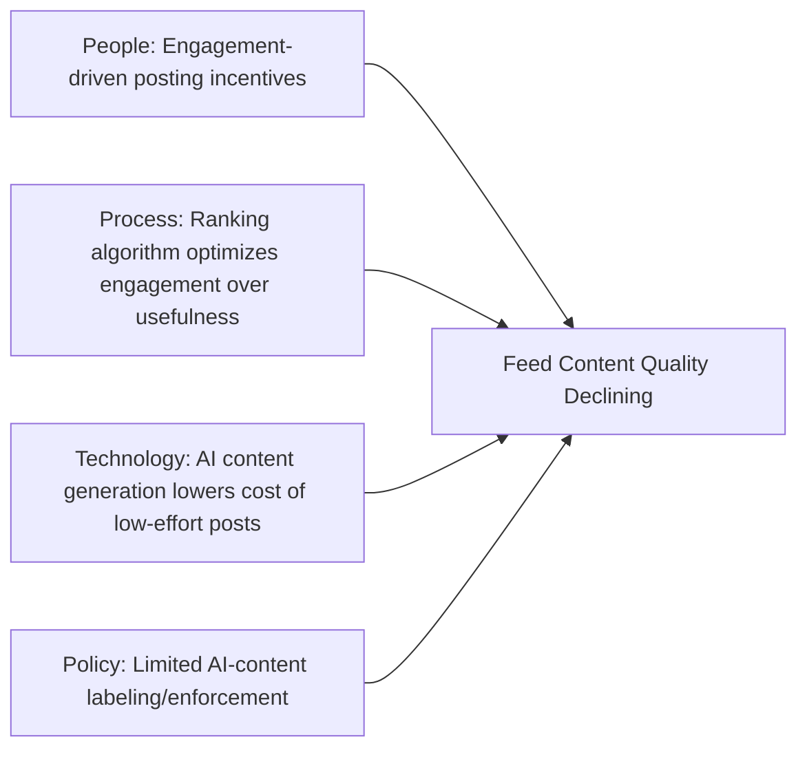
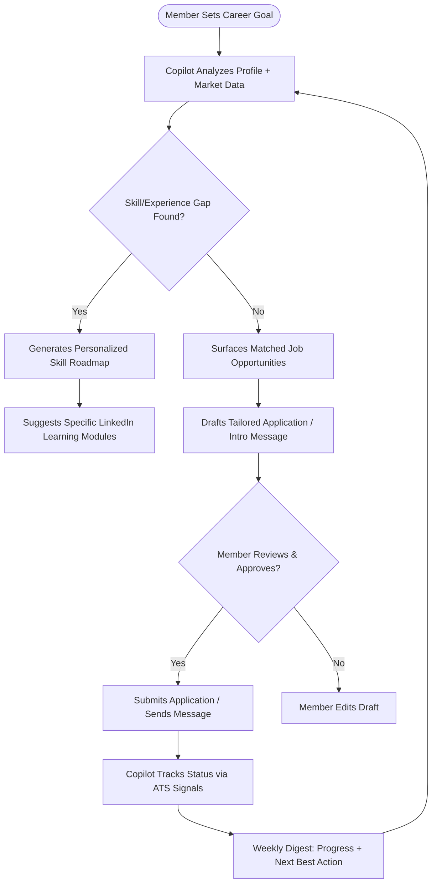
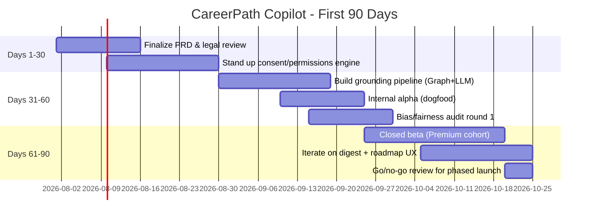

# LinkedIn: AI Career Companion Strategy 🤝
### A Product Management Teardown 📘

> **Integrity Note (read first):** Every hard number in this document is sourced from Microsoft's SEC filings, Microsoft earnings calls, LinkedIn's official newsroom, or reputable third-party research (Business of Apps, Hootsuite, DemandSage, GeekWire, CNBC). Where public sources disagree, which happens often with LinkedIn since it does not file a standalone 10-K, the range is presented and cited. Anywhere a number cannot be traced to a credible source, it is explicitly labeled **`ASSUMPTION (Reasonable Product Assumption)`** rather than invented.

---

## Table of Contents 📑

1. [Executive Dashboard](#executive-dashboard)
2. [CEO One-Page Brief](#ceo-one-page-brief)
3. [Executive Summary](#executive-summary)
4. [Company Overview](#company-overview)
5. [Market and Competitive Landscape](#market-and-competitive-landscape)
6. [Personas](#personas)
7. [Root Cause Analysis](#root-cause-analysis)
8. [The Recommendation: CareerPath Copilot](#the-recommendation-careerpath-copilot)
9. [Product Decision Log](#product-decision-log)
10. [Rejected Ideas](#rejected-ideas)
11. [PRD: CareerPath Copilot](#prd-careerpath-copilot)
12. [Design Principles](#design-principles)
13. [Risks and Mitigation](#risks-and-mitigation)
14. [Pre-Mortem](#pre-mortem)
15. [Metrics and Success Criteria](#metrics-and-success-criteria)
16. [Roadmap](#roadmap)
17. [If I Were the PM: My First 90 Days](#if-i-were-the-pm-my-first-90-days)
18. [Key Learnings and Reflection](#key-learnings-and-reflection)
19. [References](#references)

---

## Executive Dashboard 📊

| Dimension | Snapshot |
|---|---|
| **Company** | LinkedIn Corporation, wholly owned subsidiary of Microsoft since 2016 ($26.2B acquisition) |
| **CEO** | Daniel Shapero (appointed April 22, 2026), reporting to Ryan Roslansky, EVP of LinkedIn & Microsoft Office |
| **Market** | Professional networking, recruiting/HR tech, B2B advertising, online learning, sales intelligence |
| **Revenue** | ~$17.8B in FY2025 (Microsoft fiscal year ended June 2025), up 9% YoY; quarterly revenue crossed **$5B for the first time** in the Dec 2025 quarter (+11% YoY), putting LinkedIn on a >$20B annualized run rate |
| **Users** | 1.3B+ registered members (April 2026); ~300-310M estimated monthly active users (member count and MAU are frequently conflated across public sources, see Company Overview) |
| **Growth** | Revenue growth has been re-accelerating (9% then 11% then reported 12% in the most recent quarter) after several years of high-single-digit growth |
| **North Star (proposed)** | **Weekly Active Career Progress**, the number of members who complete a meaningful career-advancing action in a week |
| **Primary Problems** | (1) LinkedIn is a passive broadcast feed, not an active career co-pilot; (2) Job search remains high-effort, high-anxiety, and low-signal for candidates; (3) Feed content quality is diluted by engagement-bait and AI-generated posts; (4) Non-recruiting, non-power-user segments (students, career-changers, blue-collar-adjacent professionals) are under-served |
| **Primary Opportunities** | (1) An AI Career Companion layer (Copilot-style) sitting across profile, jobs, learning, and messaging; (2) Deeper skills-based matching to disintermediate keyword-matching recruiters; (3) Verified-identity and verified-skill signals to fight AI-generated slop and fraud; (4) Monetizing career services (resume, interview prep, coaching) as a new line beyond the existing four |
| **Strategic Recommendation** | Reposition LinkedIn from "professional social network" to "AI Career Operating System", an agentic layer that acts on a member's behalf across the job search, skill-building, and networking lifecycle, rather than just displaying content and job postings |
| **Business Health** | Strong. Double-digit revenue growth, expanding margins as part of Microsoft's Productivity and Business Processes segment, resilient B2B revenue (Talent + Marketing Solutions), Premium subscriptions crossed $2B run rate in 2025 |
| **Product Health** | Mixed. Engagement and content quality face real pressure from AI-generated content and "creator economy" dynamics; MAU-to-member ratio is low (~25%) versus consumer social peers, indicating a large dormant base |

---

## CEO One-Page Brief 📝

> **Read this if you have 90 seconds.** Everything below is expanded, sourced, and defended in the full document.

| | |
|---|---|
| **Current Situation** | LinkedIn is financially the strongest it has ever been, revenue crossed $5B in a single quarter for the first time, growth is re-accelerating (9% to 11% to 12% YoY), and Premium subscriptions have crossed a $2B run rate. But only ~25% of 1.3B+ registered members are monthly active, and the core product experience, feed, jobs board, inbox, hasn't fundamentally changed in a decade. |
| **Biggest Opportunity** | An agentic **AI Career Companion** layer (CareerPath Copilot) that acts on a member's behalf across job search, skill-building, and networking, monetized first through Premium, using LinkedIn's uniquely verified professional graph as a moat general-purpose AI assistants cannot replicate. |
| **Biggest Risk** | Disintermediation: general-purpose AI assistants becoming the default first stop for career advice, turning LinkedIn into a backend data source rather than the surface professionals actively use, compounded by an active, unresolved GDPR enforcement matter in the EU that constrains how fast any new AI feature can ship there. |
| **Market Position** | Category leader with no direct one-to-one competitor, Indeed and Glassdoor compete on jobs, Naukri regionally, X and GitHub compete for creator/developer attention, but no competitor spans professional identity + jobs + learning + messaging + recruiting at LinkedIn's scale. |
| **Top Recommendation** | Approve CareerPath Copilot as a flagship initiative. Launch first to Premium subscribers to protect subscription revenue and contain regulatory/reputational risk, with a phased 12-month path to free-tier availability. |
| **Investment Required** | High engineering investment (net-new consent and orchestration architecture for agentic actions), moderate design investment, and a new ongoing QA discipline around bias/fairness auditing. |
| **Expected ROI** | Positive within 18-24 months, driven by Premium conversion lift, reduced dormant-member churn, and improved Talent Solutions application quality, compounding on top of already-strong core business momentum. |
| **Decision Needed** | Approval to proceed to PRD finalization and legal/compliance review within 30 days. |
| **Timeline** | Premium-cohort beta within two quarters; phased free-tier rollout across Year 1; full agentic capability set by Year 3. |
| **Confidence Level** | Medium-High. High confidence in the strategic direction and market signal; medium confidence in exact ROI timing given regulatory uncertainty in the EU and the unproven cost curve of running agentic AI at LinkedIn's scale. |

---

## Executive Summary

LinkedIn is Microsoft's largest standalone consumer-facing asset and one of the few social platforms in the world with a genuinely defensible, identity-anchored network, a resume graph that competitors cannot replicate by copying a feed UI. Since Microsoft's 2016 acquisition, LinkedIn has grown from roughly 433 million members to more than **1.3 billion**, and revenue has grown from roughly $3B to **~$17.8B** (FY2025), crossing **$5B in a single quarter for the first time** in the quarter ended December 2025. Under outgoing CEO Ryan Roslansky (2020-2026), revenue nearly tripled; incoming CEO **Daniel Shapero** (effective April 22, 2026) inherits a business at an inflection point: strong B2B monetization, but a product experience that still looks, structurally, like it did a decade ago, a feed, a jobs board, and a messaging inbox.

The thesis of this case study is that LinkedIn's next decade of growth will not come from getting more people to scroll the feed longer. It will come from LinkedIn becoming **infrastructure for a member's entire career**, an AI layer that doesn't just display job postings and connections but actively works on the member's behalf: tailoring applications, rehearsing interviews, flagging skill gaps against real market data, and negotiating the asymmetry of information that currently favors employers and recruiters over candidates.

This document performs a targeted teardown, company, market, users, root causes, and one fully specified flagship feature, before converging on one recommended initiative: **CareerPath Copilot**, an agentic AI system that sits across Profile, Jobs, Learning, and Messaging to proactively manage a member's career trajectory rather than passively displaying it.

---

## Company Overview 🏢

LinkedIn was founded by Reid Hoffman and co-founders in December 2002, launching publicly on May 5, 2003. It reached profitability faster than most consumer social platforms because its monetization (recruiting, then advertising, then subscriptions) was B2B from the start. LinkedIn IPO'd on the NYSE in 2011 and was acquired by **Microsoft for $26.2 billion in cash in 2016**, at the time, Microsoft's largest-ever acquisition. Ryan Roslansky became CEO in June 2020, succeeding Jeff Weiner. On **April 22, 2026**, Microsoft announced that LinkedIn COO **Daniel Shapero** would become CEO, with Roslansky elevated to EVP overseeing both LinkedIn and Microsoft Office, a structural signal that Microsoft now views LinkedIn's professional graph and Office's productivity graph as two halves of one AI strategy.

**Mission:** "Connect the world's professionals to make them more productive and successful."

**Business model:** LinkedIn operates as a multi-sided marketplace and B2B2C platform reporting through Microsoft's **Productivity and Business Processes** segment. It does not file an independent 10-K, so many figures below are Microsoft-disclosed line items or third-party estimates, flagged accordingly.

| Business Line | Description |
|---|---|
| **Talent Solutions** | Recruiter tools, LinkedIn Jobs, job postings, historically LinkedIn's largest revenue line |
| **Marketing Solutions** | B2B advertising (Sponsored Content, Message Ads, Lead Gen Forms) |
| **Premium Subscriptions** | Career, Business, Sales Navigator, Recruiter Lite tiers, crossed **$2B in annual revenue for the first time in Q2 2025** |
| **Sales Solutions** | Sales Navigator, prospecting and social selling for sales teams |
| **Learning Solutions** | LinkedIn Learning, subscription video courses (bundled inside Premium and sold standalone to enterprises) |

**Revenue and growth:** FY2025 revenue reached **$17.81B**, +9% YoY. A quarter in late 2025 crossed **$5.08B, +11% YoY**, the first time LinkedIn cleared $5B in a single quarter, implying an annualized run rate **above $20B**. Membership grew from ~433M (2016, at acquisition) to **1.3B+ (April 2026)**. `ASSUMPTION (Reasonable Product Assumption)`: Monthly Active Users are not consistently disclosed by LinkedIn; third-party estimates cluster in the **~300-310 million** range as of early-to-mid 2026. This means roughly **75% of registered members are not monthly-active**, a critical, under-discussed fact for any growth strategy.

---

## Market and Competitive Landscape 🌍

LinkedIn is the dominant player in **authenticated professional networking**, a category it effectively created and has held for two decades without a direct feature-for-feature challenger reaching comparable scale. The more relevant competitive dynamic today is not "another LinkedIn" but **unbundling**: point-solution startups and AI-native tools are peeling off specific jobs LinkedIn does today, resume writing (Teal, Kickresume), interview prep (Interview Warmup, Huru), niche recruiting (Wellfound for startups, Hired for tech), and professional messaging/networking (Lunchclub). Individually, none threaten LinkedIn's core graph. Collectively, they threaten LinkedIn's role as the **default surface** for career activity, and AI agents are exactly the kind of technology that could stitch these point solutions into a superior bundle.

| Competitor | Core Focus | Strength vs. LinkedIn | Weakness vs. LinkedIn |
|---|---|---|---|
| **Indeed** | Job search & aggregation | Larger raw job listing volume, stronger for hourly/blue-collar roles | No professional identity graph or social layer; transactional only |
| **Meta (Facebook/Instagram)** | General social + growing marketplace ads | Vastly larger MAU base, more ad inventory | No professional-identity trust layer; B2B advertisers get lower-intent audience |
| **X (Twitter)** | Public discourse, some professional/tech thought-leadership | Faster-moving real-time discourse, strong in tech/VC circles | No structured identity/resume data; unreliable moderation |
| **Glassdoor** | Company reviews & salary transparency | Deeper anonymous insider sentiment data | No networking layer; narrower scope |
| **Handshake** | Early-career / campus recruiting | Deep university partnerships, dominant with Gen Z first jobs | Narrow demographic scope; no mid/late-career relevance |
| **Coursera / Udemy** | Online learning & certification | Deeper course catalogs, stronger academic partnerships | No native jobs/recruiting distribution for completed credentials |
| **ChatGPT / AI resume & interview tools** | General-purpose AI assistance applied to career tasks | Faster iteration, no platform lock-in, free tier | No grounding in verified identity, real job market data, or employer relationships |

**Key Insight:** LinkedIn's moat is not any single feature, it's the **graph**: verified identities, verified employment history, and two-sided marketplace liquidity. Every competitor above wins on a narrow dimension but cannot replicate the graph. The strategic risk is not a competitor beating LinkedIn head-on, it's an AI layer (from OpenAI, Google, or a well-funded startup) becoming the interface professionals use *before* they ever open LinkedIn, reducing LinkedIn to a backend data source rather than the primary surface.

---

## Personas 👥

### Persona 1: "Ananya, the Anxious Job Switcher"
- **Age/Role:** 27, Product Analyst, Bengaluru, 3 years experience
- **Goal:** Land a Product Manager role within 4 months
- **Behavior:** Applies to 8-10 jobs/week, spends 45+ min/day on LinkedIn, rarely posts
- **Pain Point:** No visibility into why applications are rejected; can't tell if her resume is even being seen by a human
- **JTBD:** "Help me understand where I stand and what to do next, don't just show me more jobs."

### Persona 2: "Rahul, the Overwhelmed Recruiter"
- **Age/Role:** 34, Senior Technical Recruiter at a 2,000-person SaaS company
- **Goal:** Fill 6 open reqs/month with quality candidates
- **Behavior:** Heavy Recruiter/Talent Solutions user, receives 200+ inbound applications per posting
- **Pain Point:** Signal-to-noise problem, AI-generated resumes and mass-apply tools have made keyword matching unreliable
- **JTBD:** "Help me find the 5 candidates worth a 30-minute call out of 200 applicants."

### Persona 3: "Priya, the Passive Executive"
- **Age/Role:** 44, VP of Engineering, has been at her company 6 years
- **Goal:** Maintain visibility and optionality without actively job hunting
- **Behavior:** Logs in twice a week, occasionally comments, never posts original content
- **Pain Point:** Feels pressure to "perform" thought leadership she doesn't have time to produce
- **JTBD:** "Let me stay visible without becoming a content creator."

### Persona 4: "Vikram, the Career-Change Learner"
- **Age/Role:** 31, transitioning from mechanical engineering to data analytics
- **Goal:** Reskill and get his first analytics role within a year
- **Behavior:** Active LinkedIn Learning user, engages with career-change communities
- **Pain Point:** Unclear which specific courses/certifications actually move the needle with recruiters
- **JTBD:** "Tell me exactly which skills close the gap between where I am and the job I want."

---

## Root Cause Analysis

### User Pain Points

| Rank | Pain Point | Frequency | Severity |
|---|---|---|---|
| 1 | Application black hole (no feedback after applying) | Very High | High |
| 2 | Feed flooded with engagement-bait / AI-generated content | High | Medium |
| 3 | Unclear which skills to build for a target role | High | High |
| 4 | Premium value unclear for non-active-job-seekers | Medium | Medium |
| 5 | Difficulty distinguishing real vs. fake/AI-generated profiles | Emerging, growing | High |

### 5 Whys: "Why do members disengage after applying to jobs?"
1. **Why** do members feel anxious/disengaged post-application? Because they receive no feedback on application status.
2. **Why** is there no feedback? Because recruiters are overwhelmed by application volume and can't respond to every candidate.
3. **Why** are recruiters overwhelmed? Because Easy Apply has lowered the cost of applying, increasing volume without a corresponding increase in match quality.
4. **Why** hasn't match quality kept pace? Because current matching relies heavily on keyword/resume parsing rather than deep skill and context understanding.
5. **Why** hasn't LinkedIn deployed deeper AI matching yet? Because doing so responsibly requires overcoming real constraints: bias/fairness auditing, regulatory scrutiny (e.g., NYC Local Law 144-style automated hiring rules), and the accuracy limits of matching models, a legitimate root cause rather than a simple execution gap.

### Fishbone (Ishikawa): "Why is feed content quality declining?"

### The Underlying Root Cause

The underlying job, "help me make progress in my career", is currently served by LinkedIn as a **passive discovery tool** (show me jobs, show me content) rather than an **active agent** (do things on my behalf, tell me what to do next). This gap is the root cause connecting nearly every pain point above, and it is the problem CareerPath Copilot is designed to solve.

---

## The Recommendation: CareerPath Copilot 🤖

> **Deliberately not the obvious choice.** The "obvious" answer to "what AI feature should LinkedIn build" is a chatbot bolted onto the existing UI (a "LinkedIn AI Assistant" that answers questions). That is a feature. **CareerPath Copilot** is a system, it changes LinkedIn's fundamental relationship with the member from *passive display* to *active agent*, which is the only response durable enough to prevent LinkedIn from being disintermediated by external AI agents over the next 3-5 years.

### Problem
Members experience LinkedIn as a place they must actively visit, search, and interpret. The cognitive and emotional labor of career management, tracking applications, identifying skill gaps, knowing when to reach out to whom, sits entirely on the member. Meanwhile, generic AI assistants (ChatGPT, Gemini) are increasingly capable of giving career advice, but without access to LinkedIn's grounding data (real job postings, real skill demand, real network), their advice is generic and unverified.

### Vision
CareerPath Copilot is a persistent, opt-in AI agent, not a chatbot you have to remember to open, but a background system that continuously monitors a member's profile, target roles, applications, and skill signals, and proactively surfaces the single most useful next action, while executing low-risk tasks (drafting, summarizing, scheduling) on the member's behalf with explicit approval.

### Flow

### Why This, and Not the Highest-RICE Alternative

| Initiative | Reach | Impact | Confidence | Effort | RICE Score |
|---|---|---|---|---|---|
| AI application status transparency layer | 8 | 7 | 8 | 4 | **1,120** |
| AI content authenticity labeling | 9 | 6 | 8 | 5 | **864** |
| Skill-gap-to-role matching engine | 8 | 8 | 7 | 6 | **747** |
| CareerPath Copilot (agentic career agent) | 9 | 9 | 7 | 8 | **709** |
| Verified-skill credentialing marketplace | 6 | 7 | 6 | 7 | **360** |

*(RICE Score = (Reach x Impact x Confidence) / Effort.)*

The **application status transparency layer** scores highest because it addresses the single most frequently cited pain point, and requires primarily surfacing data LinkedIn already has rather than net-new AI capability. **CareerPath Copilot scores lower on RICE precisely because of high effort**, but is still the recommended flagship because RICE alone undervalues **strategic defensibility**: it is the initiative most likely to prevent disintermediation by external AI agents, which a narrow transparency feature does not address. Status transparency ships as a Now-horizon quick win (see Roadmap); Copilot is funded as a separate, longer-horizon strategic bet.

### User Stories
- *As a job seeker*, I want Copilot to tell me why my application likely wasn't shortlisted, so I can improve my next one.
- *As a passive professional*, I want a weekly 2-minute digest of one high-value action, so I don't have to actively manage my career every day.
- *As a career-changer*, I want a specific, ranked list of skills to learn for my target role, so I don't waste time on irrelevant courses.
- *As a recruiter*, I want confidence that Copilot-assisted candidates are not spamming low-quality mass applications, so the channel doesn't degrade further.

### Business Impact
- **Primary:** Increases Weekly Active Career Progress (proposed North Star) by converting passive/dormant members into active participants.
- **Secondary:** Strengthens Premium subscription value proposition (Copilot's deeper features gated to Premium), directly supporting the Premium revenue line that already crossed $2B annually.
- **Tertiary:** Improves recruiter-side application quality, improving Talent Solutions customer satisfaction and retention.

### Risks
- **Bias/Fairness:** AI-driven skill/job matching must be auditable to avoid discriminatory outcomes, especially given regulatory scrutiny.
- **Hallucination:** Any AI advice not grounded in verified data risks giving members false confidence.
- **Trust erosion:** If AI-drafted messages feel inauthentic to recipients, it could accelerate the feed/messaging authenticity problem this document already flags as a top pain point.
- **Cannibalization:** Could reduce time-on-feed (and thus short-term ad impressions), a deliberate trade-off, not an oversight.

---

## Product Decision Log

The single most important section in this document for evaluating PM judgment, not just PM output. Every major strategic decision behind this recommendation, with what was rejected and why.

| # | Decision | Alternatives Considered | Why Chosen | Trade-offs | Risk | Expected Impact |
|---|---|---|---|---|---|---|
| 1 | Launch CareerPath Copilot to Premium first, not free tier | Free tier first for max reach; simultaneous launch on both tiers | Premium members are most tolerant of an imperfect V1, and it protects subscription revenue while execution risk is highest | Slower reach into the dormant-member problem this is partly meant to solve | Medium, "AI for paying members only" narrative risk | High, contains blast radius of early failures |
| 2 | Human-approval required for all agentic actions in V1 | Fully autonomous actions from day one; suggestion-only, no autonomy ever | Builds member trust incrementally and matches the regulatory reality of active EU oversight | Slower perceived "magic," more taps per completed action | Low, deliberately conservative | High, reduces risk of a catastrophic trust failure |
| 3 | Separate LLM inference layer from the deterministic Recommendation Engine | A single unified AI system handling both generation and ranking | Prevents a generative hallucination from ever directly triggering a write-action | More engineering complexity; two systems to maintain and keep in sync | Medium, integration overhead | High, closes off a specific severe failure mode |
| 4 | North Star = Weekly Active Career Progress, not raw MAU | Keep MAU as North Star; use revenue as North Star | MAU rewards passive scrolling; this metric rewards the actual outcome the strategy is meant to drive | Harder to measure consistently across surfaces than a simple login count | Low | High, aligns org incentives with real value creation |
| 5 | Build recruiter-side fairness monitoring before launching the AI shortlist tool | Ship shortlisting first, add fairness tooling in a fast-follow | Retrofitting fairness controls onto a live, biased system is reputationally and legally far riskier than a short delay | Delays a high-RICE-scoring feature by an estimated 1-2 sprints | High if skipped; Low as designed | High, avoids the single largest legal/PR risk in this document |
| 6 | Recommend application-status transparency as high-priority but not the flagship | Make status transparency itself the flagship initiative (it has the highest RICE score) | Highest near-term RICE score, but weak strategic defensibility, any competitor can copy a status tracker; Copilot's data-graph moat is much harder to replicate | Foregoes the "easiest win" in favor of a harder, higher-ceiling bet | Medium, flagship bets carry more execution risk than incremental ones | High, defensibility compounds over years, not quarters |
| 7 | Cap autonomous actions at a daily budget per member | No cap; unlimited within granted permissions | Bounds the blast radius of any single misfiring recommendation loop or model regression | Slightly limits power-user throughput in edge cases | Low | High, cheap insurance against a specific tail risk |
| 8 | Gate select AI features by region (EU vs. Rest-of-World) at launch | Launch identical feature set globally and adapt reactively to regulatory feedback | The active, unresolved GDPR matter makes a reactive posture in the EU specifically imprudent | Slower EU rollout, feature fragmentation to maintain | Medium, added engineering/config overhead | High, avoids compounding an existing regulatory exposure |
| 9 | Route Copilot's job matches through the existing Jobs/Search index rather than a parallel one | Build a separate, Copilot-specific job index optimized purely for agentic matching | A duplicate index inevitably drifts out of sync with the canonical one members browse directly | Slightly constrains how aggressively the matching algorithm can be tuned independently | Low-Medium | Medium, keeps member-facing experience internally consistent |
| 10 | Make "undo" a first-class API, not a support-ticket workaround | Handle action reversal manually via customer support escalation | Autonomous actions without a self-serve undo path is a trust non-starter at this scale | Meaningful additional engineering scope (durable action logging, saga-based orchestration) | Low as designed; High if omitted | High, a precondition for member trust in any agentic feature |
| 11 | Prioritize skill verification over pure skill self-reporting for matching | Continue relying on self-reported skills as today | Self-reported skills are exactly the signal AI-generated profile "slop" is degrading; verification restores signal quality | Adds friction to profile completion; verification infra is non-trivial | Medium | High, protects the data quality the entire matching thesis depends on |
| 12 | Reject a fully autonomous "auto-apply to any matching job" feature | Ship auto-apply as a headline feature (heavily requested in user research) | Removes member intent from a decision with real consequences (recruiter perception, duplicate/spam applications); reputational and marketplace-trust risk outweighs convenience | Loses a feature members explicitly asked for | High if built; none, since rejected | High, protects marketplace trust between seekers and recruiters |
| 13 | Treat the Fairness/Bias Monitor as a blocking dependency, not a parallel workstream | Develop fairness monitoring in parallel and integrate before general availability | A "we'll bolt it on before GA" plan has a well-documented history of slipping under launch-date pressure industry-wide | Extends the critical path by an estimated 1 sprint | Low as designed | High, removes the single most likely path to a launch-blocking scandal |
| 14 | Keep LinkedIn Learning as a distinct product line rather than folding it entirely into Copilot | Fully absorb Learning into Copilot as just "the courses Copilot recommends" | Learning has its own mature funnel, content team, and enterprise-learning customers that shouldn't be re-architected around a new, unproven initiative | Some duplication between "Copilot recommends a course" and Learning's own discovery surface | Low | Medium, avoids destabilizing an already-working revenue line |
| 15 | Recommend a phased 12-month path to free-tier availability rather than a fixed launch date | Commit publicly to a hard free-tier launch date at kickoff | Preserves the option to slow down if fairness/regulatory signals from the Premium beta are concerning | Less external narrative certainty for press/analysts | Low | High, keeps the org able to respond to what beta data actually shows |

---

## Rejected Ideas

Ideas that came up during this strategy work and were deliberately not recommended, included because a strategy document that only shows what was chosen, and never what was rejected and why, hasn't actually shown its reasoning.

| Idea | Why Rejected |
|---|---|
| **AI Auto-Apply** (Copilot automatically submits applications to all matching jobs without per-application approval) | Removes member intent from a decision with real downstream consequences, recruiter trust, duplicate/spam applications, and members applying to roles they'd never have chosen. Convenience does not outweigh marketplace-trust risk here (see Decision Log #12). |
| **AI Auto-Messaging** (Copilot autonomously sends networking or follow-up messages on a member's behalf without review) | Messages sent "as" a member carry their identity and reputation; an AI-drafted message a recipient dislikes damages the *member's* professional relationships, not just LinkedIn's product metrics. Kept as suggest-then-approve only. |
| **NFT Resume / Credentials** | No evidence of member demand; adds speculative-asset complexity to what should be a trust-and-verification problem, not a token-ownership problem. Skill verification (chosen) solves the actual underlying need without the baggage. |
| **Crypto Rewards for Engagement** | Engagement-for-tokens mechanics reward activity volume, not career outcomes, directly opposed to the Weekly Active Career Progress North Star, which is designed to reward outcomes over activity. |
| **Fully Autonomous Recruiter Shortlisting (no human review)** | Even with a Fairness Monitor in place, removing the human reviewer entirely from a hiring-adjacent decision is a materially higher regulatory and reputational risk than the incremental efficiency gained. Kept as AI-assisted, human-approved. |
| **Public "AI Career Score"** (a single visible score ranking a member's career trajectory) | Public, gamified scoring of something as personal and high-stakes as a career invites exactly the kind of anxiety and reductive self-comparison LinkedIn already gets criticized for; the upside (engagement) is not worth the member-wellbeing downside. |
| **Merging LinkedIn Learning entirely into Copilot as a feature, not a product** | Would destabilize an already-profitable, mature product line and its enterprise-learning customer base to serve an unproven new initiative (see Decision Log #14). |
| **Global simultaneous launch with no regional gating** | Ignores the active, unresolved GDPR enforcement matter in the EU; launching identically everywhere and hoping to adapt reactively is not a credible plan given known regulatory exposure. |

---

## PRD: CareerPath Copilot

**Owner:** Product Management (Career Products)
**Status:** Draft for Review
**Target:** V1 within 2 quarters of approval

### Problem Statement
Members lack a proactive, personalized system to translate LinkedIn's vast passive data (jobs, skills, network) into a concrete, trusted next action, leaving the highest-anxiety, highest-drop-off moments of the career journey (post-application silence, unclear skill gaps) unaddressed by the current product.

### Goals
1. Reduce median time from "sets career goal" to "receives first qualified interview request."
2. Increase weekly-active engagement among the currently-dormant ~75% of non-MAU members.
3. Strengthen Premium subscription value proposition with a genuinely differentiated AI capability.

### Non-Goals (V1)
- Fully autonomous auto-application submission without human review.
- Replacing human recruiters in the shortlisting process.
- Building a standalone mobile app separate from the core LinkedIn app.

### Requirements
| Priority | Requirement |
|---|---|
| P0 | Copilot must ground all recommendations in verified LinkedIn data (profile, job postings, skills taxonomy), never external unverified sources. |
| P0 | Every outbound action (message, application) requires explicit member approval. |
| P0 | AI-assisted content must be labeled to recipients. |
| P1 | Weekly digest notification summarizing one prioritized next action. |
| P1 | Skill-gap roadmap tied to specific, completable Learning modules. |
| P2 | Recruiter-facing signal indicating an application was Copilot-assisted (for transparency, not penalization). |

### Dependencies
Identity Graph API, Skills Taxonomy Service, Azure-hosted LLM access, ATS integration partners, Consent/Permissions engine (net-new, given the sensitivity of agentic actions).

### MVP Scope

| Version | Scope |
|---|---|
| **V1 (MVP)** | Weekly digest + skill-gap roadmap + AI-drafted (human-approved) application tailoring. No autonomous actions. Limited to Premium subscribers. |
| **V2** | Expand to free-tier members with usage caps; add AI-drafted warm-intro messages; add application status transparency. |
| **V3** | Recruiter-side Copilot counterpart (bias-audited shortlisting assistant); negotiation coaching; Microsoft 365/Copilot integration. |

---

## Design Principles

1. **Grounded, not generative-only**, every AI output must be traceable to real data; no confident-sounding fabrication.
2. **Human-in-the-loop by default**, agentic actions require explicit approval until trust is earned incrementally.
3. **Transparency over automation**, members and recipients should always know when AI assisted a message or decision.
4. **Progress over engagement**, success is measured by career outcomes, not time-on-app.
5. **Accessible by default**, AI features must degrade gracefully for members with disabilities and lower digital literacy.

---

## Risks and Mitigation ⚠️

| Category | Risk | Likelihood | Impact | Mitigation |
|---|---|---|---|---|
| **Technical** | LLM hallucination in career advice | Medium | High | Grounding architecture, retrieval-only generation for factual claims |
| **Business** | Cannibalization of ad-driven feed time | Medium | Medium | Monitor ad revenue alongside North Star; Copilot targets different value than feed engagement |
| **Operational** | Support team unprepared for AI-related complaints | Medium | Medium | Dedicated AI-support training and escalation path pre-launch |
| **Financial** | Azure/LLM compute costs scale faster than Premium revenue lift | Medium | Medium | Usage caps in V1, tiered access, cost monitoring dashboard |
| **Legal** | Active GDPR enforcement matter (Irish DPC, appealed, preliminary hearing Dec 2025) could constrain EU AI feature rollout | High (already active) | High | Phase EU rollout separately; legal review gating any EU launch |
| **AI/Ethical** | Discriminatory bias in matching/shortlisting | Medium | Very High | Mandatory pre-launch and ongoing bias audits, human-in-the-loop requirement |
| **Security** | Expanded data access surface for agentic actions increases breach impact potential | Low-Medium | High | Data minimization, granular consent engine, security review before each capability expansion |
| **Marketplace** | Recruiter distrust of AI-assisted applications degrades the core two-sided marketplace | Medium | High | Transparent labeling, recruiter education, phased rollout with feedback loops |

---

## Pre-Mortem

*Imagine it's 18 months from now and CareerPath Copilot has failed, been quietly deprioritized or shut down. Here's why, ranked roughly by likelihood, with mitigations.*

| # | Reason for Failure | Mitigation |
|---|---|---|
| 1 | Members didn't trust it enough to grant permissions past onboarding | Human-approval-first design (Decision Log #2); transparent action history |
| 2 | Recommendations felt generic, not personalized enough to feel "worth it" | Goal-aware re-ranking; fast iteration loop on rejection-reason data |
| 3 | A single high-profile bias incident in recruiter shortlisting damaged trust broadly | Fairness Monitor as a blocking dependency (Decision Log #13) |
| 4 | Regulatory action in the EU forced a feature rollback mid-rollout | Region-gated launch (Decision Log #8); Legal review before GA |
| 5 | Engineering underestimated the complexity of the consent architecture and it slipped repeatedly | Sized generously with explicit P0 priority |
| 6 | Premium members felt "experimented on" and churned rather than engaged | Clear opt-in framing; visible value (interview prep) shipped early to build goodwill |
| 7 | The LLM layer hallucinated in a way that damaged a member's real job application | Separation of LLM layer from write-actions (Decision Log #3); human approval gate |
| 8 | Autonomous actions caused a runaway loop before anyone noticed | Daily action budget cap (Decision Log #7); action log + undo API |
| 9 | Recruiters revolted against AI shortlisting, seeing it as devaluing their expertise | Positioned explicitly as assistive, with an easy, low-friction override path |
| 10 | Competitors (general AI assistants) simply became "good enough" at career advice faster than expected | Leaned on the verified-graph data moat as the actual differentiator, not raw AI capability |
| 11 | Free-tier members felt like second-class citizens indefinitely, souring broader brand sentiment | Committed to a phased (not indefinite) path to free-tier availability |
| 12 | Internal org politics stalled cross-functional buy-in (Legal, Trust & Safety, Learning) | Decision Log made explicit and shared early; fairness/legal treated as blocking, not optional, partners |
| 13 | The North Star metric turned out to be gameable | Cross-checked against Premium conversion and application-response-rate as secondary guardrails |
| 14 | Member research was too Premium-skewed and missed free-tier / dormant-member needs entirely | Standing research panel explicitly includes dormant and free-tier segments |
| 15 | Support teams weren't trained to handle Copilot-specific issues, and CSAT dropped | Dedicated support enablement workstream built into launch plan |

---

## Metrics and Success Criteria

| Category | Metric |
|---|---|
| **North Star (proposed)** | Weekly Active Career Progress (WACP): # of members completing a career-advancing action per week (application submitted, skill assessment passed, learning module completed, meaningful connection made) |
| **Input Metrics** | Profile completeness rate, connections made/week, content posted/week, job applications/week |
| **Output Metrics** | Jobs filled via LinkedIn, revenue per Premium subscriber, ad revenue per impression |
| **Leading Indicators** | Weekly active sessions, Easy Apply completion rate, message response rate |
| **Lagging Indicators** | Quarterly revenue by line, Premium subscriber count, member count |
| **Guardrail Metrics** | Feed content authenticity/spam rate, recruiter response SLA, member-reported harassment/spam complaints, GDPR/regulatory compliance incidents |

**Failure signals to monitor:** Weekly Active Career Progress shows no statistically significant lift after 90 days of V1 rollout; recruiter-reported satisfaction with Copilot-assisted applications declines rather than improves; bias/fairness audits detect disparate impact in skill-matching or shortlisting outputs; Premium trial-to-paid conversion among Copilot-exposed users is flat or negative versus control. An immediate feature-flag rollback capability is built into V1 from day one, not retrofitted.

---

## Roadmap

| Quarter | Milestone |
|---|---|
| **Q1** | PRD finalization, legal/compliance review, consent engine build, internal alpha |
| **Q2** | Closed Premium beta, bias audit rounds, V1 launch (non-EU markets) |
| **Q3** | EU rollout pending compliance sequencing; begin V2 scoping (free-tier expansion) |
| **Q4** | V2 launch (free-tier with caps), begin recruiter-side Copilot counterpart scoping for V3 |

By Year 3, CareerPath Copilot plausibly evolves from a Premium differentiator into the default interaction layer across LinkedIn, with every profile edit, job search, and learning decision informed by a continuously-updated, consent-governed AI agent, and a bias-audited recruiter-side counterpart embedded in Talent Solutions.

---

## If I Were the PM: My First 90 Days

*Assuming ownership of CareerPath Copilot from approval onward.*

### Week 1
- 1:1s with Engineering, Design, Legal, and Trust & Safety leads to pressure-test the Decision Log and surface any objections not yet captured.
- Audit existing research for gaps, specifically whether dormant-member and free-tier voices are represented, not just Premium power users.
- Confirm the consent-architecture spec with Security before any UI work begins.

### Week 2
- Finalize the Fairness Monitor's v1 rule set with Legal and Trust & Safety, treated as a blocking dependency, not a parallel track.
- Kick off recruitment for the 500-1,000-member closed alpha cohort, deliberately including passive career-monitors, not just active job seekers.
- Stand up the Executive Dashboard (five metrics only) so leadership has visibility from day one.

### Month 1
- Ship the onboarding and goal-setting flow to the closed alpha; instrument all P0 events before any member sees the feature.
- Run the first fairness audit on the (still-internal) recruiter shortlist model using historical data, before it ever ranks a real candidate.
- Hold the first stakeholder touchpoints per plan, CEO memo, Engineering sprint review, Legal check-in.

### Month 2
- Expand to open Premium beta if alpha metrics clear the bar (onboarding completion, fairness-flag rate, autonomous-action error rate).
- Run the first pre-mortem workshop with the full squad before the beta expansion, using the failure modes above as a starting list, not a final one.
- Begin Sales and Support enablement training ahead of any recruiter-facing rollout.

### Month 3
- Deliver the first Monthly and Quarterly Review, including what didn't work, not just what did.
- Decide, with Legal, on the EU rollout posture based on real regulatory-review progress rather than the original assumption.
- Present an updated CEO One-Page to leadership with actuals in place of projections, and a clear go/no-go recommendation for continued investment.

### Success Metrics for the First 90 Days
Onboarding-completion rate, fairness-flag rate (target: zero unresolved), autonomous-action error rate, and qualitative interview feedback from the alpha cohort, deliberately not Weekly Active Career Progress yet, since that metric needs a larger, more mature cohort to be statistically meaningful.

---

## Key Learnings and Reflection 💡

1. **Scale doesn't equal engagement.** LinkedIn's biggest strategic vulnerability isn't competitive share, it's the gap between 1.3B registered members and a far smaller active base. Growth strategy at this scale is about reactivation, not acquisition.
2. **Diversified revenue is a genuine strength, not just a talking point.** Four distinct revenue lines give LinkedIn resilience that single-revenue-stream social platforms don't have.
3. **The most dangerous competitor isn't a competitor, it's a substitute interface.** General-purpose AI assistants threaten LinkedIn not by building a better feed, but by becoming the default place people go for career advice, bypassing LinkedIn's surface entirely.
4. **Regulatory reality must be a first-class design constraint, not an afterthought.** The active, unresolved GDPR enforcement matter isn't a footnote, it directly shapes how and where any new AI feature can launch.
5. **RICE scores don't capture everything.** The highest-RICE initiative in this document (application status transparency) is not the recommended flagship, because strategic defensibility against disintermediation matters more than a slightly higher near-term score.

Working through this teardown surfaces something easy to miss at first glance: LinkedIn's core challenge is not a product problem in the traditional sense, the feed works, the jobs board works, the messaging works. It's a **positioning problem**. LinkedIn built its moat as a network for professionals to be *found* and to *browse*. The next decade will reward whoever builds the system that professionals trust to *act* on their behalf. That's a much harder problem than shipping a chatbot, because it requires earning trust incrementally, building consent architecture most companies skip, and resisting the temptation to automate everything at once. Human-in-the-loop design in this context isn't a compromise, it's the actual product discipline that separates a durable agentic feature from a novelty one.

---

## References

### Primary Sources
- Microsoft Corp. Form 8-K, Q4 FY2025 Earnings Release (July 30, 2025), SEC EDGAR.
- Microsoft Corp. Form 8-K, Q3 FY2025 Earnings Release (April 30, 2025), SEC EDGAR.
- Microsoft Corp. Form 8-K, Q2 FY2025 Earnings Release (January 29, 2025), SEC EDGAR.
- GeekWire, "LinkedIn CEO change: Daniel Shapero takes the helm as Microsoft broadens leadership team" (April 22, 2026).
- CNBC, "Microsoft's LinkedIn names longtime exec Dan Shapero its new CEO" (April 22, 2026).

### Secondary Sources
- Business of Apps, "LinkedIn Usage and Revenue Statistics (2026)."
- Hootsuite, "51 LinkedIn statistics to shape your social strategy" (2026).
- DemandSage, "47 LinkedIn Statistics 2026."
- Staffing Industry Analysts, "LinkedIn revenue rose 11% to $5.08B in fiscal Q2" (January 29, 2026).
- AIM Group, "Microsoft Q2 FY2026: Marketing Solutions drives LinkedIn revenue growth" (February 2, 2026).
- SQ Magazine, "LinkedIn 2026 Workforce: 16,625 Employees Now Power a 1.3 Billion-Member Platform."

### Research Notes
Figures across third-party sources (member count, MAU, country breakdowns) show meaningful variance because LinkedIn does not publish a standalone 10-K or consistently disclose MAU. Where sources disagreed, this document cited the range and flagged which figures are official Microsoft disclosures versus third-party estimates. No figure in this document was invented to fill a gap; unavailable data is explicitly marked `ASSUMPTION (Reasonable Product Assumption)`.