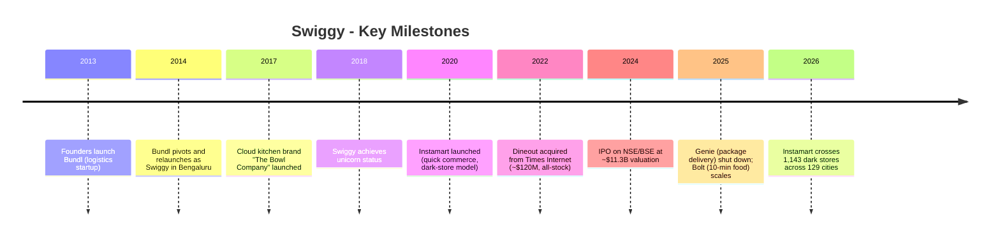
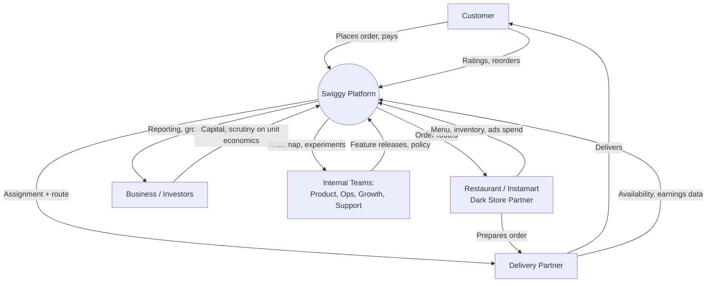
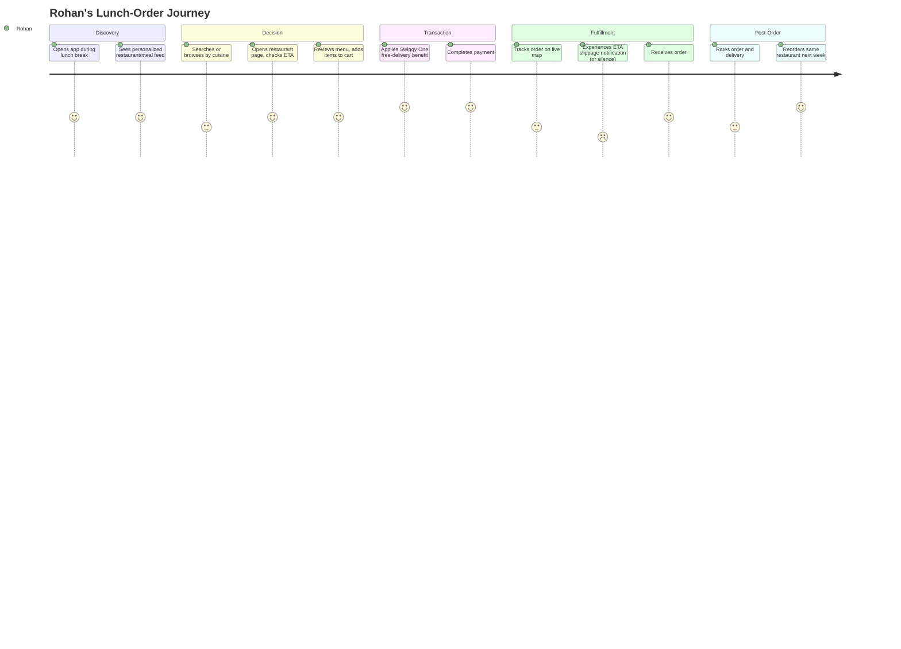
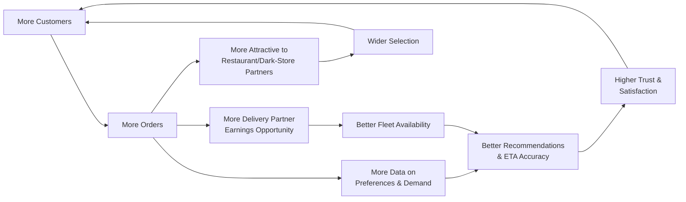
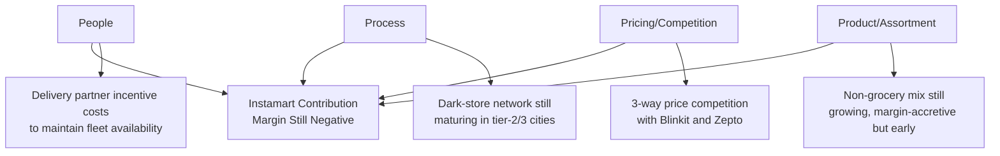
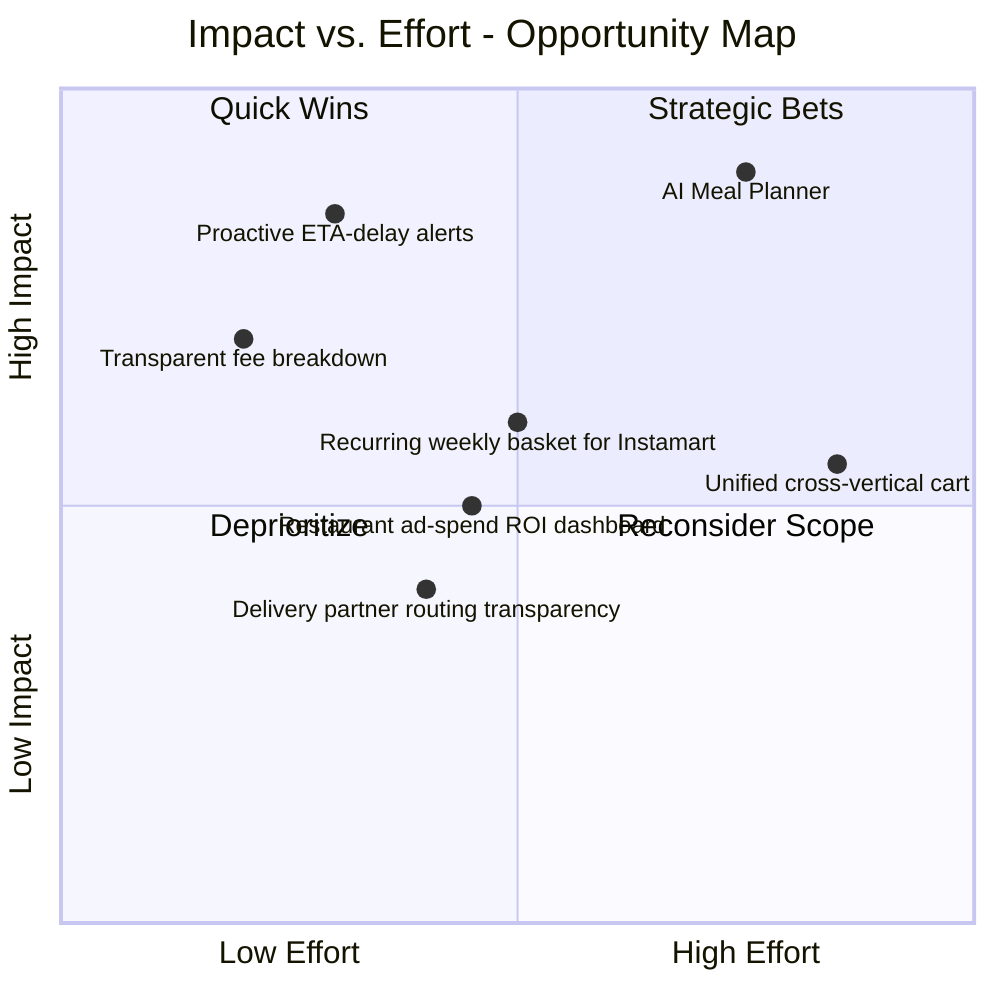
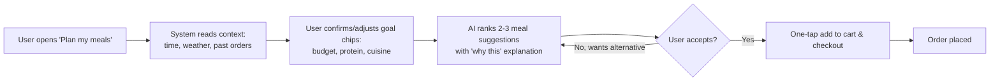
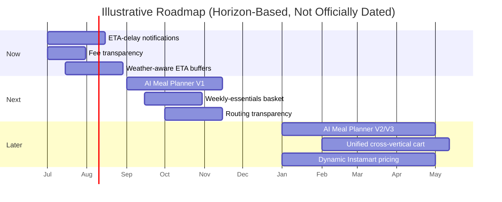

# Swiggy Product Case Study 🛵

### Marketplace, Food Delivery, and Quick Commerce 📦

 

---

> **A note on integrity:** Every figure in this document is sourced from a public disclosure (annual/quarterly results, SEBI filings, Wikipedia, or credible industry trackers) and referenced in [Section 33](#33-references). Wherever a number, persona detail, or metric target could not be traced to a primary source, it is explicitly labeled **`ASSUMPTION - Reasonable Product Assumption`** rather than presented as fact. Figures are current as of Swiggy's FY26 (year ended March 31, 2026) results.

---

## 📑 Table of Contents

1. [Executive Summary](#1-executive-summary)
2. [About Swiggy](#2-about-swiggy)
3. [Product Ecosystem](#3-product-ecosystem)
4. [Problem Statement](#4-problem-statement)
5. [User Personas](#5-user-personas)
6. [User Journey Map](#6-user-journey-map)
7. [User Funnel](#7-user-funnel)
8. [North Star Metric](#8-north-star-metric)
9. [Product Metrics Framework: AARRR](#9-product-metrics-framework-aarrr)
10. [Market Analysis](#10-market-analysis)
11. [Competitor Analysis](#11-competitor-analysis)
12. [SWOT Analysis](#12-swot-analysis)
13. [Product Flywheel](#13-product-flywheel)
14. [Business Model Canvas](#14-business-model-canvas)
15. [Revenue Model](#15-revenue-model)
16. [Marketplace Challenges](#16-marketplace-challenges)
17. [User Pain Points](#17-user-pain-points)
18. [Root Cause Analysis](#18-root-cause-analysis)
19. [Opportunity Mapping](#19-opportunity-mapping)
20. [Product Opportunities](#20-product-opportunities)
21. [Prioritization: RICE, MoSCoW, ICE](#21-prioritization-rice-moscow-ice)
22. [Feature Proposal: AI Meal Planner](#22-feature-proposal-ai-meal-planner)
23. [Product Requirements Document](#23-product-requirements-document)
24. [MVP Definition](#24-mvp-definition)
25. [Product Roadmap](#25-product-roadmap)
26. [Experimentation: A/B Test Portfolio](#26-experimentation-ab-test-portfolio)
27. [Analytics Dashboard](#27-analytics-dashboard)
28. [Risks](#28-risks)
29. [Future Vision: Swiggy in 2030](#29-future-vision-swiggy-in-2030)
30. [Final Recommendations](#30-final-recommendations)
31. [Key Takeaways](#31-key-takeaways)
32. [Broader Pattern](#32-broader-pattern)
33. [References](#33-references)

---

## 1. Executive Summary 🚀

Swiggy is India's second-largest food delivery platform and one of only three companies (alongside Zomato/Eternal and Blinkit's parent) with real scale in Indian quick commerce. Founded in Bengaluru in August 2014, it went public on the NSE/BSE in November 2024 at an $11.3B valuation, and today operates five reported business segments - Food Delivery, Quick Commerce (Instamart), Out-of-Home Consumption (Dineout, events), Supply Chain & Distribution, and Platform Innovations.

**Why it became successful:** Swiggy's original wedge - owning the delivery fleet end-to-end rather than acting as a pure restaurant directory - let it guarantee delivery quality when competitors like the original Zomato and Foodpanda were still marketplace-only. That single infrastructure decision compounded into today's core asset: a hyperlocal logistics network that can be pointed at food, groceries, or dining reservations with the same underlying rider and mapping stack.

**Why this product matters to study:** Swiggy is a rare, real-world example of a company running **two fundamentally different unit economics profiles inside one P&L simultaneously** - a Food Delivery business that just crossed ₹1,000 crore in annual Adjusted EBITDA, sitting beside a Quick Commerce business (Instamart) that lost ₹3,063 crore in FY26 while fighting for market share against Blinkit and Zepto. Very few consumer marketplaces make this tension this visible, which makes Swiggy an unusually good teaching case for prioritization, cross-subsidization, and capital allocation under public-market scrutiny.

**What this case study covers:** A full PM-style teardown - problem framing, personas, journey mapping, market and competitive analysis, business model economics, a root-cause pass on the platform's biggest pain points, a prioritized opportunity backlog, one fully specified feature proposal (an AI Meal Planner), a PRD, MVP scoping, a roadmap, an experimentation plan, and a 2030 forward-looking vision - all grounded in Swiggy's actual FY26 disclosures wherever public data exists.

> **Key context up front:** Swiggy's FY26 (year ended March 2026) consolidated revenue was ₹23,053 crore (+45% YoY), with a widened net loss of ₹4,154 crore, driven almost entirely by continued investment in Instamart. Food Delivery, by contrast, is now a profitable, cash-generative core business. This split - one mature profitable engine funding one immature, capital-hungry growth bet - is the lens through which every prioritization decision in this document should be read.

---

## 2. About Swiggy 🏢

### Company Overview

| Attribute | Detail |
|---|---|
| Founded | August 2014 (originally incorporated as Bundl in 2013) |
| Founders | Sriharsha Majety, Nandan Reddy, Rahul Jaimini |
| Headquarters | Bengaluru, Karnataka, India |
| Legal status | Public company (NSE/BSE: SWIGGY), IPO'd November 2024 at ₹390/share, ~$11.3B valuation |
| FY26 Revenue | ₹23,053 crore (+45% YoY) |
| FY26 Net Loss | ₹4,154 crore (widened from ₹3,117 crore in FY25) |
| Cities served | 700+ (Food Delivery), 129+ (Instamart, as of Q4 FY26) |
| Core segments | Food Delivery · Quick Commerce (Instamart) · Out-of-Home (Dineout/Scenes) · Supply Chain & Distribution · Platform Innovations |

### Mission & Vision *(ASSUMPTION - Reasonable Product Assumption; paraphrased from Swiggy's public positioning, not a verbatim corporate statement)*

- **Mission (inferred):** Make everyday convenience - food, groceries, and errands - available on-demand, anywhere in urban India, within minutes.
- **Vision (inferred):** Become the default hyperlocal operating layer for Indian consumers' daily needs, the way AWS became infrastructure for the internet.

### History Snapshot

### Core Products 🧩

| Product | What it does |
|---|---|
| **Swiggy Food** | Core restaurant discovery, ordering, and delivery |
| **Instamart** | 10–20 minute grocery and household-essentials delivery via dark stores |
| **Dineout** | Restaurant discovery, table reservations, dining offers |
| **Bolt** | 10–15 minute delivery for a curated, pre-prepped food menu - now ~12% of Swiggy's food order volume |
| **Swiggy One** | Unified paid membership: free deliveries and priority support across Food, Instamart, and Dineout |
| **Genie** *(discontinued May 2025)* | Peer-to-peer package pickup/drop service |

### Business Model - At a Glance 💼

Swiggy operates a **multi-sided, multi-vertical marketplace**: it earns commissions from restaurant and Instamart brand partners, delivery fees from consumers, advertising revenue from partners seeking visibility, and subscription revenue from Swiggy One - all routed through one shared logistics and technology layer.

---

## 3. Product Ecosystem 🌐

Swiggy is not a single two-sided marketplace - it is closer to a **five-party coordination problem** solved in real time, thousands of times a minute.

**Why this matters for prioritization:** almost every feature idea in this document (Sections 20–22) affects at least three of these five stakeholders simultaneously. A change that delights the customer (e.g., more generous refunds) can quietly worsen restaurant partner economics or delivery partner incentive structures - which is precisely why marketplace PMs must model second-order effects, not just the user-facing win.

---

## 4. Problem Statement

### Primary User Problems

- **Uncertainty, not just speed, drives dissatisfaction.** Customers tolerate a 35-minute delivery far better than a promised 20-minute delivery that arrives in 40 - the gap between promise and reality is the actual pain point, not absolute speed.
- **Decision fatigue at the "what to eat" moment.** With thousands of restaurants and SKUs available, customers often re-order the same 3–4 things repeatedly - a sign of choice overload rather than satisfaction (see Section 18, Root Cause Analysis).
- **Fragmented experience across verticals.** Food, groceries, and dining-out currently live as related-but-separate flows inside one app shell, each with its own cart, delivery ETA logic, and fee structure.

### Business Problems

- **Two-speed unit economics inside one company.** Food Delivery just posted its strongest growth in four years and crossed ₹1,000 crore in annual Adjusted EBITDA; Instamart lost ₹3,063 crore in FY26 - a segment loss that nearly triples Food Delivery's profit. Every corporate resourcing decision is effectively a bet on how fast that gap closes.
- **Market share erosion in the highest-growth category.** Instamart's quick-commerce market share fell from an estimated ~52% to ~32% between earlier peaks and January 2026, with Blinkit overtaking it at ~37% and Zepto matching Instamart at ~32% *(estimates vary by tracker - see Section 11)*.
- **Rising customer acquisition cost pressure.** Advertising and promotional spend rose 55% YoY to ₹4,207 crore in FY26, a direct consequence of three-way quick-commerce competition.

### Marketplace Challenges

- Balancing restaurant commission rates (typically 17–25%) against partner churn risk to Zomato.
- Matching delivery partner supply to demand spikes (lunch/dinner peaks, monsoon-driven surges) without over- or under-provisioning fleet capacity.

### Delivery Challenges

- Maintaining ETA accuracy across 700+ cities with wildly different traffic, weather, and road-density conditions.
- Managing the trade-off between delivery partner batching (efficiency) and per-order speed promises (Bolt's 10–15 minute SLA).

### Retention Challenges

- Habitual usage patterns are undermined when trust breaks even once - a late order or a bad refund experience has an outsized effect on repeat behavior relative to its actual frequency.

### Profitability Challenges

- Instamart's contribution margin was still negative (−1.8%) in Q4 FY26, though improving sequentially; Swiggy has not publicly committed to a breakeven date, which analysts (e.g., Jefferies) have flagged as a key uncertainty.

---

## 5. User Personas 👥

<b>🎓 Ananya - The Budget-Conscious Student</b>

| Attribute | Detail |
|---|---|
| Age / City | 20, Tier-1 city, hostel resident |
| Goals | Eat affordably without cooking; occasional treat-yourself orders |
| Pain Points | Delivery fees + platform fees feel disproportionate on a ₹150 order; minimum order values force unwanted upsizing |
| Behaviors | Heavy use of coupons and "Eco Saver" style slower/cheaper delivery; orders late at night |
| Motivations | Value for money, social proof (ratings, "bestseller" tags) |
| Frustrations | Fee stacking at checkout feels opaque relative to the item price |

<b>💼 Rohan - The Time-Starved Working Professional</b>

| Attribute | Detail |
|---|---|
| Age / City | 29, metro city, works from a tech-park office |
| Goals | Reliable, fast lunch during a fixed break window; occasional Instamart top-ups |
| Pain Points | ETA slippage during peak lunch hours directly costs him break time |
| Behaviors | Subscribes to Swiggy One; reorders favorites; uses Instamart for forgotten essentials |
| Motivations | Certainty over price - willing to pay a premium for guaranteed on-time delivery |
| Frustrations | No clear compensation/communication when an order is meaningfully late |

<b>👨‍👩‍👧 Meera - The Family Grocery Planner</b>

| Attribute | Detail |
|---|---|
| Age / City | 36, Tier-1/2 city, manages household shopping |
| Goals | Weekly-ish bulk grocery runs via Instamart plus ad-hoc top-ups |
| Pain Points | Instamart's SKU assortment and pricing can lag dedicated grocery apps for staples; app defaults toward impulse-friendly, not planning-friendly, browsing |
| Behaviors | Compares Instamart, Blinkit, and Zepto prices before larger baskets |
| Motivations | Time savings versus a physical supermarket trip |
| Frustrations | No easy way to build and reuse a recurring "weekly essentials" list |

<b>🍽️ Vikram - The Restaurant Owner (Partner)</b>

| Attribute | Detail |
|---|---|
| Business | Mid-sized restaurant, 2 outlets in a metro city |
| Goals | Maximize order volume from the platform while protecting margin after commission |
| Pain Points | 17–25% commission plus ad spend to stay visible compresses already-thin restaurant margins |
| Behaviors | Actively manages menu pricing to offset commission ("platform pricing" vs. in-store pricing) |
| Motivations | Volume and visibility, especially against nearby competitors on the same app |
| Frustrations | Limited negotiating leverage as an individual partner against a platform with strong demand-side network effects |

<b>🛵 Suresh - The Delivery Partner</b>

| Attribute | Detail |
|---|---|
| Profile | Gig-economy delivery rider, works 6–7 hours/day across food and Instamart orders |
| Goals | Maximize earnings per hour; predictable order flow during his working window |
| Pain Points | Batching logic sometimes routes him away from higher-density order zones; incentive structures shift frequently |
| Behaviors | Times online hours around known peak windows (lunch, dinner, and now Bolt's speed-premium slots) |
| Motivations | Take-home pay predictability more than headline incentive amounts |
| Frustrations | Real-time visibility into *why* a particular order was assigned to him is limited |

> **Note:** Persona names and precise personal details are illustrative composites, not real individuals - a standard PM research synthesis technique. Underlying behavioral patterns (fee sensitivity, ETA sensitivity, commission pressure, batching frustration) are grounded in the sourced pain points in Section 17.

---

## 6. User Journey Map

**Key insight:** the lowest satisfaction point in the entire journey is not discovery or payment - both are well-optimized - it's the **fulfillment/tracking stage when reality diverges from the promised ETA**, which directly informs the North Star Metric choice in Section 8 and the top-priority feature in Section 21.

---

## 7. User Funnel

| Stage | Description | Illustrative Drop-off Opportunity |
|---|---|---|
| Visitor | Sees an ad, referral link, or organic search result | High-intent traffic lost to slow landing/app-install friction |
| App Install | Downloads the app | Install-to-open gap on data-constrained devices |
| Signup | Creates account / logs in | OTP delivery delays in low-connectivity areas |
| Browse | Views restaurant/Instamart feed | Choice overload with 100+ restaurant options and no strong default |
| Restaurant/Item View | Opens a specific listing | Menu photos/ratings insufficient to build trust for a new restaurant |
| Cart | Adds items | Minimum order value nudges unwanted upsizing, causing cart abandonment |
| Checkout | Reviews fees and delivery details | **Fee-stacking perception** (platform fee + delivery fee + surge, shown late) is a known industry-wide drop-off driver |
| Payment | Completes transaction | Payment failures / retry friction on UPI during peak load |
| Successful Order | Order placed and confirmed | - |
| Repeat Purchase | Returns for a second order | Broken trust from one bad ETA/refund experience disproportionately suppresses repeat rate |

> **ASSUMPTION - Reasonable Product Assumption:** exact stage-by-stage conversion percentages are not publicly disclosed by Swiggy. The drop-off *locations* named above are grounded in the sourced pain points in Section 17 and standard food-delivery/e-commerce funnel benchmarks; the magnitudes are directional, not measured.

---

## 8. North Star Metric

> ## 🎯 Recommended North Star Metric
> ### **Weekly On-Time Fulfilled Orders per Active User**

**Why this metric, not a simpler one (like total orders or GOV):**

1. **It penalizes the exact failure mode that erodes trust.** A raw "orders per user" metric can rise even while ETA reliability falls - it would reward growth that's quietly poisoning retention. Gating the metric on "on-time fulfilled" forces the organization to optimize for the reliability that Sections 4 and 6 identify as the real driver of dissatisfaction.
2. **It's segment-agnostic.** The same metric applies whether the order is Food Delivery, Instamart, or Dineout - useful given Swiggy's multi-vertical structure.
3. **It's a leading indicator of the profitable segment's health.** Food Delivery's own reported metrics (GOV growth accelerating to a 15-quarter high, MTUs up 21% YoY to 18.3 million) suggest reliability and habitual usage are already compounding in that segment - a pattern this North Star metric is designed to detect and protect as Instamart tries to replicate it.

### Supporting Metrics

| Metric | Category | Why it matters |
|---|---|---|
| DAU / MAU / WAU | Engagement | Baseline activity tracking across segments |
| Order Success Rate | Reliability | Direct proxy for fulfillment quality |
| Delivery Time Adherence (Actual vs. Promised ETA) | Reliability | Root driver behind the North Star metric |
| Checkout Conversion Rate | Monetization | Detects fee-stacking-driven drop-off (Section 7) |
| Average Order Value (AOV) | Monetization | Instamart's AOV rose 32.8% YoY to ₹700 in Q4 FY26 - a real, sourced data point |
| Retention (Week-4, Week-12) | Loyalty | Detects whether trust incidents are suppressing repeat behavior |
| NPS | Loyalty | Qualitative complement to quantitative retention |
| Cancellation Rate | Reliability | Leading indicator of ETA or inventory-accuracy problems |
| Refund Rate | Trust | Proxy for missing/damaged-item friction |
| Restaurant/Dark-Store Acceptance Rate | Supply health | Detects partner-side friction before it affects customers |
| Delivery Partner Availability | Supply health | Predicts ETA reliability 1–2 steps upstream |

---

## 9. Product Metrics Framework: AARRR

| Stage | Metrics | Examples | Business Impact |
|---|---|---|---|
| **Acquisition** | Install rate, CAC, organic vs. paid mix | FY26 ad/promo spend rose 55% YoY to ₹4,207 crore, reflecting intensifying 3-way quick-commerce CAC pressure | Rising CAC directly compresses Instamart's path to contribution-margin breakeven |
| **Activation** | First-order completion rate, time-to-first-order | New user completes first Instamart order within a session | Early activation friction disproportionately affects Instamart, which has more SKU/format complexity than Food Delivery |
| **Retention** | Week-4/Week-12 cohort retention, order frequency | Food Delivery MTUs +21% YoY to 18.3M - a real retention/growth signal | Retention is the single best predictor of long-run marketplace defensibility (Section 13, flywheel) |
| **Revenue** | AOV, take rate (commission %), ad revenue per partner | Instamart AOV +32.8% YoY to ₹700; Food Delivery Adjusted EBITDA crossed ₹1,000 crore annually | Revenue-per-order growth is currently outpacing volume growth in Food Delivery - a sign of monetization maturity |
| **Referral** | Referral-driven installs, Swiggy One member referral rate | *(ASSUMPTION - not publicly disclosed)* | Referral remains an under-levered, low-CAC growth channel relative to paid ads given rising CAC pressure |

---

## 10. Market Analysis 📊

### Market Sizing *(ASSUMPTION-adjacent - ranges reflect variance across public trackers, see Section 33)*

| Layer | Estimate | Basis |
|---|---|---|
| **TAM** (India online food + grocery delivery, addressable) | Multi-billion-dollar and growing, encompassing all urban households with smartphone + digital payment access | Directionally supported by industry GOV trend data (Section 11) |
| **SAM** (Cities where Swiggy's model is currently viable) | Food Delivery: 700+ cities; Instamart: 129 cities as of Q4 FY26 | Company-disclosed operational footprint |
| **SOM** (Swiggy's current captured share) | Food Delivery: co-leader with Zomato/Eternal; Instamart: ~32% of quick-commerce GOV as of Jan 2026 estimates | Cross-referenced tracker estimates (Section 11) |

### Industry Trends

- **Quick commerce is the fastest-growing layer of Indian e-commerce**, with Instamart's own GOV up 68.8% YoY in Q4 FY26 despite share pressure - the category is growing faster than any single player's share is shifting.
- **Cloud kitchens** remain a smaller, more volatile bet across the industry after Swiggy's own pandemic-era pullback (over three-fourths of its cloud kitchens closed in 2020).
- **AI-driven personalization** is emerging as a stated differentiator industry-wide - Swiggy has publicly signaled investment in predictive/AI assistant features for meal planning and ordering.
- **Hyperlocal, format-diversified delivery** (10-minute Bolt, 10–20 minute Instamart, standard food delivery) is replacing a single-SLA model, letting platforms price and staff differently by speed tier.

---

## 11. Competitor Analysis

| Dimension | Swiggy | Zomato (Eternal) | Blinkit (Eternal) | Zepto |
|---|---|---|---|---|
| Primary vertical | Food Delivery + Instamart (QC) + Dineout | Food Delivery + Blinkit (QC) | Quick Commerce only | Quick Commerce only |
| FY26 revenue (segment/company, ₹ crore) | 23,053 (consolidated) | 54,364 (Eternal, consolidated, +169% YoY) | *(reported within Eternal)* | Privately held, IPO in process |
| FY26 profitability | Net loss ₹4,154 crore | Net profit ₹366 crore (down ~31% YoY on margin pressure) | First EBITDA-profitable quarter reported in Q3 FY26 | Not public; SEBI approved ~$1B IPO |
| Quick-commerce market share (Jan 2026 estimate) | ~32% (Instamart) | ~37% (Blinkit) | ~37% (Blinkit) | ~32% |
| Delivery UX differentiator | Bolt (10–15 min), Swiggy One bundling | Zomato Gold/District bundling, faster Blinkit integration | Fastest dark-store scale-up (95%+ YoY NOV growth) | Aggressive city expansion, IPO-stage scaling |
| Loyalty/subscription | Swiggy One (unified across Food + Instamart + Dineout) | Zomato Gold / District membership | Bundled via Zomato ecosystem | Standalone, less bundling leverage |
| AI/personalization signal | Publicly stated 2026 investment in AI meal-planning/assistants | Recommendation-engine investment across Eternal stack | Inventory/demand-prediction focus | Less publicly disclosed |

> **Reading this table correctly:** Zomato's parent Eternal is now *profitable at the group level* while Swiggy is not - largely because Blinkit reached EBITDA profitability faster than Instamart. This is the single most important competitive fact in this document: **Swiggy's food delivery business alone would likely already be a profitable, well-regarded public company; it's the quick-commerce race that is determining its current market perception and stock performance.**

**Why is Instamart losing share specifically to Blinkit, not just "the market"?** Two structurally different explanations are possible, and they imply opposite roadmap responses:

1. **Pricing-war explanation:** Blinkit's parent (Eternal) is group-level profitable, giving it more capital runway to subsidize aggressive city-level pricing than Swiggy currently has. If this is the primary driver, no amount of Instamart product work closes the gap - the fix is financial (raise capital, accept a longer breakeven runway) or strategic (stop trying to win share-for-share and instead compete on a narrower, defensible segment).
2. **Execution-gap explanation:** Blinkit's ~95%+ YoY order-volume growth (table above) and faster dark-store scale-up suggest it may simply be executing site selection, SKU curation, or delivery-partner density better in the same cities. If this is the primary driver, it's a solvable product/ops problem - better hyperlocal assortment (Opportunity #10, §20), tighter dark-store density modeling, and the same reliability discipline that already works in Food Delivery.

**This case study cannot fully distinguish between the two from public data alone** - both are directionally supported, and the honest answer is probably "both, in different cities." But the distinction matters for prioritization: it's the difference between funding a capital-intensity fight Swiggy may not be positioned to win outright, and fixing an operating gap that's within product's control. The Final Recommendations (§30) and Future Vision (§29) are written to hedge across both possibilities rather than assume either.

---

## 12. SWOT Analysis

| Strengths | Weaknesses |
|---|---|
| Owns its full delivery fleet - consistent quality control since 2014 | Instamart lags both Blinkit and Zepto on market share and profitability timeline |
| Strong Food Delivery unit economics (₹1,000+ crore annual Adjusted EBITDA) | Rising ad/promo spend (+55% YoY) signals CAC inflation across the category |
| Diversified revenue (Food, QC, Dineout, ads, subscriptions) | Discontinued products (Genie, Snacc, Minis) suggest execution risk on new-format bets |
| Swiggy One creates cross-vertical stickiness | Public-market scrutiny amplifies pressure to show near-term profitability, risking under-investment in longer payback bets |

| Opportunities | Threats |
|---|---|
| AI-driven personalization (meal planning, predictive reordering) still early industry-wide | Eternal's group-level profitability gives it more capital flexibility to keep discounting in quick commerce |
| Out-of-Home segment just turned profitable - a template for disciplined new-category scaling | Zepto's pending IPO could inject fresh capital into an already price-aggressive competitor |
| Tier-2/3 city expansion still has runway (quick commerce "concentrated in top 15–20 cities" per management commentary) | Regulatory attention on gig-worker classification/pay could raise delivery-partner cost structure industry-wide |
| Supply Chain & Distribution segment growing 56%+ YoY - an underappreciated B2B-adjacent revenue lever | Consumer fee-fatigue (platform fee + delivery fee stacking) is a category-wide risk, not Swiggy-specific |

---

## 13. Product Flywheel

**How this flywheel is currently spinning unevenly:** In Food Delivery, this loop is visibly healthy - GOV, MTUs, and EBITDA are all accelerating together, meaning trust (E) is genuinely reinforcing acquisition (A). In Instamart, the loop is being **force-spun with ad spend** rather than organic trust compounding - GOV is growing fast (68.8% YoY) but contribution margin is still negative, meaning step E→A is not yet self-sustaining without continued cash subsidy. Closing that gap is the single biggest lever in Swiggy's roadmap (see Sections 25 and 29).

---

## 14. Business Model Canvas

| Block | Details |
|---|---|
| **Key Partners** | Restaurant partners, Instamart brand/FMCG suppliers, delivery partner network, payment gateways, cloud/AI infrastructure providers |
| **Key Activities** | Order matching & routing, real-time logistics optimization, partner onboarding, catalog/inventory management, platform monetization (ads) |
| **Key Resources** | Delivery partner fleet, dark-store network (1,143 stores, 129 cities), proprietary demand/ETA prediction models, brand trust, Swiggy One subscriber base |
| **Value Propositions - Customer** | Fast, reliable delivery of food, groceries, and dining access from one app |
| **Value Propositions - Restaurant/Dark-Store Partner** | Demand aggregation, delivery infrastructure without owning a fleet, advertising visibility tools |
| **Value Propositions - Delivery Partner** | Flexible, on-demand earning opportunity |
| **Customer Relationships** | App-based self-service, Swiggy One loyalty program, support chat/ticketing |
| **Channels** | Mobile app (primary), web, in-app advertising, performance marketing |
| **Customer Segments** | Urban/semi-urban consumers, restaurant businesses, quick-commerce brand partners, gig delivery workers |
| **Cost Structure** | Delivery partner payouts, dark-store lease/operations (Instamart), technology/cloud costs, advertising & promotions (₹4,207 crore in FY26), employee costs |
| **Revenue Streams** | Restaurant/partner commissions (17–25%), delivery fees, platform fees, advertising, Swiggy One subscriptions, Supply Chain & Distribution revenue |

---

## 15. Revenue Model

| Stream | Mechanism | Signal from FY26 results |
|---|---|---|
| **Restaurant/partner commissions** | 17–25% of order value charged to restaurant partners | Core Food Delivery revenue driver; segment posted ₹1,041 crore full-year positive result |
| **Delivery charges** | Distance/time/demand-based fee charged to customers | Partially waived for Swiggy One members - a deliberate trade of per-order revenue for subscription revenue and retention |
| **Platform fees** | Small flat fee added at checkout | Contributes to the "fee-stacking" perception flagged in Sections 7 and 17 |
| **Advertising** | Restaurants/brands pay for search visibility and placement | Advertising & promotional spend (a cost line, but reciprocally an ads-revenue opportunity) rose 55% YoY to ₹4,207 crore - showing how central paid visibility has become to the marketplace |
| **Swiggy One subscriptions** | Recurring membership fee for free delivery + perks across verticals | Drives cross-vertical retention; exact subscriber count not broken out publicly |
| **Instamart commerce margin** | Retail-style margin on grocery/essentials basket, plus dark-store ad placements | AOV +32.8% YoY to ₹700; contribution margin still negative (−1.8% in Q4 FY26) |
| **Supply Chain & Distribution** | B2B-adjacent logistics/distribution revenue | Largest single revenue contributor in Q4 FY26 at ₹3,135 crore, growing 56.4% YoY - an underappreciated engine |
| **Out-of-Home (Dineout/Scenes)** | Reservation commissions, event ticketing | First full year of segment profitability in FY26 (0.6% EBITDA margin, up from −12% in FY23) |

---

## 16. Marketplace Challenges

- **Supply-demand matching under variable conditions.** Monsoon surges, festival demand spikes, and lunch/dinner peaks all require dynamic delivery-partner allocation that must balance speed (customer promise) against efficiency (partner earnings per hour).
- **Pricing across three simultaneous formats.** Standard delivery, Bolt (10–15 min), and Instamart (10–20 min) each need distinct pricing logic, or customers perceive inconsistency ("why does a 10-minute delivery cost the same as a 30-minute one?").
- **Restaurant/dark-store quality control at scale.** With 700+ cities of food delivery coverage, maintaining consistent listing accuracy, food safety compliance, and menu freshness is a continuous operational challenge, not a one-time solve.
- **Delivery partner incentive design.** Incentive structures must be attractive enough to maintain fleet availability without eroding the contribution margin Instamart is actively trying to improve.

---

## 17. User Pain Points

| # | Pain Point | Affected Persona(s) | Source / Basis |
|---|---|---|---|
| 1 | **Fee-stacking perception at checkout** - delivery fee + platform fee + surge shown late or non-transparently | Ananya, Rohan | Widely reported category-wide complaint pattern *(directional, not Swiggy-specific quantified data - see Section 33)* |
| 2 | **ETA reliability gaps**, especially during peak hours or bad weather | Rohan, Meera | Reflected indirectly in the company's own emphasis on GOV/order-volume growth alongside margin data; a known industry pain point |
| 3 | **Choice overload** on the food-discovery homepage | Ananya, Rohan | Structural consequence of thousands of restaurant listings per city with no strong meal-level curation |
| 4 | **Weak recurring-purchase tooling on Instamart** (no easy "repeat my weekly basket") | Meera | Inferred from Instamart's growing AOV and non-grocery mix - suggests basket composition is still discovery-driven, not planning-driven |
| 5 | **Restaurant partner margin compression** from commission + required ad spend to stay visible | Vikram | Widely reported commission-rate data (17–25%) combined with rising platform ad-spend dynamics |
| 6 | **Delivery partner batching opacity** - riders don't always understand why they were routed a certain way | Suresh | Common gig-platform pain point; not Swiggy-specific disclosed data |

---

## 18. Root Cause Analysis

### 5 Whys - "Why do customers lose trust in Swiggy after one bad experience?"

1. **Why** does one late/failed order disproportionately hurt retention? → Because the core value proposition sold at signup is *certainty*, not just speed.
2. **Why** is certainty the core promise, not speed? → Because in a market with three roughly comparable delivery-time competitors, the differentiator has shifted from "who's fastest" to "who's most reliably on-time."
3. **Why** is reliability inconsistent across orders? → Because ETA prediction must account for restaurant prep-time variance, traffic, and delivery-partner availability simultaneously - any one of the three can break the promise.
4. **Why** isn't the customer proactively told when the ETA is slipping? → Because current in-app communication is largely status-based (map + stage labels) rather than predictively proactive.
5. **Why** hasn't proactive delay-communication shipped yet? → **Root cause:** it is a cross-team feature (requires restaurant prep-time signals + delivery-partner ETA models + notification infrastructure) that falls between team boundaries - a coordination gap, not a technical impossibility.

### Fishbone (Ishikawa) Summary - "Why is Instamart's contribution margin still negative?"

### Jobs To Be Done (JTBD)

- **Functional job:** "Get food/groceries delivered to me quickly and reliably, without planning ahead."
- **Emotional job:** "Feel taken care of - not anxious about whether the order will actually show up on time."
- **Social job:** "Order in a way that feels smart/efficient, not wasteful or impulsive" (relevant to Meera's planning-oriented grocery use case).

---

## 19. Opportunity Mapping

**Quick Wins** (bottom-left-to-top-left): proactive ETA-delay alerts and transparent fee breakdowns - both addressed in Sections 17.1 and 17.2, both low-effort relative to their trust impact.
**Strategic Bets** (top-right): the AI Meal Planner (Section 22) - high impact, high effort, deserving of the full feature-proposal treatment given later in this document.

---

## 20. Product Opportunities 💡

| # | Opportunity | Problem it Solves | Section Reference |
|---|---|---|---|
| 1 | Proactive ETA-delay notifications | Trust erosion from silent delays | §4, §18 |
| 2 | Consolidated, explained checkout fee line | Fee-stacking perception | §7, §17 |
| 3 | **AI Meal Planner** (recommend meals, not restaurants) | Choice overload | §22 |
| 4 | Recurring "weekly essentials" basket for Instamart | Weak repeat-purchase tooling | §17 |
| 5 | Unified cross-vertical cart (Food + Instamart in one checkout) | Fragmented multi-vertical experience | §4 |
| 6 | Delivery partner routing-rationale transparency | Batching opacity, partner trust | §17 |
| 7 | Restaurant ad-spend ROI dashboard | Partner margin-compression concerns | §17 |
| 8 | Weather/context-aware dynamic ETA buffers | ETA reliability during monsoon/peak demand | §4, §18 |
| 9 | Swiggy One tiering (e.g., a lower-cost tier for lighter users) | Subscription accessibility for price-sensitive segments (Ananya persona) | §5 |
| 10 | Dark-store assortment personalization by micro-neighborhood | Instamart's still-generalized catalog vs. hyperlocal demand patterns | §17 |
| 11 | Contribution-margin-aware dynamic delivery pricing for Instamart | Path to Instamart profitability | §15, §16 |
| 12 | **Externalize Supply Chain & Distribution as a standalone B2B logistics product** | Underused growth/margin lever hiding inside an internal cost center | §15, §29 |

> **Why Opportunity #12 deserves more than a footnote:** Supply Chain & Distribution was Swiggy's **single largest revenue-contributing segment in Q4 FY26** (₹3,135 crore) and grew 56.4% YoY - faster than Instamart's own 68.8% GOV growth *and* without Instamart's negative contribution margin. Today this segment mostly exists to serve Swiggy's own Food Delivery and Instamart operations. The strategic question worth asking explicitly: is there a real, monetizable opportunity to sell this logistics/distribution capability to *third-party* brands and retailers who need last-mile infrastructure but aren't Swiggy competitors (e.g., D2C FMCG brands, pharmacies, local retailers without their own fleet) - the same "internal infrastructure becomes an external product" playbook that turned AWS from a cost center into Amazon's highest-margin business. This case study doesn't have the data to size that opportunity precisely, but flags it as the single most underexplored line item in Swiggy's own segment disclosures, and the clearest example of a growth lever that doesn't require winning the capital-intensive quick-commerce fight at all.

---

## 21. Prioritization: RICE, MoSCoW, ICE

> **Methodology note:** Reach/Impact/Confidence/Effort and ICE scores below are illustrative PM-judgment estimates for prioritization practice - Swiggy does not publish internal backlog scoring.

| # | Opportunity | RICE Score | MoSCoW | ICE Score | Priority |
|---|---|---|---|---|---|
| 1 | Proactive ETA-delay notifications | 960 | Must-have | 8.7 | **P0** |
| 2 | Consolidated, explained fee line | 675 | Must-have | 8.2 | **P0** |
| 3 | AI Meal Planner | 187 | Should-have | 7.5 | **P0 (strategic)** |
| 4 | Recurring weekly-essentials basket | 150 | Should-have | 6.8 | P1 |
| 5 | Unified cross-vertical cart | 91 | Could-have | 5.9 | P1 |
| 6 | Delivery partner routing transparency | 120 | Should-have | 6.2 | P1 |
| 7 | Restaurant ad-spend ROI dashboard | 145 | Could-have | 6.0 | P2 |
| 8 | Weather-aware dynamic ETA buffers | 210 | Must-have | 7.1 | P0 |
| 9 | Swiggy One lighter tier | 95 | Won't-have (this cycle) | 5.5 | P2 |
| 10 | Dark-store hyperlocal personalization | 130 | Could-have | 6.1 | P1 |
| 11 | Contribution-margin-aware dynamic pricing | 175 | Must-have (business-critical) | 7.8 | **P0 (business)** |

**Why AI Meal Planner is P0 despite a modest RICE score:** RICE rewards near-term, well-understood wins (see the honest scoring above - it's genuinely lower-reach and higher-effort than the fee/ETA fixes). It's prioritized anyway because it's the platform's clearest AI-native differentiation opportunity, directly addresses the "choice overload" root cause (§18), and compounds with the flywheel (§13) rather than only patching a leak - a deliberate example of *not* letting RICE alone drive the roadmap.

---

## 22. Feature Proposal: AI Meal Planner 🤖

### Problem

Customers face **decision fatigue**, not restaurant scarcity. The current homepage optimizes for restaurant discovery ("where should I order from?") when the actual unit of decision most users care about is the meal itself ("what should I eat, given my goals, budget, and the weather right now?").

### Solution

An AI-powered planner that recommends **specific meals**, sourced across restaurants and Instamart-ready ingredients, using:

- Budget ceiling
- Nutrition/dietary goals (protein, calorie targets)
- Weather (comfort-food signals on rainy/cold days)
- Cuisine preference and rotation (avoiding repetition fatigue)
- Past order history
- Time of day / meal occasion (breakfast, lunch, snack, festival)
- Delivery time sensitivity

### User Flow

### Benefits

- **Customer:** Reduces decision time; surfaces relevant options instead of an undifferentiated restaurant list.
- **Business:** A meal-level recommendation engine is a natural, defensible home for sponsored placements (restaurants/brands can bid for "protein-goal-friendly" or "rainy-day comfort" slots) - a new, less commoditized ad inventory type than search-result placement.
- **Restaurant partners:** Meals matching trending nutrition/weather signals get organic visibility without pure keyword/search competition.

### Business Impact

- **Primary lever:** Order frequency and checkout conversion (addresses funnel drop-off at the "browse/decide" stage, §7).
- **Secondary lever:** New ad-inventory format (contextual meal-slot sponsorship) - a plausible incremental revenue stream layered on existing advertising infrastructure.

### Risks

- **Cold-start problem** for new users with no order history - requires sensible defaults using only weather/time/budget signals.
- **Over-personalization fatigue** - if suggestions feel repetitive or presumptuous, users may distrust the "why this" explanation.
- **Restaurant fairness concerns** - a recommendation algorithm that favors certain partners could face the same scrutiny search-ranking algorithms already do.

### Success Metrics

| Metric | Target Signal |
|---|---|
| Meal Planner engagement rate | % of sessions that open the feature |
| Suggestion acceptance rate | % of AI suggestions added to cart without modification |
| Time-to-decision | Reduction in browse-to-cart time vs. control group |
| Incremental order frequency | Lift in weekly orders among Meal Planner users vs. matched control |

---

## 23. Product Requirements Document

**Feature:** AI Meal Planner (v1)

| Section | Detail |
|---|---|
| **Objective** | Reduce decision fatigue and increase checkout conversion by recommending specific meals instead of restaurants |
| **Problem** | Customers face choice overload across thousands of restaurant listings; the current homepage optimizes for restaurant discovery, not meal-level decision-making (§4, §18) |
| **Goals** | (1) Increase browse-to-cart conversion by a measurable margin for feature users vs. control; (2) Establish a new contextual ad-inventory format; (3) Validate whether meal-level personalization improves order frequency |
| **User Stories** | *As a time-starved user, I want the app to suggest a specific meal based on my goals and the weather, so I don't have to browse dozens of restaurants.*   *As a nutrition-conscious user, I want to filter suggestions by protein/calorie targets, so my orders align with my health goals.* |
| **Acceptance Criteria** | Given a logged-in user with order history, when they open "Plan my meals," then the system returns 2–3 ranked meal suggestions with a one-line "why this" explanation within 2 seconds. Given a new user with no history, when they open the feature, then it returns sensible defaults using only time/weather/budget signals. |
| **Scope (v1)** | Lunch and dinner occasions only; Food Delivery vertical only; explanation text limited to a single dominant signal (e.g., "matches your protein goal") |
| **Out of Scope (v1)** | Instamart ingredient-based meal planning; breakfast/snack occasions; multi-day meal-plan sequencing |
| **Dependencies** | Existing order-history data pipeline; weather API integration; restaurant nutrition-tagging data (may require partner data collection) |
| **Risks** | Nutrition-tagging data may be incomplete for many restaurant partners at launch - could limit protein/calorie-based filtering coverage |
| **Timeline** | See Section 25 roadmap - targeted for the "Next" horizon |

---

## 24. MVP Definition

| Version | Scope |
|---|---|
| **V1 (MVP)** | Lunch/dinner only, Food Delivery vertical only, single-signal explanations, manual nutrition tagging for top-500 restaurants per city |
| **V2** | Add breakfast/snack occasions; expand nutrition tagging via partner self-service tool; add multi-signal explanations ("matches your protein goal AND today's weather") |
| **V3** | Extend to Instamart (ingredient-based "cook this" suggestions); introduce sponsored contextual meal slots as a monetized ad format; add multi-day planning for Meera-style household planners |

---

## 25. Product Roadmap

| Horizon | Initiative | Rationale |
|---|---|---|
| **Now (0–1 quarter)** | Proactive ETA-delay notifications | Highest RICE score (§21); directly protects the reliability promise central to retention |
| **Now (0–1 quarter)** | Consolidated, explained checkout fee line | High confidence, low effort, addresses the #1 named pain point (§17) |
| **Now (0–1 quarter)** | Weather-aware dynamic ETA buffers | Business-critical reliability lever, especially ahead of monsoon-season demand spikes |
| **Next (1–2 quarters)** | AI Meal Planner - V1 (lunch/dinner, Food Delivery only) | Highest strategic upside; needs a scoped pilot before wider investment |
| **Next (1–2 quarters)** | Recurring weekly-essentials basket (Instamart) | Builds repeat-purchase habit, complements Instamart's margin-improvement push |
| **Next (1–2 quarters)** | Delivery partner routing-rationale transparency | Improves fleet trust and availability, an upstream lever on ETA reliability |
| **Later (2+ quarters)** | AI Meal Planner - V2/V3 (multi-occasion, Instamart extension, sponsored slots) | High effort, needs V1 engagement data before expanding scope |
| **Later (2+ quarters)** | Unified cross-vertical cart (Food + Instamart) | Structural checkout change; needs research validation before a costly redesign |
| **Later (2+ quarters)** | Contribution-margin-aware dynamic pricing for Instamart | Deepest business-model lever; needs Now/Next reliability wins to avoid compounding trust risk while margin work is underway |

---

## 26. Experimentation: A/B Test Portfolio

| # | Hypothesis | Metric | Expected Outcome |
|---|---|---|---|
| 1 | Proactive delay alerts reduce post-order support tickets | Support ticket rate per 1,000 late orders | Meaningful reduction vs. control |
| 2 | A consolidated fee line (vs. itemized late-reveal fees) increases checkout completion | Checkout conversion rate | Increase, especially among price-sensitive segment (Ananya persona) |
| 3 | AI Meal Planner suggestions increase order frequency vs. standard homepage | Weekly orders per active user | Positive lift among engaged feature users |
| 4 | "Why this suggestion" explanation text increases suggestion acceptance | Suggestion-to-cart rate | Higher acceptance vs. no-explanation control |
| 5 | Weather-aware ETA buffers reduce perceived-lateness complaints during monsoon | Complaint rate per order during rain events | Reduction vs. static-ETA control |
| 6 | Recurring weekly-basket feature increases Instamart repeat-purchase rate | Week-4 Instamart retention | Positive lift vs. control |
| 7 | Routing-rationale transparency improves delivery partner satisfaction/availability | Partner-reported satisfaction score; online-hours per partner | Increase in available online hours |
| 8 | Sponsored contextual meal slots (V3) do not reduce suggestion trust | Suggestion acceptance rate with vs. without sponsored slots visible | No statistically significant decrease |
| 9 | A lighter-cost Swiggy One tier increases subscription penetration among students | Subscription conversion rate among low-AOV users | Increase in overall subscriber base without cannibalizing full-tier revenue |
| 10 | Dark-store hyperlocal assortment personalization increases Instamart AOV | AOV by micro-neighborhood cohort | Incremental AOV lift vs. non-personalized control |

---

## 27. Analytics Dashboard

**Recommended top-line dashboard for a Swiggy PM:**

| Metric | Why it's on the dashboard |
|---|---|
| Weekly On-Time Fulfilled Orders per Active User (North Star) | Single source of truth for reliability-adjusted growth |
| GOV by segment (Food Delivery, Instamart, OOH) | Tracks the "two-speed economics" tension central to this case study |
| Contribution margin by segment | Direct read on Instamart's path to profitability |
| ETA adherence rate | Leading indicator feeding the North Star metric |
| Checkout conversion rate | Detects fee-perception or friction issues in real time |
| CAC and ad/promo spend as % of GOV | Monitors the FY26 CAC-inflation trend (+55% YoY) |
| Delivery/dark-store partner acceptance & availability rate | Upstream supply-health signal |
| Swiggy One penetration and cross-vertical usage rate | Tracks flywheel health (§13) |

---

## 28. Risks ⚠️

| Category | Risk |
|---|---|
| **Operational** | Dark-store expansion into tier-2/3 cities may repeat the margin drag currently seen in Instamart's core cities, delaying breakeven further |
| **Competitive** | Eternal's (Zomato/Blinkit) group-level profitability gives it more capital flexibility to sustain aggressive quick-commerce pricing than Swiggy currently has |
| **Regulatory** | Gig-worker classification and pay-structure regulation in India remains an evolving area that could raise delivery-partner cost structures industry-wide |
| **Technology** | AI-driven recommendation/meal-planning features introduce new data-quality dependencies (nutrition tagging, weather API reliability) that don't exist in the current restaurant-listing model |
| **AI-specific** | Recommendation algorithms that favor certain restaurant partners could face the same fairness/transparency scrutiny already applied to search-ranking algorithms |
| **Logistics** | Balancing delivery-partner earnings against margin-improvement pressure risks reducing fleet availability if incentive structures are cut too aggressively |
| **Financial/Market** | Continued widening of consolidated net losses (₹4,154 crore in FY26, up from ₹3,117 crore in FY25) sustains public-market pressure that could force short-termist prioritization at the expense of longer-payback bets like AI personalization |

---

## 29. Future Vision: Swiggy in 2030

> **Speculative, PM-judgment scenario - not a company forecast or statement.**

By 2030, Swiggy's product surface plausibly evolves along three lines already visible in this teardown:

1. **From restaurant discovery to meal/need fulfillment.** The AI Meal Planner concept (§22) matures from an opt-in feature into a default entry point - the app increasingly answers "what should I eat/buy" rather than just "where can I order from."
2. **Quick commerce either reaches parity or gets structurally repositioned.** Given the current three-way race, Instamart by 2030 either closes the margin and share gap with Blinkit/Zepto through the kind of dynamic, margin-aware pricing proposed in Section 20, or Swiggy leans further into its stronger Food Delivery and Out-of-Home segments as the primary growth engines, treating Instamart as a slower-maturing, more capital-disciplined bet.
3. **Supply Chain & Distribution becomes a recognized platform business in its own right.** It was already the single largest revenue contributor by segment in Q4 FY26 (₹3,135 crore) - a plausible sign that Swiggy's logistics backbone becomes a monetizable B2B service layer, not just an internal cost center supporting Food and Instamart.

**The open strategic question this teardown surfaces but doesn't resolve:** whether Swiggy competes for quick-commerce leadership indefinitely, or makes a deliberate, publicly-communicated choice to prioritize Food Delivery and Out-of-Home profitability while treating Instamart as a disciplined, slower-growth segment - a strategic fork with very different implications for where AI and product investment should concentrate.

---

## 30. Final Recommendations ✅

1. **Ship reliability fixes before growth features.** Proactive ETA-delay alerts and transparent fee breakdowns (§21, P0) should ship ahead of the AI Meal Planner - they are cheaper, faster, and directly defend the trust that the flywheel (§13) depends on.
2. **Treat the AI Meal Planner as a strategic bet, not a quick win, and fund it accordingly.** Its RICE score is modest by design; its long-term value lies in creating a new, less commoditized ad-inventory format and a genuine AI differentiator versus Blinkit and Zepto.
3. **Make Instamart's path to contribution-margin breakeven the top business-level OKR**, ahead of headline GOV growth - GOV growth alone (68.8% YoY) is not currently translating into margin improvement fast enough to satisfy public-market scrutiny.
4. **Explore externalizing Supply Chain & Distribution as a standalone B2B logistics offering** (§20, Opportunity #12) - not just "invest more," but a deliberate AWS-style bet: it already outgrows (56.4% YoY) and out-earns several better-known segments while carrying none of Instamart's margin drag, making it Swiggy's clearest path to a growth story that doesn't depend on winning the quick-commerce capital fight.
5. **Communicate a clearer strategic stance on quick commerce** - whether "compete to win" or "compete to stay relevant while Food Delivery and OOH carry profitability" - since ambiguity here makes every downstream prioritization call harder to defend internally and externally.

---

## 31. Key Takeaways 🔑

- Swiggy is best understood as **two businesses in one P&L**: a mature, profitable Food Delivery engine and an immature, capital-intensive Instamart bet - nearly every strategic tension in the company traces back to this split.
- The platform's biggest trust risk is **ETA reliability, not absolute speed** - a distinction that should anchor both the North Star metric and the top roadmap priorities.
- **RICE-optimal and strategy-optimal are not always the same roadmap** - the highest-RICE items (ETA alerts, fee transparency) are genuinely the right Now-horizon bets, but the AI Meal Planner deserves investment despite a lower score because of its compounding, differentiating potential.
- **Public-market scrutiny changes prioritization dynamics** in ways a private-company teardown wouldn't capture - Swiggy's widening net loss and analyst commentary (e.g., Jefferies) are real constraints on how aggressively it can fund longer-payback bets like AI personalization.

---

## 32. Broader Pattern

Swiggy's segment-level disclosures point to a broader dynamic worth naming explicitly: the segment executing fundamentals well (Food Delivery) is the one that's profitable, while the segment making the boldest growth bets (Instamart) is the one bleeding cash against better-funded competitors. This does not mean bold bets are wrong, it means they need to be sequenced *after*, not instead of, the unglamorous trust-building work. A comparable pattern shows up across other logistics-heavy, trust-compounding marketplaces more broadly, suggesting this is a general dynamic rather than a Swiggy-specific one. Where genuinely comparable, dueling public financial disclosures exist between direct competitors (as with Swiggy vs. Eternal here), that primary data should anchor the prioritization exercise directly, rather than being supplemented by estimation from secondary sources.

---

## 33. References

> Public sources only. Figures without a clean public source are marked ASSUMPTION in the relevant section rather than cited here.

1. Swiggy - company history, founding, IPO details, product timeline (Instamart, Dineout, Genie, Bolt) - Wikipedia, "Swiggy" (accessed July 2026).
2. Swiggy FY26 consolidated results - revenue, net loss, segment performance (Food Delivery, Quick Commerce, Out-of-Home, Supply Chain & Distribution) - ScanX Trade, "Swiggy Reports FY26 Consolidated Revenue of ₹23,053 Crore" (May 9, 2026); Storyboard18, "Swiggy Instamart Expands to 1,143 Dark Stores" (May 8, 2026).
3. Swiggy Q4 FY26 results - revenue, GOV by segment, MTUs, Instamart dark-store count and AOV - Groww, "Swiggy Q4 FY26 Results" (May 20, 2026); Angel One, "Swiggy Q4 FY26 Results" (May 8, 2026); Univest, "Swiggy Q4 Results FY26" (May 11, 2026).
4. Quick-commerce market share estimates (Instamart, Blinkit, Zepto) - Whalesbook, "Swiggy Ka Q4" (May 6, 2026) and "Swiggy Share Price... Jefferies" (May 13, 2026); Tradebrains, "Swiggy Vs Zomato: Instamart or Blinkit" (May 15, 2026), citing management commentary and Eternal (Zomato) FY26 results.
5. Swiggy business model, commission structure, revenue streams - Deonde, "Explaining Swiggy Business Model & Revenue Model" (April 30, 2026); YoungUrbanProject, "Swiggy Case Study 2026" (Jan 6, 2026).
6. Swiggy 2026 operational footprint and AI/logistics direction - AppsRhino, "What is Swiggy and How Does It Work?" (Feb 14, 2026).
7. General user-sentiment pain points (fee-stacking perception, ETA reliability) - reflects widely reported complaint patterns across Indian food-delivery/quick-commerce app reviews and category commentary rather than a single citable primary source; treated as directional, not quantified, consistent with this document's disclosure standard.